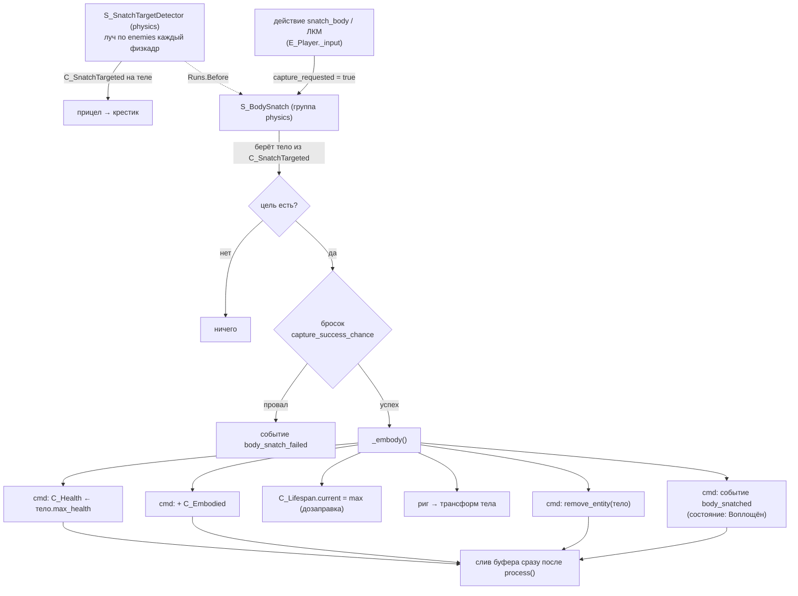
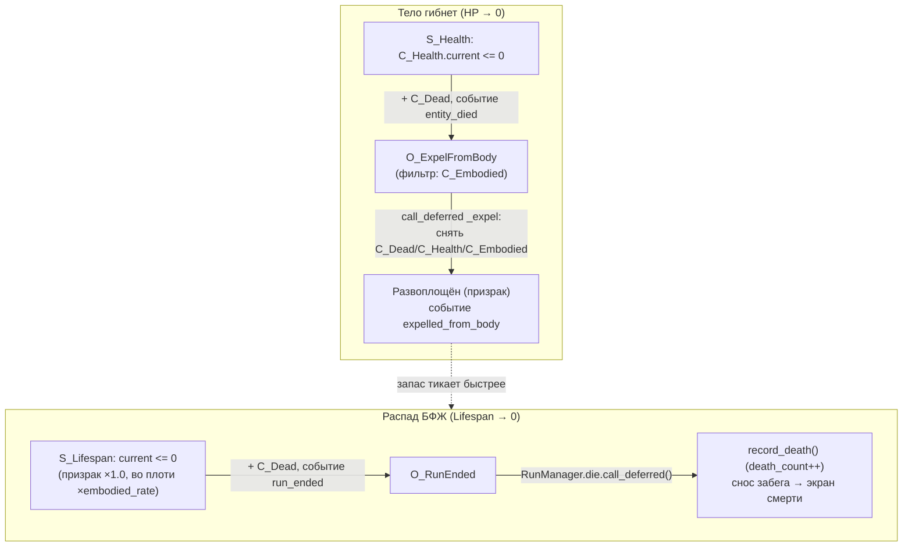

# Захват тела

Ядро игры: БФЖ — бестелесное сознание, которое вне тела **распадается** и должно
**вселяться** в тела, чтобы существовать. Реализовано по модели **«душа-риг +
состояние воплощения»**: постоянный управляемый объект — `E_Player` («точка
присутствия» БФЖ), а захват = обмен данных на этом риге, а не переселение
управления в другую сущность.

## Два состояния БФЖ

Различаются наличием компонентов на `E_Player`:

| Состояние | Компоненты | Поведение |
|---|---|---|
| **Воплощён** | `C_Embodied` + `C_Health` | ходит (гравитация, прыжок); здоровье тела; распад **замедлен** (`embodied_rate`); берёт урон; механизмы доступны |
| **Развоплощён** (призрак) | нет `C_Embodied`/`C_Health` | **летает** (нет гравитации, инерция); проходит сквозь `permeable`; `C_Lifespan` на полной скорости; механизмы с `requires_body` недоступны |

**Движение призрака** (`S_PlayerMovement._move_ghost`): гравитации нет вовсе,
направление берётся в базисе **камеры** — смотришь вниз, летишь вниз, отдельные
клавиши «вверх/вниз» не нужны; «прыжок» даёт импульс вверх. Скорость не
выставляется мгновенно, а подтягивается к желаемой и гаснет при отпущенных
клавишах — отсюда «плывущее» ощущение. Тюнинг — `RS_GameConfig`, группа
«БФЖ (развоплощён)».

Тело **не останавливает** распад, а только замедляет: иначе после первого же
захвата забег перестаёт торопить. Давление снимает не само тело, а момент
вселения — он возвращает запас к `max_duration`. Истечение запаса заканчивает
забег в любом состоянии, в том числе во плоти.

Компоненты-идентичность `C_BodySnatch` и `C_Lifespan` живут на игроке всегда —
навешиваются в `E_Player.define_components()`, а не в сцене, чтобы каждый новый
забег стартовал с непочатым запасом жизни.

## Компоненты

| Компонент | Где | Данные |
|---|---|---|
| `C_BodySnatch` | `E_Player` (идентичность) | `capture_range` (2.0), `capture_success_chance` (0.5), `capture_requested` (транзиентный флаг) |
| `C_Lifespan` | `E_Player` (идентичность) | `max_duration` (60), `current`, `embodied_rate` (доля скорости распада во плоти, крутится в инспекторе) |
| `C_BodySnatchable` | тело-цель (`E_Body`) | `max_health` — что тело даёт при вселении |
| `C_Embodied` | `E_Player` во плоти | маркер (пустой) |
| `C_Health` | воплощённая душа / тела | `maximum`, `current` |
| `C_Dead` | труп/распавшийся | маркер, чтобы смерть объявлялась один раз |

## Поток

**Захват** (`S_BodySnatch`, группа `physics` — как `S_InteractionDetector`, т.к.
кастует луч, а Jolt на отдельном потоке):
1. `E_Player._input` по действию **`snatch_body`** (`project.godot [input]`, по
   умолчанию **ЛКМ**, переназначаемо) ставит `C_BodySnatch.capture_requested`.
2. Цель берётся из метки `C_SnatchTargeted`, которую **непрерывно** держит
   `S_SnatchTargetDetector`: это он каждый физкадр кастует луч из камеры по маске
   `enemies` (layer_3, `1 << 2`) в пределах `capture_range` и поднимается от
   коллайдера до `Entity` с `C_BodySnatchable`. Он же переключает прицел в
   крестик — см. [[Прицел — крестик при захвате тела]]. `S_BodySnatch` объявлен
   `Runs.After` относительно него, поэтому своего луча не кастует: во что целимся
   и что подсвечено игроку — одно и то же.
3. Бросок `randf() > capture_success_chance` → провал = событие
   `body_snatch_failed`.
4. Успех → `_embody()`: свежий `C_Health` из `max_health` тела; `+ C_Embodied`;
   `C_Lifespan` дозаправляется до `max_duration` (захват снимает давление
   распада); риг переносится в трансформ тела; **исходное тело поглощается**
   (`remove_entity`); событие `body_snatched`.

Все структурные правки (`C_Health`, `C_Embodied`, поглощение тела) идут через
**командный буфер** `cmd`, а не напрямую: с GECS v9 системы обходят массивы
архетипов zero-copy, и прямые add/remove в `process()` пропускают сущности
(подробнее — «Правило v9» в `CLAUDE.md`). Буфер сливается сразу после `process()`
`S_BodySnatch`, коалесцируя remove+add `C_Health` в один переезд архетипа.
Событие `body_snatched` тоже поставлено в буфер (`cmd.add_custom`) — иначе оно
ушло бы **раньше** появления `C_Embodied`, и наблюдатель увидел бы душу ещё
развоплощённой. Дозаправка `C_Lifespan` и перенос трансформа — обычная запись в
поля, буфер им не нужен.

## Смерть — два разных исхода

Важно не путать: смерть **тела** ≠ конец забега. Настоящая смерть — только распад
призрака.

- **Гибель тела** (`S_Health` → `entity_died`): `O_ExpelFromBody` ловит событие
  **только для воплощённой души** (`C_Embodied`) и **отложенно** (`call_deferred`)
  снимает `C_Dead`/`C_Health`/`C_Embodied` — БФЖ снова призрак, `C_Lifespan` опять
  тикает. Забег **не** заканчивается.
  - *Порядок кадра:* `S_Health` вешает `C_Dead` через командный буфер (отложенно),
    но шлёт `entity_died` синхронно; снимать компоненты сразу нельзя — снятие
    произошло бы до применения `C_Dead`. Поэтому `_expel` через `call_deferred`.
- **Распад БФЖ** (`S_Lifespan` → `run_ended`): `O_RunEnded` зовёт
  `RunManager.die()` (отложенно — нельзя сносить забег в середине прохода ECS).
  `die()` пишет `WorldSave.record_death()` (`death_count++` → следующая генерация
  иная), сносит забег и уводит на `death_screen`. Это **настоящая** смерть.

## Цель захвата: `E_Body`

`src/entities/body/e_body.tscn` — инертное тело/труп (ИИ пока нет):
`StaticBody3D` на `collision_layer = 4` (= enemies/layer_3, куда смотрит луч
захвата), с `C_Health` + `C_BodySnatchable` в сцене (тюнятся в инспекторе).
Капсула оливково-зелёная — по вселении визуал пока **не** переносится на риг
(остаётся белая капсула игрока), см. [[Визуал захваченного тела]].

## Где что зарегистрировано (`world.tscn`)

- `World/Systems/physics`: `S_BodySnatch` (рядом с `S_InteractionDetector`).
- `World/Systems/gameplay`: `S_Health`, `S_Lifespan`.
- `World/Systems` (наблюдатели): `O_ExpelFromBody`, `O_RunEnded`.
- Тюнинг от навыков: `O_ApplySkillEffects` меняет `capture_range` / `max_duration`
  по событию `skill_unlocked` (см. [[Состояние проекта]]).

## События (для подписчиков UI/звука)

`body_snatched`, `body_snatch_failed`, `entity_died`, `expelled_from_body`,
`run_ended`; сигналы `RunManager`: `died`, `run_finished`.

## Пробелы

- **Визуал тела** не переносится при вселении — [[Визуал захваченного тела]].
- **ИИ тел** нет (тело статично) — [[Враг-тело]] / отложено в [[v0.4.0]].
- **Per-body скорость** не реализована: движение читает глобальный
  `SettingsManager.settings.move_speed`, тело на скорость не влияет.
