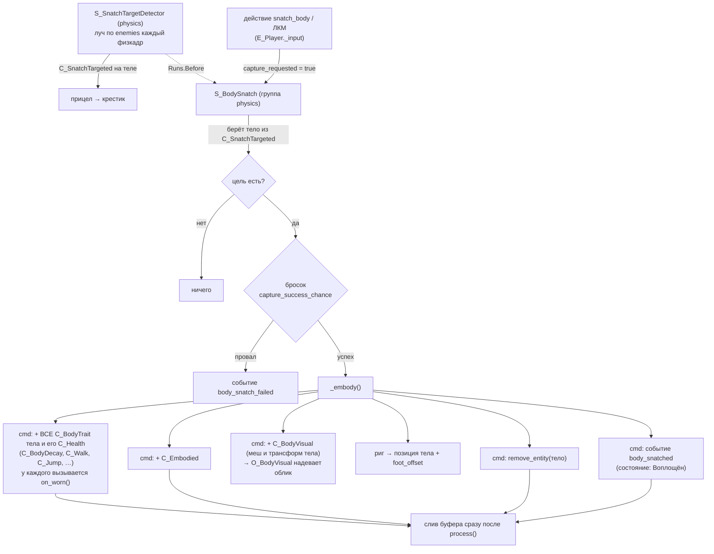
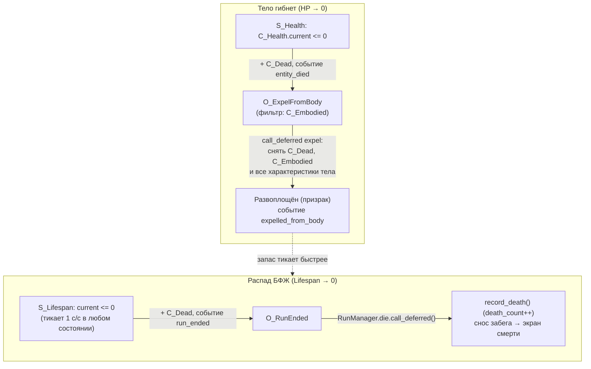

# Захват тела

Ядро игры: БФЖ — бестелесное сознание, которое вне тела **распадается** и должно
**вселяться** в тела, чтобы существовать. Реализовано по модели **«душа-риг +
состояние воплощения»**: постоянный управляемый объект — `E_Player` («точка
присутствия» БФЖ), а захват = обмен данных на этом риге, а не переселение
управления в другую сущность.

## Два состояния БФЖ

Различаются наличием компонентов на `E_Player`:

| Состояние | Компоненты | Поведение |
|---|---|---|
| **Воплощён** | `C_Embodied` + характеристики тела (`C_Health`, `C_BodyDecay`, `C_Walk`, `C_Jump`) | ходит (гравитация, прыжок) со **скоростью и прыжком этого тела**; здоровье тела; распад платится **из кармана тела**; берёт урон; механизмы доступны |
| **Развоплощён** (призрак) | ничего из перечисленного | **летает** (нет гравитации, инерция), но **не прыгает**; проходит сквозь `permeable`; запас — только собственный; механизмы с `requires_body` недоступны |

## Характеристики тела = компоненты (`C_BodyTrait`)

Всё, чем одно тело отличается от другого, лежит **отдельными компонентами в его
сцене**, а не полями в одном «листе характеристик». Правило, по которому решается,
что заслуживает компонента: **компонент оправдан, когда его отсутствие меняет
запрос** — какая-то система при отсутствии не должна работать вовсе. Иначе это
поле.

| Компонент тела | Что значит его отсутствие |
|---|---|
| `C_Health` | тело неуязвимо (урон некуда писать) |
| `C_BodyDecay` | тело не даёт укрытия от распада — время идёт из запаса души |
| `C_Walk` | тело не ходит |
| `C_Jump` | телу **нечем прыгать** (безногое) |

Все они, кроме `C_Health`, наследуют **`C_BodyTrait`**, и захват переносит на душу
*все* трейты, не перечисляя их поимённо (`E_Body.traits_of`); развоплощение так же
их снимает. Добавить телу характеристику = создать один скрипт и систему, которая
его читает: ни `S_BodySnatch`, ни `RunManager` при этом не правятся. `C_Health`
назван в переносе явно — это общий компонент всего живого, а не характеристика
именно тела; исключение одно на весь проект.

**Числа абсолютные.** `C_Walk.speed` — это м/с, а не множитель к чему-то. До
v0.5.0 они были множителями к `RS_Settings.move_speed`/`jump_velocity`, что
обосновывалось «игрок настроил их себе сам» — хотя в меню настроек этих полей не
было ни дня. Характеристики персонажа игрок не настраивает; модификаторы от перков
и улучшений забега лягут отдельным слоем поверх базовых чисел (см.
[[Модификаторы механик через скиллы]]).

Скорость **призрака** — тоже абсолютное число, но живёт в `RS_GameConfig`
(`ghost_speed`): у БФЖ нет тела, которое дало бы ему `C_Walk`, и он один на всю
игру.

**Движение призрака** (`S_PlayerMovement._move_ghost`): гравитации нет вовсе,
направление берётся в базисе **камеры** — смотришь вниз, летишь вниз, отдельные
клавиши «вверх/вниз» не нужны; «прыжок» даёт импульс вверх. Скорость не
выставляется мгновенно, а подтягивается к желаемой и гаснет при отпущенных
клавишах — отсюда «плывущее» ощущение. Тюнинг — `RS_GameConfig`, группа
«БФЖ (развоплощён)».

**Время всегда идёт 1 с/с.** Тело не замедляет ход времени — оно даёт ДРУГОЙ
КАРМАН, из которого это время платится. Так было не всегда: раньше во плоти распад
тикал с множителем, и подпись «45 с» в HUD врала — эти 45 секунд шли вдвое дольше.

**Распад как ресурс** (v0.5.0). Две шкалы, по сути один ресурс, перетекающий
туда-обратно. Живут они в **разных компонентах**: собственный запас души — в
`C_Lifespan`, карман тела — в `C_BodyDecay`, который приходит вместе с телом и
уходит вместе с ним. Полями одного компонента карман лежал бы мёртвыми нулями всё
время, пока игрок призрак, и «есть ли у меня тело» приходилось бы спрашивать у
`C_Embodied`; наличие `C_BodyDecay` и есть ответ — по нему ветвятся и `S_Lifespan`,
и шкала в HUD.

- во плоти убывает `C_BodyDecay.remaining` — карман текущего тела; собственный
  запас души (`C_Lifespan.current`) в это время **не трогается вообще** и ждёт;
- **вышел сам** (действие `leave_body`) — остаток кармана **прибавляется** к
  запасу души: вошёл с 20 с, вышел с 30 с в теле → стало 50 с. Сумма может уйти
  **за** `max_duration`;
- **тело погибло** (HP в ноль или его время вышло) — не даёт ничего, а запас души
  падает до доли от максимума (`GameConfig.lifespan_death_fraction`, 10%).
  Гибель обязана быть больнее добровольного выхода, иначе выходить вовремя незачем;
- **излишек сверх максимума утекает быстрее** (`lifespan_overflow_leak`, ×3):
  накопить буфер и ходить с ним нельзя, его надо тратить;
- **пересадка из тела в тело** остаток прошлого тела сжигает. Иначе выгодно было
  бы прыгать по телам, копя чужое время, и добровольный выход обесценился бы.

Все три выхода (гибель от урона, истечение времени тела, добровольный выход) идут
через одну функцию `O_ExpelFromBody.expel(soul, voluntary)` — разъехавшись, они
дали бы три разные модели распада.

Истечение СОБСТВЕННОГО запаса заканчивает забег; истечение запаса тела — только
выбрасывает наружу.

Компоненты-идентичность `C_BodySnatch` и `C_Lifespan` живут на игроке всегда —
навешиваются в `E_Player.define_components()`, а не в сцене, чтобы каждый новый
забег стартовал с непочатым запасом жизни.

## Компоненты

| Компонент | Где | Данные |
|---|---|---|
| `C_BodySnatch` | `E_Player` (идентичность) | `capture_range` (2.0), `capture_success_chance` (0.5), транзиентные флаги `capture_requested` / `leave_requested` |
| `C_Lifespan` | `E_Player` (идентичность) | `max_duration` (60) и `current` — свой запас души (может превышать максимум) |
| `C_BodySnatchable` | тело-цель (`E_Body`) | **чистый тег** «меня можно захватить»; чисел не несёт |
| `C_BodyTrait` | базовый класс | не используется напрямую: от него наследуют характеристики тела, и по нему их переносит захват |
| `C_BodyDecay` | тело → воплощённая душа | `maximum` (сколько тело даёт) и `remaining` (сколько осталось; состояние, не `@export`) |
| `C_Walk` | тело → воплощённая душа | `speed`, м/с. Нет компонента — тело не ходит |
| `C_Jump` | тело → воплощённая душа | `velocity`, м/с. Нет компонента — тело не прыгает |
| `C_Embodied` | `E_Player` во плоти | маркер + `body_scene_path` (по нему восстанавливается облик и характеристики) |
| `C_Health` | воплощённая душа / тела | `maximum`, `current` |
| `C_Dead` | труп/распавшийся | маркер, чтобы смерть объявлялась один раз |

## Поток

**Захват** (`S_BodySnatch`, группа `physics` — как `S_InteractionDetector`, т.к.
кастует луч, а Jolt на отдельном потоке):
1. `E_Player._input` по действию **`snatch_body`** (`project.godot [input]`, по
   умолчанию **ЛКМ**, переназначаемо) ставит `C_BodySnatch.capture_requested`.
2. Цель берётся из метки `C_SnatchTargeted`, которую **непрерывно** держит
   `S_SnatchTargetDetector`: это он каждый физкадр кастует луч из камеры по маске
   `enemies` (layer_3, `1 << 2`) в пределах `capture_range` и поднимается от
   коллайдера до `Entity` с `C_BodySnatchable`. Он же переключает прицел в
   крестик — см. [[Прицел — крестик при захвате тела]]. Порядок объявляет сам
   детектор (`deps()` → `Runs.Before: [S_BodySnatch]`; у `S_BodySnatch` своего
   `deps()` нет), поэтому захват луча не кастует: во что целимся и что подсвечено
   игроку — одно и то же.
3. Бросок `randf() > capture_success_chance` → провал = событие
   `body_snatch_failed`.
4. Успех → `_embody()`: на душу переносятся **все характеристики тела** — его
   `C_BodyTrait`-компоненты плюс `C_Health` (`E_Body.traits_of`), причём копии, а
   не оригиналы: компонент в сцене общий для всех инстансов пресета. У каждого
   трейта вызывается `on_worn()` — момент, когда характеристика становится
   состоянием (`C_BodyDecay` так открывает карман полным). Дальше `+ C_Embodied`
   (с путём сцены тела); `+ C_BodyVisual` — облик тела, снятый с его геометрии
   (надевает `O_BodyVisual`, снимает `O_ExpelFromBody`; см.
   [[Визуал захваченного тела]]); риг переносится в **позицию** тела с поправкой
   `E_Player.foot_offset()`; **исходное тело поглощается** (`remove_entity`);
   событие `body_snatched`.

Все структурные правки (характеристики, `C_Embodied`, поглощение тела) идут через
**командный буфер** `cmd`, а не напрямую: с GECS v9 системы обходят массивы
архетипов zero-copy, и прямые add/remove в `process()` пропускают сущности
(подробнее — «Правило v9» в [[GECS и правила движка]]). Буфер сливается сразу после `process()`
`S_BodySnatch`; каждый трейт ставится парой remove+add (при пересадке из тела в
тело он уже висит с числами прошлого тела), и буфер коалесцирует пару в один
переезд архетипа. Событие `body_snatched` тоже поставлено в буфер
(`cmd.add_custom`) — иначе оно ушло бы **раньше** появления `C_Embodied`, и
наблюдатель увидел бы душу ещё развоплощённой. Перенос позиции — обычная запись в
поля, буфер ему не нужен.

## Смерть — два разных исхода

Важно не путать: смерть **тела** ≠ конец забега. Настоящая смерть — только распад
призрака.

- **Гибель тела** (`S_Health` → `entity_died`): `O_ExpelFromBody` ловит событие
  **только для воплощённой души** (`C_Embodied`) и **отложенно** (`call_deferred`)
  снимает `C_Dead`, `C_Embodied` и **все характеристики тела** (тем же перебором
  `C_BodyTrait` + `C_Health`, что и надевал захват, — симметрия держится сама, а не
  двумя списками) — БФЖ снова призрак, `C_Lifespan` опять тикает. Забег **не**
  заканчивается.
  - *Порядок кадра:* `S_Health` вешает `C_Dead` через командный буфер (отложенно),
    но шлёт `entity_died` синхронно; снимать компоненты сразу нельзя — снятие
    произошло бы до применения `C_Dead`. Поэтому `_expel` через `call_deferred`.
- **Распад БФЖ** (`S_Lifespan` → `run_ended`): `O_RunEnded` зовёт
  `RunManager.die()` (отложенно — нельзя сносить забег в середине прохода ECS).
  `die()` пишет `WorldSave.record_death()` (`death_count++` → следующая генерация
  иная), сносит забег и уводит на `death_screen`. Это **настоящая** смерть.

## Цель захвата: `E_Body`

Инертное тело/труп, ИИ пока нет. Три пресета в `src/entities/body/` —
`e_body_walker`, `e_body_crawler`, `e_body_hound`. Контракт сцены тела:

- корень — `E_Body`, иначе тело не найдут ни `RunManager` при регистрации, ни
  `E_Body.visual_of_scene` при восстановлении облика из сейва;
- коллайдер на `collision_layer = 4` (enemies/layer_3) — по нему бьёт луч
  `S_SnatchTargetDetector`;
- в `component_resources` — тег `C_BodySnatchable` и характеристики: `C_Health`,
  `C_BodyDecay`, `C_Walk`, `C_Jump` (тюнятся в инспекторе);
- `origin` в ступнях, у меша и у арматуры — см. [[Визуал захваченного тела]].

**Новое тело делается копией эталона** `src/entities/body/e_body.tscn` (или через
шаблон **«Тело»** в доке «Шаблоны» — `data/entity_templates/body.tres`, он на эту
же сцену и ссылается), а не набором компонентов из выпадашки инспектора: там
перечислены все `Component` проекта, и собирать тело по одному — работа не для
дизайнера. Собственный список компонентов у этого шаблона пуст намеренно: базовая
сцена уже несёт весь набор, и продублировать его в шаблон значило бы положить
каждый компонент в `component_resources` дважды. Тюнинг ростера таблицей
«тела × характеристики» — задача [[Единый редактор геймдизайна]].

> [!important] Трупов, в которые нельзя вселиться, не бывает
> `C_BodySnatchable` отделяет тело от прочего содержимого комнаты — декораций,
> дверей, механизмов, — а не «пригодные» трупы от «непригодных». Захват тела и
> есть игра; труп, который смотрит на игрока и не даёт себя занять, отнимал бы у
> механики глубину, а не добавлял. Поэтому шаблон и называется просто «Тело»:
> уточнение «(захват)» описывало бы различие, которого нет. Если появится тело,
> недоступное прямо сейчас (заперто, слишком свежо, занято другим), это будет
> отдельный компонент-условие, а не отсутствие тега.

> [!warning] Контракт сейчас нарушен во всех трёх сценах
> После арт-пасса с ригами тела пересобраны из `monsters.glb` как есть:
> у `crawler` и `hound` корень — голый `Node3D` без скрипта, коллайдера и
> компонентов; у `walker` корень — `Node` с базовым `entity.gd`, а коллизия
> только на костях `PhysicalBoneSimulator3D`. Коллайдера на слое `enemies` нет
> ни у одного, поэтому захват не срабатывает вообще. Чинится возвратом обвязки
> в сцены — см. [[Характеристики захватываемых тел]].

## Где что зарегистрировано (`world.tscn`)

- `World/Systems/physics`: `S_BodySnatch` (рядом с `S_InteractionDetector`).
- `World/Systems/gameplay`: `S_Health`, `S_Lifespan`.
- `World/Systems` (наблюдатели): `O_ExpelFromBody`, `O_RunEnded`.
- Тюнинг от навыков: `O_ApplySkillEffects` меняет `capture_range` / `max_duration`
  по событию `skill_unlocked` (см. [[Состояние проекта]]).

## Проверка

`dev/body_traits_check.tscn` (F6 или `godot --headless dev/body_traits_check.tscn`)
— headless-прогон модели характеристик (24 проверки): загрузка всех сцен тел и
шаблона, измеримость коллайдера игрока (`foot_offset`), чтение трейтов из сцены,
перенос при
захвате, тик кармана тела при нетронутом запасе души, добровольный выход со
складыванием остатка, ускоренная утечка излишка, гибель тела и снятие всех
трейтов. Запускать после правок захвата, развоплощения или `S_Lifespan`.

## События (для подписчиков UI/звука)

`body_snatched`, `body_snatch_failed`, `entity_died`, `expelled_from_body`,
`run_ended`; сигналы `RunManager`: `died`, `run_finished`.

## Пробелы

- **Облика БФЖ как такового нет** — риг вне тела остаётся белой сферой-заглушкой;
  прозрачность/свечение призрака не сделаны. Облик ТЕЛА при вселении переносится,
  а вот «как выглядит бестелесное» — вопрос арта.
- **ИИ тел** нет (тело статично) — [[Враг-тело]] / отложено в [[v0.4.0]].
- **Габарит и уровень глаз не переносятся**: коллайдер игрока (сейчас сфера
  радиусом 0.55) и высота камеры остаются призрачными для любого тела —
  [[Баг — вселение в тело (посадка, масштаб, камера)]].
