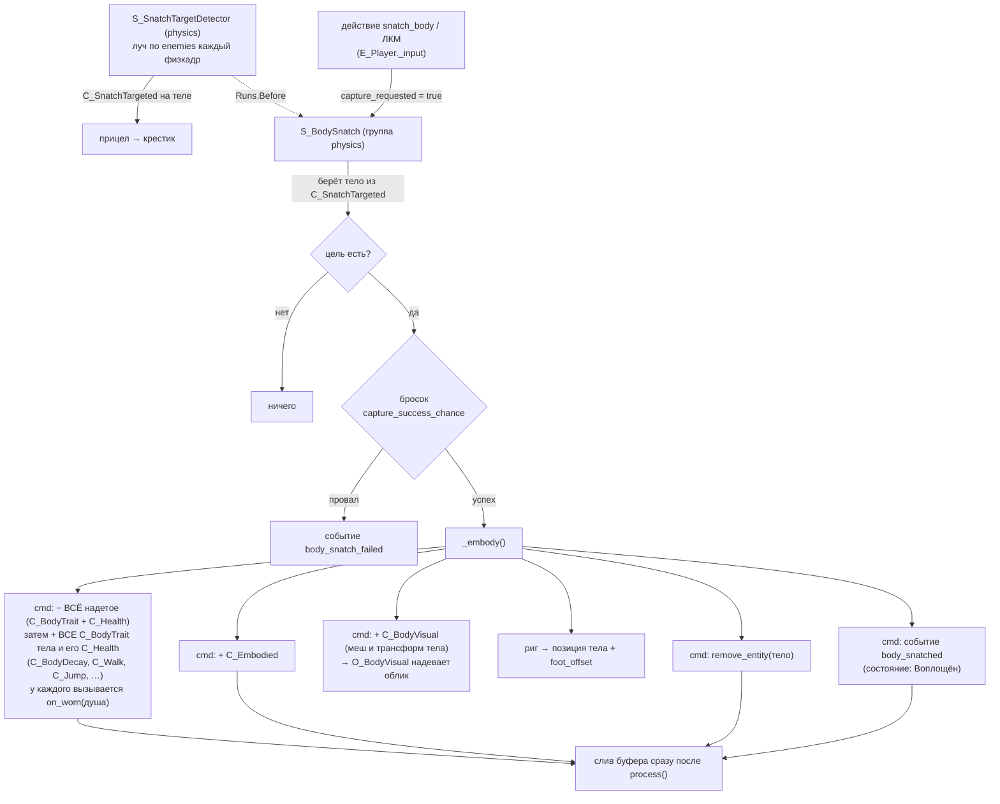
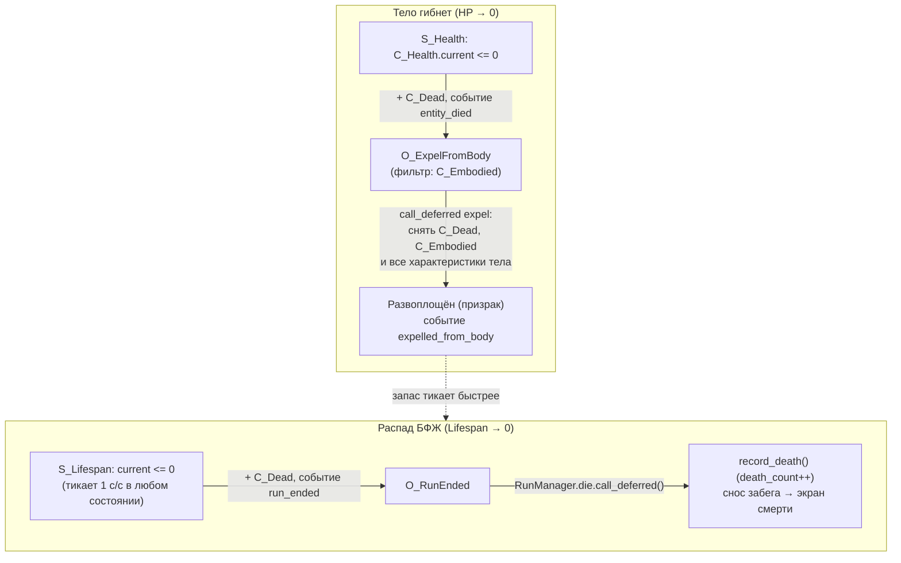

# Захват тела

Ядро игры: БФЖ — бестелесное сознание, которое вне тела **распадается** и должно
**вселяться** в тела, чтобы существовать. Реализовано по модели **«душа-риг +
состояние воплощения»**: постоянный управляемый объект — `E_Player` («точка
присутствия» БФЖ), а захват = обмен данных на этом риге, а не переселение
управления в другую сущность.

## Два состояния БФЖ

Различаются наличием компонентов на `E_Player`:

| Состояние | Компоненты | Поведение |
|---|---|---|
| **Воплощён** | `C_Embodied` + характеристики тела (`C_Health`, `C_BodyDecay`, `C_Walk`, `C_Jump`) | ходит (гравитация, прыжок) со **скоростью и прыжком этого тела**; здоровье тела; распад платится **из кармана тела**; берёт урон; механизмы доступны |
| **Развоплощён** (призрак) | возможности души: `C_Flight`, `C_Phasing` | **летает** (нет гравитации, инерция), но **не прыгает**; проходит сквозь `permeable`; запас — только собственный; механизмы с `requires_body` недоступны |

## Характеристики тела = компоненты (`C_BodyTrait`)

Всё, чем одно тело отличается от другого, лежит **отдельными компонентами в его
сцене**, а не полями в одном «листе характеристик». Правило, по которому решается,
что заслуживает компонента: **компонент оправдан, когда его отсутствие меняет
запрос** — какая-то система при отсутствии не должна работать вовсе. Иначе это
поле.

| Компонент тела | Что значит его отсутствие |
|---|---|
| `C_Health` | тело неуязвимо (урон некуда писать) |
| `C_BodyDecay` | тело не даёт укрытия от распада — время идёт из запаса души |
| `C_Walk` | тело не ходит |
| `C_Jump` | телу **нечем прыгать** (безногое) |

Все они, кроме `C_Health`, наследуют **`C_BodyTrait`**, и захват переносит на душу
*все* трейты, не перечисляя их поимённо (`E_Body.traits_of`); развоплощение так же
их снимает. Добавить телу характеристику = создать один скрипт и систему, которая
его читает: ни `S_BodySnatch`, ни `RunManager` при этом не правятся. `C_Health`
назван в переносе явно — это общий компонент всего живого, а не характеристика
именно тела; исключение одно на весь проект.

**Числа абсолютные.** `C_Walk.speed` — это м/с, а не множитель к чему-то. До
v0.5.0 они были множителями к `RS_Settings.move_speed`/`jump_velocity`, что
обосновывалось «игрок настроил их себе сам» — хотя в меню настроек этих полей не
было ни дня. Характеристики персонажа игрок не настраивает; модификаторы от перков
и улучшений забега лежат **отдельным слоем поверх** базовых чисел — см.
«Модификаторы механик» ниже.

## Возможности САМОЙ души (`C_SoulTrait`)

Зеркало `C_BodyTrait`: полёт (`C_Flight`) и проход сквозь решётки (`C_Phasing`)
принадлежат БФЖ, а не телу. Отдельный базовый класс, а не общий с трейтами тела,
ровно потому, что направление переноса **противоположное**: трейты тела приходят
и уходят вместе с телом, возможности души принадлежат душе и на время воплощения
**засыпают**. Наследуй они один класс, общий перебор захвата утащил бы полёт на
тело или снял бы его насовсем при первом развоплощении.

Авторятся в **сцене души** (`component_resources` в `e_player.tscn`), а не в
`define_components()`: у возможности есть числа, и тюнить их полагается в
инспекторе — ровно как `C_Walk.speed` у тел. Раньше числа полёта лежали в
`RS_GameConfig`; возможность и её числа обязаны лежать в одном месте, иначе
«сделать полёт быстрее» правится в двух файлах.

**Сон и пробуждение** — `O_SoulTraits`, наблюдатель на `C_Embodied`. Не вызов из
захвата: воплощают душу ДВА пути (`S_BodySnatch` и
`RunManager._restore_embodiment`), и правило, расписанное в обоих, разъезжается
молча — этим уже обжигались с посадкой облика.

Возвращает он их **свежими копиями** из сцены души (`E_Player.soul_traits()`), а
не из заначки, снятой при вселении. Заначка пережила бы обычный выход, но не
пересадку тело→тело: там буфер коалесцирует `remove`+`add` `C_Embodied` в один
переезд архетипа, снятия наблюдатель может не увидеть вовсе, и заначка осталась
бы пустой — душа навсегда без полёта. Нечего хранить — нечему и потеряться.

**Движение призрака** (`S_Flight`): гравитации нет вовсе — её система объявляет
`with_none([C_Flight])`, то есть падает всё, что не летит, и второго способа
сказать «невесомый» в проекте нет. Направление берётся в базисе **камеры** —
смотришь вниз, летишь вниз, отдельные клавиши «вверх/вниз» не нужны. Скорость не
выставляется мгновенно, а подтягивается к желаемой и гаснет при отпущенных
клавишах — отсюда «плывущее» ощущение. Тюнинг — `C_Flight` на сцене игрока.

## Возможность = система

Ветвлений по `C_Embodied` внутри движения нет ни одного: каждая возможность —
своя система, и тело без компонента в выборку просто не попадает.

| Система | Кого забирает | Что делает |
|---|---|---|
| `S_Phasing` | `C_Phasing` / всё остальное | снимает и возвращает бит `permeable` в **маске** сущности |
| `S_Gravity` | всё с `C_Velocity`, кроме `C_Flight` | тянет вниз |
| `S_Walk` | `C_Walk` | ход в базисе сущности, мгновенный старт/стоп |
| `S_Jump` | `C_Jump` / всё остальное | прыжок с пола |
| `S_Flight` | `C_Flight` | полёт в базисе камеры, с инерцией |

У `S_Phasing` и `S_Jump` **по две выборки** (`sub_systems()`), и вторая — не
симметрия ради симметрии:

- маска — состояние узла, а не компонента, и восстановить её можно только
  повторным утверждением: наблюдатель поставил бы её один раз на событие и
  разошёлся бы с истиной при первом же стороннем изменении;
- `jump_pressed` — защёлка, и гасить её обязан в том числе тот, кому прыгать
  нечем. Иначе нажатие, сделанное призраком, срабатывает в тот самый миг, когда
  он вселяется в прыгучее тело.

Обе половины правила держатся в одном файле намеренно: разнеси их по системам —
и «кто ставит бит обратно» станет вопросом порядка.

## Модификаторы механик

Правило, ради которого затевался паттерн: **если про механику подумалось «это
можно будет менять скиллом» — добавить такой скилл должно стоить строчки в
данных, а не правки механики.**

Механика читает не поле компонента, а **посчитанный стат**:

```
эффективное = (база + Σflat) * Πmult
```

- **база** — авторское число там, где оно и лежало: `C_Walk.speed`,
  `C_BodyDecay.maximum`, `RS_GameConfig.lifespan_death_fraction`. База
  **никогда не переписывается**;
- **модификаторы** — `C_StatModifiers` на душе. Компонент живёт в
  `E_Player.define_components()`: характеристики приходят и уходят вместе с
  телами, а слой прокачки принадлежит душе и переживает любую пересадку.

Из «база не переписывается» следует всё остальное: два скилла на один стат
**складываются**, а не затирают друг друга; эффект можно **снять** (респек,
конец забега, временный баф), потому что исходное число никуда не делось.
Свёртка не зависит от порядка выдачи — иначе перк из дерева, награда за забег и
временный эффект давали бы разный результат в зависимости от того, что случилось
раньше.

**База передаётся аргументом, а не ищется по реестру** «стат → компонент →
поле»: половина того, что просится крутить скиллами (темп утечки излишка, доля
остатка при гибели), лежит скаляром в `RS_GameConfig` и компонентом не является
вовсе.

**Модификаторы сгруппированы по источнику.** `set_source(&"skills", flat, mult)`
заменяет вклад источника целиком, поэтому пересчёт идемпотентен: наблюдателю не
нужно помнить, что источник давал в прошлый раз. Улучшения за забег лягут
отдельным именем и снимутся в конце забега, не трогая перки дерева.

### Каталог статов

Полный список — константы в `C_StatModifiers`; `RS_StatModifier` рисует из него
выпадающий список в инспекторе, так что опечатка в имени стата не доживает до
рантайма.

| Стат | База |
|---|---|
| `capture_range` | `C_BodySnatch.capture_range` |
| `capture_chance` | `C_BodySnatch.capture_success_chance` |
| `soul_lifespan` | `C_Lifespan.max_duration` |
| `body_decay` | `C_BodyDecay.maximum` — объём кармана тела |
| `body_health` | `C_Health.maximum` |
| `walk_speed` | `C_Walk.speed` |
| `jump_velocity` | `C_Jump.velocity` |
| `leave_body_gain` | 1.0 — доля остатка, забираемая при добровольном выходе |
| `overflow_leak` | `RS_GameConfig.lifespan_overflow_leak` |
| `death_keep` | `RS_GameConfig.lifespan_death_fraction` |

### Как объявляется скилл

`RS_SkillDefinition.modifiers` — `Array[RS_StatModifier]`, редактируется в
`data/skill_tree.tres`. У модификатора три поля: `stat`, `op` (`FLAT` / `MULT`) и
`per_rank`. Величина задаётся **на один ранг** и умножается на ранг при свёртке
(`FLAT` даёт `per_rank * rank` в сумму, `MULT` — множитель `1 + per_rank * rank`),
поэтому трёхранговый навык описывается одним модификатором, а не тремя.

### Кто пересчитывает

`O_ApplySkillEffects` по сигналу `SkillManager.skills_changed` **пересобирает
вклад источника `skills` целиком** по текущей таблице рангов — он не применяет
«только что открытый навык». Отсюда у наблюдателя нет своей памяти: один и тот же
вызов годится и на разблокировку, и на спавн игрока, и на загрузку сейва, а
повторное применение ничего не удваивает.

> [!warning] `emit_event(name, null, …)` — не «разослать всем подходящим»
> Это широковещалка: фильтр сущности не применяется вовсе (его не по чему
> вычислять), и `each` получает `entity == null` **один раз**. Прошлая версия
> наблюдателя делала именно так и молча падала на `entity.get_component()` —
> из-за чего перки не применялись НИКОГДА, ни один. Рассылать надо по
> сущностям: пройти запросом и слать событие на каждую.

Пересчёт зовётся из `RunManager._spawn_player()` (`SkillManager.reapply_all()`):
дерево прокачано между забегами, а душа только что создана. Там же свежий
`C_Lifespan.current` доводится до **эффективного** максимума — стартовать с
авторских 60 при потолке 100 значило бы выдать прокачку, которой не видно.

**Настройки игрока — не модификаторы.** `SettingsManager` (чувствительность, FOV,
клавиши) живёт отдельно и в этот слой не тянется.

**Время всегда идёт 1 с/с.** Тело не замедляет ход времени — оно даёт ДРУГОЙ
КАРМАН, из которого это время платится. Так было не всегда: раньше во плоти распад
тикал с множителем, и подпись «45 с» в HUD врала — эти 45 секунд шли вдвое дольше.

**Распад как ресурс** (v0.5.0). Две шкалы, по сути один ресурс, перетекающий
туда-обратно. Живут они в **разных компонентах**: собственный запас души — в
`C_Lifespan`, карман тела — в `C_BodyDecay`, который приходит вместе с телом и
уходит вместе с ним. Полями одного компонента карман лежал бы мёртвыми нулями всё
время, пока игрок призрак, и «есть ли у меня тело» приходилось бы спрашивать у
`C_Embodied`; наличие `C_BodyDecay` и есть ответ — по нему ветвятся и `S_Lifespan`,
и шкала в HUD.

- во плоти убывает `C_BodyDecay.remaining` — карман текущего тела; собственный
  запас души (`C_Lifespan.current`) в это время **не трогается вообще** и ждёт;
- **вышел сам** (действие `leave_body`) — остаток кармана **прибавляется** к
  запасу души: вошёл с 20 с, вышел с 30 с в теле → стало 50 с. Сумма может уйти
  **за** `max_duration`;
- **тело погибло** (HP в ноль или его время вышло) — не даёт ничего, а запас души
  падает до доли от максимума (`GameConfig.lifespan_death_fraction`, 10%).
  Гибель обязана быть больнее добровольного выхода, иначе выходить вовремя незачем;
- **излишек сверх максимума утекает быстрее** (`lifespan_overflow_leak`, ×3):
  накопить буфер и ходить с ним нельзя, его надо тратить;
- **пересадка из тела в тело** остаток прошлого тела сжигает. Иначе выгодно было
  бы прыгать по телам, копя чужое время, и добровольный выход обесценился бы.

Все три выхода (гибель от урона, истечение времени тела, добровольный выход) идут
через одну функцию `O_ExpelFromBody.expel(soul, voluntary)` — разъехавшись, они
дали бы три разные модели распада.

Истечение СОБСТВЕННОГО запаса заканчивает забег; истечение запаса тела — только
выбрасывает наружу.

Компоненты-идентичность `C_BodySnatch` и `C_Lifespan` живут на игроке всегда —
навешиваются в `E_Player.define_components()`, а не в сцене, чтобы каждый новый
забег стартовал с непочатым запасом жизни.

## Компоненты

| Компонент | Где | Данные |
|---|---|---|
| `C_BodySnatch` | `E_Player` (идентичность) | `capture_range` (2.0), `capture_success_chance` (0.5), транзиентные флаги `capture_requested` / `leave_requested` |
| `C_Lifespan` | `E_Player` (идентичность) | `max_duration` (60) и `current` — свой запас души (может превышать максимум) |
| `C_StatModifiers` | `E_Player` (идентичность) | слой модификаторов души по источникам; не `@export` — производное состояние, пересобирается из `SkillManager` |
| `C_BodySnatchable` | тело-цель (`E_Body`) | **чистый тег** «меня можно захватить»; чисел не несёт |
| `C_BodyTrait` | базовый класс | не используется напрямую: от него наследуют характеристики тела, и по нему их переносит захват |
| `C_BodyDecay` | тело → воплощённая душа | `maximum` (сколько тело даёт) и `remaining` (сколько осталось; состояние, не `@export`) |
| `C_Walk` | тело → воплощённая душа | `speed`, м/с. Нет компонента — тело не ходит |
| `C_Jump` | тело → воплощённая душа | `velocity`, м/с. Нет компонента — тело не прыгает |
| `C_Embodied` | `E_Player` во плоти | маркер + `body_scene_path` (по нему восстанавливается облик, форма и характеристики) |
| `C_BodyForm` | тело → воплощённая душа | форма коллизии и высота глаз тела + `restore_*`; надевает `O_BodyForm` |
| `C_Health` | воплощённая душа / тела | `maximum`, `current` |
| `C_Dead` | труп/распавшийся | маркер, чтобы смерть объявлялась один раз |
| `C_SoulTrait` | базовый класс | зеркало `C_BodyTrait`: возможности САМОЙ души, засыпают во плоти |
| `C_Flight` | душа (спит во плоти) | `speed`, `acceleration`, `damping`. Нет компонента — не летит и падает |
| `C_Phasing` | душа (спит во плоти) | маркер + `PERMEABLE_BIT`. Нет компонента — не проходит сквозь решётки |

## Поток



**Захват** (`S_BodySnatch`, группа `physics` — как `S_InteractionDetector`, т.к.
кастует луч, а Jolt на отдельном потоке):
1. `E_Player._input` по действию **`snatch_body`** (`project.godot [input]`, по
   умолчанию **ЛКМ**, переназначаемо) ставит `C_BodySnatch.capture_requested`.
2. Цель берётся из метки `C_SnatchTargeted`, которую **непрерывно** держит
   `S_SnatchTargetDetector`: это он каждый физкадр кастует луч из камеры по маске
   `enemies` (layer_3, `1 << 2`) в пределах `capture_range` и поднимается от
   коллайдера до `Entity` с `C_BodySnatchable`. Он же переключает прицел в
   крестик — см. [[Прицел — крестик при захвате тела]]. Порядок объявляет сам
   детектор (`deps()` → `Runs.Before: [S_BodySnatch]`; у `S_BodySnatch` своего
   `deps()` нет), поэтому захват луча не кастует: во что целимся и что подсвечено
   игроку — одно и то же.
3. Бросок `randf() > capture_success_chance` → провал = событие
   `body_snatch_failed`.
4. Успех → `_embody()`: сперва с души снимается **всё надетое** (те же
   `C_BodyTrait` + `C_Health`), и только потом надеваются характеристики нового
   тела. Снятие «по списку нового» оставляло на душе то, чего у новой плоти нет
   вовсе: пересадка из прыгучего тела в безногое давала прыгающего безногого —
   ровно тот случай, ради которого возможность и сделана компонентом.
   Переносятся **все характеристики тела** — его `C_BodyTrait`-компоненты плюс
   `C_Health` (`E_Body.traits_of`), причём копии, а не оригиналы: компонент в
   сцене общий для всех инстансов пресета. У каждого
   трейта вызывается `on_worn(soul)` — момент, когда характеристика становится
   состоянием (`C_BodyDecay` так открывает карман, причём на **эффективный**
   объём: перк «+10% к длительности» обязан быть виден сразу при вселении).
   Душа передаётся аргументом, а не берётся из `Component.parent`: на этот момент
   трейт ещё не надет — он лежит в командном буфере. Дальше `+ C_Embodied`
   (с путём сцены тела); `+ C_BodyVisual` — облик тела, снятый с его геометрии
   (надевает `O_BodyVisual`, снимает `O_ExpelFromBody`; см.
   [[Визуал захваченного тела]]); `+ C_BodyForm` — габарит и уровень глаз
   (надевает `O_BodyForm`, см. «Габарит и уровень глаз»); риг переносится в
   **позицию** тела с поправкой на офсет **надеваемой** формы; **исходное тело
   поглощается** (`remove_entity`); событие `body_snatched`.

Все структурные правки (характеристики, `C_Embodied`, поглощение тела) идут через
**командный буфер** `cmd`, а не напрямую: с GECS v9 системы обходят массивы
архетипов zero-copy, и прямые add/remove в `process()` пропускают сущности
(подробнее — «Правило v9» в [[GECS и правила движка]]). Буфер сливается сразу после `process()`
`S_BodySnatch`; каждый трейт ставится парой remove+add (при пересадке из тела в
тело он уже висит с числами прошлого тела), и буфер коалесцирует пару в один
переезд архетипа. Событие `body_snatched` тоже поставлено в буфер
(`cmd.add_custom`) — иначе оно ушло бы **раньше** появления `C_Embodied`, и
наблюдатель увидел бы душу ещё развоплощённой. Перенос позиции — обычная запись в
поля, буфер ему не нужен.

## Габарит и уровень глаз

Тело даёт не только числа и облик, но и **то, чем игрок упирается в мир и откуда
смотрит**. Механизм — тот же «компонент-запрос к презентации», что у облика:
`C_BodyForm` вешает `S_BodySnatch`, применяет и откатывает `O_BodyForm`.

Отдельный компонент от `C_BodyVisual`, а не пара полей в нём: облик — то, что
видно другим, форма — геймплей. «Ползун» вдвое ниже ходока и обязан пролезать
там, где ходок не пройдёт; тело без визуала или визуал без коллайдера должны
оставаться выразимыми по отдельности.

И не `C_BodyTrait`: трейты переносятся общим перебором и читаются системами как
числа, а форма — это узлы сцены рига (коллайдер и камера), которые правит
наблюдатель. В трейтах она означала бы, что общий перебор молча тащит на душу
то, что без наблюдателя ничего не делает.

**Источник — сцена тела**, как и у облика:

- габарит берётся с `CollisionShape3D`, лежащего **прямо на корне** тела. Не с
  любого в поддереве: у ригов их десятки на костях (`PhysicalBoneSimulator3D`), и
  «первый попавшийся» дал бы душе форму предплечья. Корневой коллайдер — тот
  самый, по которому в тело бьёт луч захвата, так что подсвеченный игроку габарит
  и надетый им — одно и то же;
- уровень глаз — узел-маркер **`Eyes`**, ищется на любой глубине. Высота глаз
  становится частью модели, а не числом в коде; маркер можно повесить дочерним к
  `BoneAttachment3D` на кость `head`, когда тела станут анимированными, и код от
  этого не изменится. Нет маркера — берётся доля от роста (0.94), а не молчаливый
  ноль: ноль посадил бы взгляд в подошву, и симптом был бы неотличим от бага
  посадки рига.

**Посадка считается по НАДЕВАЕМОЙ форме.** `S_BodySnatch` ставит риг в позицию
тела ещё в своём `process()`, а форму применяет наблюдатель после слива буфера,
так что спросить в этот момент `E_Player.foot_offset()` значило бы получить
призрачный габарит — рослое тело село бы по пояс в пол. Поэтому офсет считает сам
`C_BodyForm.foot_offset()`, по той форме, которую риг ещё только получит. Формула
перевода при этом одна на оба соглашения — `E_Player.shape_half_height`.

**Отказ, когда тело не помещается.** Габарит проверяется `intersect_shape` в той
точке, где риг окажется, и **до броска кубика**: отказ по месту — это не «не
повезло», и тратить на него попытку нечестно. Не влезает — захват не происходит
вовсе, а игроку объясняет `C_ScreenMessage`. Выбрано это, а не «вселить и
вытолкнуть»: захват — осознанное действие, и молча застрять в низком проходе хуже
внятного отказа. Заодно получается геймплей: под лестницу надо лезть «ползуном».

Две тонкости проверки, обе неочевидные:
- маска берётся **воплощённая** (`collision_mask | C_Phasing.PERMEABLE_BIT`):
  призрак проходит сквозь решётки, а тело — нет, и проверять призрачной маской
  значило бы разрешать вселение в решётку;
- из проверки исключаются сам риг и захватываемое тело — риг стоит вплотную к
  трупу, в который целится, а тело через кадр будет поглощено.

## Смерть — два разных исхода

Важно не путать: смерть **тела** ≠ конец забега. Настоящая смерть — только распад
призрака.



- **Гибель тела** (`S_Health` → `entity_died`): `O_ExpelFromBody` ловит событие
  **только для воплощённой души** (`C_Embodied`) и **отложенно** (`call_deferred`)
  снимает `C_Dead`, `C_Embodied` и **все характеристики тела** (тем же перебором
  `C_BodyTrait` + `C_Health`, что и надевал захват, — симметрия держится сама, а не
  двумя списками) — БФЖ снова призрак, `C_Lifespan` опять тикает. Забег **не**
  заканчивается.
  - *Порядок кадра:* `S_Health` вешает `C_Dead` через командный буфер (отложенно),
    но шлёт `entity_died` синхронно; снимать компоненты сразу нельзя — снятие
    произошло бы до применения `C_Dead`. Поэтому `_expel` через `call_deferred`.
- **Распад БФЖ** (`S_Lifespan` → `run_ended`): `O_RunEnded` зовёт
  `RunManager.die()` (отложенно — нельзя сносить забег в середине прохода ECS).
  `die()` пишет `WorldSave.record_death()` (`death_count++` → следующая генерация
  иная), сносит забег и уводит на `death_screen`. Это **настоящая** смерть.

## Цель захвата: `E_Body`

Инертное тело/труп, ИИ пока нет. Три пресета в `src/entities/body/` —
`e_body_walker`, `e_body_crawler`, `e_body_hound`. Контракт сцены тела:

- корень — `E_Body`, иначе тело не найдут ни `RunManager` при регистрации, ни
  `E_Body.visual_of_scene` при восстановлении облика из сейва;
- коллайдер на `collision_layer = 4` (enemies/layer_3) — по нему бьёт луч
  `S_SnatchTargetDetector`;
- в `component_resources` — тег `C_BodySnatchable` и характеристики: `C_Health`,
  `C_BodyDecay`, `C_Walk`, `C_Jump` (тюнятся в инспекторе). Отсутствие
  характеристики значимо: у «ползуна» нет `C_Jump`, потому что прыгать ему
  нечем. А вот `C_BodySnatch` на теле — ошибка (это способность ДУШИ захватывать,
  а не характеристика тела): такой висел на `hound` до v0.5.0, ровно тот случай,
  от которого предостерегает совет «делай тело копией эталона, а не набором из
  выпадашки»;
- `CollisionShape3D` **прямым ребёнком корня** — он же габарит, который получит
  риг при вселении (см. «Габарит и уровень глаз»);
- узел `Eyes` (`Marker3D`) на высоте глаз над подошвой;
- `origin` в ступнях, у меша и у арматуры — см. [[Визуал захваченного тела]].

**Новое тело делается копией эталона** `src/entities/body/e_body.tscn` (или через
шаблон **«Тело»** в доке «Шаблоны» — `data/entity_templates/body.tres`, он на эту
же сцену и ссылается), а не набором компонентов из выпадашки инспектора: там
перечислены все `Component` проекта, и собирать тело по одному — работа не для
дизайнера. Собственный список компонентов у этого шаблона пуст намеренно: базовая
сцена уже несёт весь набор, и продублировать его в шаблон значило бы положить
каждый компонент в `component_resources` дважды. Тюнинг ростера таблицей
«тела × характеристики» — задача [[Единый редактор геймдизайна]].

> [!important] Трупов, в которые нельзя вселиться, не бывает
> `C_BodySnatchable` отделяет тело от прочего содержимого комнаты — декораций,
> дверей, механизмов, — а не «пригодные» трупы от «непригодных». Захват тела и
> есть игра; труп, который смотрит на игрока и не даёт себя занять, отнимал бы у
> механики глубину, а не добавлял. Поэтому шаблон и называется просто «Тело»:
> уточнение «(захват)» описывало бы различие, которого нет. Если появится тело,
> недоступное прямо сейчас (заперто, слишком свежо, занято другим), это будет
> отдельный компонент-условие, а не отсутствие тега.

> [!info] Арт-пасс однажды снёс этот контракт целиком
> Тела были пересобраны из `monsters.glb` как есть: у `walker` корень стал голым
> `Node` с базовым `entity.gd`, у `crawler` — `Node3D`, у `hound` —
> `CharacterBody3D`; коллайдера на слое `enemies` не осталось ни у одного, и
> захват не срабатывал вообще, молча. Обвязка возвращена в v0.5.0, а сам
> контракт теперь проверяется headless (`dev/body_form_check.tscn`, раздел
> «Контракт сцен тел») — именно чтобы следующий арт-пасс уронил проверку, а не
> игру.

## Где что зарегистрировано (`world.tscn`)

- `World/Systems/physics`: `S_BodySnatch` (рядом с `S_InteractionDetector`).
- `World/Systems/gameplay`: `S_Health`, `S_Lifespan`.
- `World/Systems` (наблюдатели): `O_ExpelFromBody`, `O_RunEnded`, `O_BodyVisual`,
  `O_BodyForm`.
- Тюнинг от навыков: `O_ApplySkillEffects` по сигналу `SkillManager.skills_changed`
  пересобирает `C_StatModifiers` души — см. «Модификаторы механик» выше.

## Проверка

`dev/body_traits_check.tscn` (F6 или `godot --headless dev/body_traits_check.tscn`)
— headless-прогон модели характеристик (24 проверки): загрузка всех сцен тел и
шаблона, измеримость коллайдера игрока (`foot_offset`), чтение трейтов из сцены,
перенос при
захвате, тик кармана тела при нетронутом запасе души, добровольный выход со
складыванием остатка, ускоренная утечка излишка, гибель тела и снятие всех
трейтов. Запускать после правок захвата, развоплощения или `S_Lifespan`.

`dev/body_form_check.tscn` — headless-прогон физической формы (28 проверок):
контракт всех сцен тел (корень `E_Body`, коллайдер на слое `enemies`, габарит и
маркер `Eyes` читаются), перенос капсулы и посадка камеры на уровень глаз,
посадка рига подошвами на место тела, откат к призрачной форме при
развоплощении, отказ при нехватке места с сообщением игроку и проход того же
захвата после устранения препятствия. Берёт настоящий `e_player.tscn`, а не
заглушку: механизм правит узлы рига и читает его маску.

`dev/stat_modifiers_check.tscn` — headless-прогон паттерна модификаторов
(19 проверок): свёртка и независимость от порядка источников, идемпотентность
`set_source`, снятие источника с возвратом к базе, непротекание модификаторов
между сущностями, трактовка `FLAT`/`MULT` по рангу, доезд дерева перков до души
(числа сверены со старыми захардкоженными формулами — перевод в данные баланс не
менял), и реальные точки чтения: объём кармана при вселении, добровольный выход,
доля остатка при гибели тела. Сейв навыков не трогается — `SkillManager.save`
подменяется в памяти.

## События (для подписчиков UI/звука)

`body_snatched`, `body_snatch_failed`, `entity_died`, `expelled_from_body`,
`run_ended`; сигналы `RunManager`: `died`, `run_finished`.

## Пробелы

- **Облика БФЖ как такового нет** — риг вне тела остаётся белой сферой-заглушкой;
  прозрачность/свечение призрака не сделаны. Облик ТЕЛА при вселении переносится,
  а вот «как выглядит бестелесное» — вопрос арта.
- **ИИ тел** нет (тело статично) — [[Враг-тело]] / отложено в [[v0.4.0]].
- **Тела стоят в T-позе**: меши скинены, но анимаций нет, и риг ставит их в
  bind-позу. `hound` запускает рэгдолл на старте, чтобы хотя бы лежать трупом, —
  это заплатка до появления анимаций. Пока так, уровень глаз держится на маркере
  `Eyes`, а не на кости `head`: скиненный меш на риге анимировать нечем.
