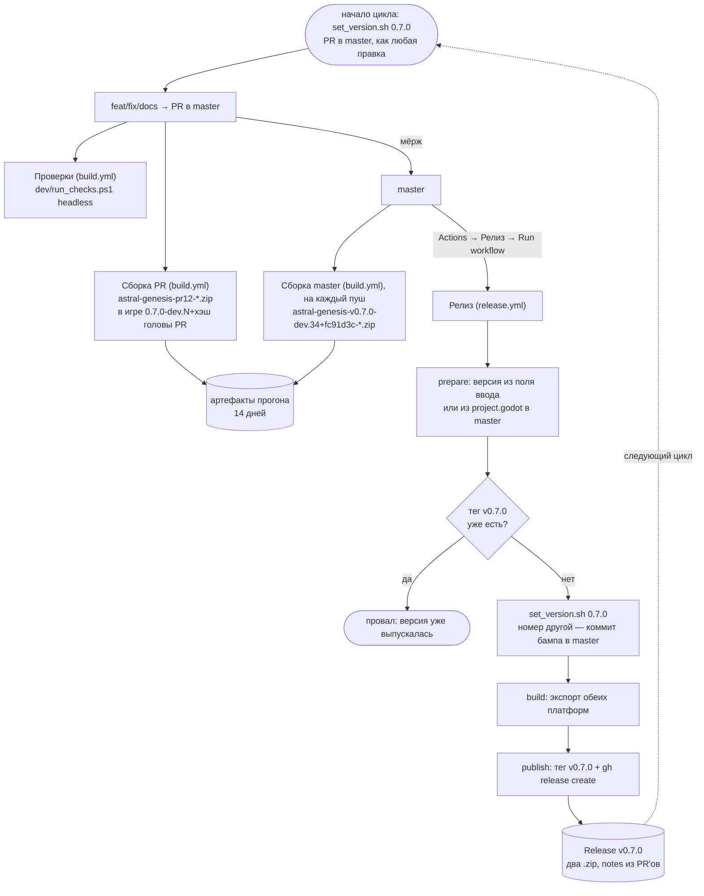

# Релизы и сборка

Как проект собирается в CI, как у любой сборки виден её коммит и как выходит
релиз. Правил два:

> **В `project.godot` лежит версия, которая разрабатывается.** Её поднимают раз,
> в начале цикла версии — `bash .github/scripts/set_version.sh 0.8.0` в PR, — и
> руками в файлах не правят.
>
> **Релиз — кнопка:** Actions → Релиз → Run workflow. Мёрж PR ничего не выпускает.

Всё остальное — номер у сборки из коммита, тег, имена архивов, сам релиз —
выводится автоматически. Почему процесс устроен так, а не релизными ветками, —
[[Работа в master и релизы тегами]].

## Схема потока



## Номер сборки

Снапшотов `-devN`/`-betaN` у проекта нет, поэтому номер у любой сборки обязан
говорить, из какого она коммита:

| Сборка | Номер (`config/version`, угол меню, оверлей) | Архив |
|---|---|---|
| релиз | `0.7.0` | `astral-genesis-v0.7.0-*.zip` |
| пуш в master, «Run workflow» у Сборки, `dev/release.ps1` | `0.7.0-dev.34+fc91d3c` | `astral-genesis-v0.7.0-dev.34+fc91d3c-*.zip` |
| PR | `0.7.0-dev.34+b93982e` — хэш головы PR | `astral-genesis-pr12-*.zip` |

- **`0.7.0`** — из `project.godot`: версия, которой сборка станет. **`dev.34`** —
  коммитов после последнего тега `vX.Y.Z`: по нему видно, какая из двух сборок
  новее, а `-dev` ставит сборку раньше релиза `0.7.0` при сортировке по semver.
  **`+fc91d3c`** — сам коммит; это метаданные сборки, в порядке они не участвуют.
- Номер считает [build_version.sh](../../../.github/scripts/build_version.sh)
  (`git describe` от последнего тега), вписывает на время сборки
  [set_version.sh](../../../.github/scripts/set_version.sh) — и не коммитит.
- Отвергнуто: `0.6.0-33-gfc91d3c` (вывод `git describe` как есть) называет
  сборку по прошлому релизу, хотя в `project.godot` уже разрабатывается
  следующий; `0.7.0+fc91d3c` по semver равен релизу `0.7.0` и не упорядочивает
  сборки между собой.
- **По PR номер берётся от головного коммита PR**, а не от merge-коммита,
  который CI собирает на самом деле: хэша merge-коммита нет ни в одной ветке, и
  со следующим пушем он пропадает.
- **Windows-метаданные `.exe`** принимают только цифры и точки: на `0.7.0-dev…`
  Godot предупреждает и пишет `1.0.0.0` (`EditorExportPreset::get_version`).
  Поэтому `set_version.sh` у не-релизной сборки задаёт `file_version` и
  `product_version` пресета явно — `0.7.0.34`, номер сборки четвёртым полем. У
  релиза поля пустые, и Godot выводит `0.7.0.0` сам.
- Где номер виден: угол главного меню и строка состояния
  [[Отладочный оверлей|отладочного оверлея]]; обоих держит
  `dev/version_label_check`.
- **Номеру нужна история с тегами**: джоб сборки клонирует с `fetch-depth: 0`,
  в клоне глубины 1 тегов нет, и `build_version.sh` падает с внятной ошибкой.
- **Версия уже выпущена, а номер не подняли** — `build_version.sh` пишет
  предупреждение (в CI — аннотацией прогона): сборка назвалась бы
  `0.7.0-dev.N` после релиза `0.7.0`.

## Что где лежит

| Файл | Роль |
|---|---|
| [build.yml](../../../.github/workflows/build.yml) | На каждый PR в master и на каждый пуш в master: headless-проверки из `dev/` (джоб «Headless-проверки», тот же `dev/run_checks.ps1`, что у разработчика) и сборка обеих платформ с номером из коммита. Артефакты живут 14 дней — ревьюер скачивает и играет, а по номеру в углу меню видно, из какого коммита сборка. |
| [release.yml](../../../.github/workflows/release.yml) | Тег, сборка, публикация релиза; бамп — только если номер отличается от `project.godot`. Срабатывает **только по кнопке** (`workflow_dispatch`). |
| [godot-setup](../../../.github/actions/godot-setup/action.yml) | Общий шаг для проверок и сборки: поставить Godot (шаблоны экспорта — по желанию), закэшировать, импортировать ресурсы. Здесь же — единственное место, где задана версия движка. |
| [godot-export](../../../.github/actions/godot-export/action.yml) | Сборка поверх `godot-setup`: номер на время сборки, экспорт пресета, упаковка в `.zip`. |
| [set_version.sh](../../../.github/scripts/set_version.sh) | Единственное место, где номер расходится по файлам: `X.Y.Z` или `X.Y.Z-dev.N+HASH`. |
| [build_version.sh](../../../.github/scripts/build_version.sh) | Номер сборки из коммита (см. выше). |
| [dev/release.ps1](../../../dev/release.ps1) | Локальная сборка в `dist/` (release или debug), по флагу — публикация релиза. |
| [dev/import.sh](../../../dev/import.sh) | Импорт ресурсов без редактора — в облачной сессии и любом headless-окружении (см. ниже). |
| [session-start.sh](../../../.claude/hooks/session-start.sh) | SessionStart-хук облачной сессии Claude (см. «Облачная сессия Claude»). |

## Почему так, а не иначе

- **Многопоточный импорт на раннере выключен.** Это и было то самое «прогон
  застрял на 22%»: главный поток Godot ждёт группу задач `WorkerThreadPool`,
  она не завершается, и раз в секунду печатается один и тот же элемент —
  `reimport | scratch_002.ogg`. Файл тут ни при чём, это просто индекс, на
  котором застыл счётчик завершённых задач: тот же `scratch_002.ogg`
  импортируется за миллисекунды и под Windows, и под Linux, а холодный импорт
  всех 679 ассетов локально проходит за 9 секунд. Ловилось на обеих ОС и всегда
  ровно на 22%, потому что очередь импорта детерминирована. Лечится
  `editor/import/use_multiple_threads=false` — action дописывает вторую секцию
  `[editor]` в конец `project.godot` уже на раннере (`ConfigFile` сливает
  одноимённые секции, так что дубль безопасен). Терять нечего: однопоточный
  импорт всего проекта стоит секунды. **Только в `project.godot`:**
  `override.cfg`, который обычно перекрывает настройки проекта, импорт не
  читает — проверено 25.09 на 4.7.2 в облачном контейнере, с ним висит так же (там
  — на `ui.csv` и `pattern_01.svg`: застывший элемент меняется от окружения).
- **Импорт ограничен таймаутом** (`IMPORT_TIMEOUT`, 10 минут). Если движок
  снова где-нибудь зависнет, прогон падает с внятным сообщением, а не висит до
  таймаута джоба и не ждёт, пока его отменят руками.
- **Обе платформы собираются на `ubuntu-latest`.** Сначала было по раннеру на
  платформу, чтобы Windows-сборка делалась «дома». Причиной переезда считался
  медленный дисковый ввод-вывод `windows-latest` — на самом деле это было то же
  зависание импорта, что описано выше. Переезд всё равно оправдан: движок,
  шаблоны и импорт переиспользуются между платформами, второй экспорт доходит
  за секунды. Кросс-экспорт при этом ничего не стоит: rcedit в Godot 4.4+
  больше не нужен (в `editor_settings-4.7.tres` ключа `export/windows/rcedit`
  уже нет — метаданные PE пишет сам движок), а `.import`-кэш общий для обеих
  платформ. Если кросс-экспортированный `.exe` когда-нибудь окажется битым
  (подозревать в первую очередь бейк шейдеров под d3d12), вернуть Windows на
  свой раннер — это `runs-on` и вызов action'а.
- **`.godot/` кэшируется между прогонами.** Ключ — хэш ассетов, `restore-keys`
  даёт частичное попадание, после которого движок переимпортирует только
  изменившееся. Без этого каждый PR платил бы полный холодный импорт.
- **Номер под тегом — тот, что в `project.godot` внутри тега.** Тег ставится на
  коммит, где номер уже проставлен (обычно — последний коммит master: номер
  подняли в начале цикла; иначе — коммит бампа от бота), а сборка релиза идёт с
  этого же коммита. Иначе номер разъезжается — ровно так вышло с v0.4.0, где тег
  есть, а в `project.godot` внутри сборки осталось `0.3.0`. Файлов с номером три
  места (`config/version` и два `export_path`), поэтому правит их только
  `set_version.sh`.
- **Тег лёгкий, бамп — через API, иначе у релиза нет «Verified».** Значок в
  списке тегов GitHub берёт у аннотированного тега подпись самого объекта тега,
  у лёгкого — подпись коммита под ним. Бот подписать тег нечем, поэтому
  v0.5.0 и v0.6.0 (аннотированные, от `git tag -a` в CI) вышли без значка, а у
  v0.6.0 и коммит бампа, запушенный через git, не подписан. Теперь `release.yml`
  ставит лёгкий тег, а бамп создаёт мутацией `createCommitOnBranch`: коммиты
  бота через API, как и мёржи PR кнопкой, GitHub подписывает сам. Следствие:
  тег получит значок, только если коммит под ним подписан — то есть если в
  master не пушили мимо PR.
- **Релиз — кнопкой, а не мёржем.** Все PR идут прямо в master, и мёрж — обычная
  работа, а не решение выпустить версию. Раньше решением был мёрж PR из
  `release/vX.Y.Z`: номер надо было знать заранее, а фичи ветвились от релизной
  ветки и синхронизировались с master. Варианты «номер только на время сборки» и
  «бот открывает PR с бампом» разобраны и отвергнуты в
  [[Работа в master и релизы тегами]].
- **Следующую версию поднимает человек, в начале цикла, а не бот после
  релиза.** Бот угадывал бы номер (0.8.0? 0.7.1? 1.0.0?) и добавлял второй
  служебный коммит на каждый релиз. Забыть поднять не страшно: сборки master
  предупреждают, что версия уже выпущена, а кнопка релиза упадёт на занятом теге.
- **Релиз помечается предварительным**, пока мажорная версия нулевая — чтобы
  «Latest release» не выглядел обещанием готовой игры.
- **Импорт прогоняется дважды.** `.godot/` в репозитории нет, импорт всегда
  холодный, а часть ссылок между сценами резолвится только после того, как
  первый проход сгенерирует `.uid`-файлы.

## Как выпустить версию

1. **Начало цикла** — PR с `bash .github/scripts/set_version.sh 0.7.0` (удобно —
   вместе с доской версии, [[v0.7.0]]). С этого момента все сборки называются
   `0.7.0-dev.N+хэш`.
2. **Работа** — PR в master. Каждый PR и каждый пуш в master собирают обе
   платформы; красный крестик в PR = экспорт сломан, чинить до мёржа.
3. **Выпуск** — Actions → **Релиз** → Run workflow, поле версии пустое. Тег
   `v0.7.0` встаёт на последний коммит master, дальше без участия человека:
   сборка → релиз.
4. **Следующий цикл** — снова пункт 1.

Выпустить под другим номером — ввести его в поле: бот проставит номер и
закоммитит бамп в master сам. Перевыпустить сломанный релиз — снести тег и
релиз руками (см. «Грабли») и нажать кнопку снова.

Локальный экспорт из редактора кладёт файлы в `builds/` с именем текущей
версии из `export_presets.cfg`; `builds/` в `.gitignore` и в релиз не едет.

## Локальная сборка

[`dev/release.ps1`](../../../dev/release.ps1) — «собери мне готовые архивы».
Ветка любая, ничего никуда не отправляется, результат в `dist/`.

```powershell
pwsh dev/release.ps1                                # обе платформы, release
pwsh dev/release.ps1 -Config debug -Platform windows  # быстро, погонять самому
pwsh dev/release.ps1 -Platform linux                  # только одна платформа
```

- **`-Config release` (по умолчанию)** — то, что раздают. **`-Config debug`** —
  отладочные шаблоны: работает удалённый отладчик, видны стеки и `print`. Архив
  получает суффикс `-debug`, чтобы не перепутать с раздаточным; сборки лежат
  рядом и не затирают друг друга (`build/windows-debug`, `build/windows-release`).
- **Номер — тот же, что у CI**: `0.7.0-dev.N+хэш` от `build_version.sh`, а на
  коммите выпущенного тега — просто `0.7.0`; им же метится архив. `-Version
  X.Y.Z` собирает как релиз под этим номером. Номер вписывается только на время
  сборки: `project.godot` и `export_presets.cfg` сохраняются байтами и
  возвращаются в `finally`, даже если экспорт упал.

Нужны: Godot той же версии, что `godot-version` в `godot-setup/action.yml` (скрипт читает её
оттуда и предупредит о расхождении), и шаблоны экспорта под обе платформы.
Для скриптов версии — `bash`: на Windows из Git for Windows, на Linux/macOS свой.

### Публикация со своей машины

`-Publish` доводит дело до релиза на GitHub — то же, что кнопка у `release.yml`:
номер из `project.godot` (или `-Version`), коммит бампа, если номер другой, тег
`vX.Y.Z`, пуш master и тега, `gh release create`. Требует ветки **master**,
`-Config release` и авторизованного `gh`; спрашивает подтверждение, если не
передан `-Force`. Тег здесь аннотированный, и «Verified» у него будет, только
если git разработчика подписывает теги (`tag.gpgSign`) ключом, загруженным на
GitHub.

**Это запасной путь, а не основной** — когда Actions недоступен.

### Устройство и грабли

- **Zip пишется вручную**, а не `Compress-Archive`: тот не хранит права POSIX, и
  распакованный на Linux бинарник оказывался бы без `+x`. Скрипт проставляет
  `0755` исполняемому файлу через `ExternalAttributes` — то же, что делает `zip`
  на раннере.
- **Обход зависания импорта** тот же, что в CI, но временный: блок с
  `use_multiple_threads=false` помечен комментарием и срезается сразу после
  импорта, чтобы не осесть в `project.godot` и не уехать в коммит.

## Облачная сессия Claude

Клон в облачном контейнере Claude Code голый: вместо ассетов LFS-указатели,
`addons/gecs` пуст, тегов нет, Godot и PowerShell нет. Всё это ставит
SessionStart-хук [session-start.sh](../../../.claude/hooks/session-start.sh)
(зарегистрирован в `.claude/settings.json`), и только в облаке: у разработчика
локально Windows со своими Godot и LFS, `CLAUDE_CODE_REMOTE` там не выставлен, и
хук сразу выходит.

По шагам, каждый пропускается, если уже сделан:

- **git-lfs** — из apt, не вышло — бинарник v3.7.0 с GitHub; затем
  `git lfs install --local && git lfs pull`. **Не подменять указатели файлами,
  скачанными мимо git-lfs**: без фильтра git увидит изменение и закоммитит
  бинарник мимо LFS.
- **`git submodule update --init`** и **теги** (`git fetch --tags`) — для
  номера сборки и скилла `project-status`.
- **Godot** — версия из `godot-setup/action.yml`, в `~/.cache/astral-genesis/`;
  ссылка `godot` в PATH и `GODOT` в окружении сессии (его читает
  `dev/run_checks.ps1`). **PowerShell** — ради того же `run_checks.ps1`.
- **Холодный импорт** — [dev/import.sh](../../../dev/import.sh), только если
  `.godot/` ещё нет. Решено по замеру 25.09: с нуля хук идёт ~45 с, из них
  импорт ~33 с (два прохода), а проверки гоняет почти каждая сессия и без
  импорта они падают. Повторный старт (resume, compact) — меньше секунды. После
  правки ассетов импорт добивается той же командой; `godot --import` напрямую не
  годится — виснет многопоточный импорт (см. «Почему так»).
- **Импорт переписывает отслеживаемые файлы** — сейчас меши тел
  `assets/monsters/models/*.res`
  ([[Баг — тела монстров без текстур в экспортированной сборке]]). Хук
  возвращает из git всё, что было чистым до импорта, и говорит об этом в
  контексте сессии: начинать с грязного дерева — значит увезти баг импорта в
  первый же коммит.

Хук синхронный, таймаут 300 с (у хуков по умолчанию 60 — свежему контейнеру
впритык). Прокси облака закрывает `api.github.com`, поэтому версии git-lfs и
PowerShell прибиты в хуке и качаются прямыми ссылками на `github.com`. Нативного
рантайма byProd в контейнере нет — звука не будет, это штатно ([[Звук]]).

## Грабли

- **Кнопка без поднятой версии падает.** Если в `project.godot` всё ещё номер
  прошлого релиза, пустое поле даёт «тег уже существует» — это напоминание
  поднять версию (или ввести номер в поле), а не поломка. Теги — `vX.Y.Z` без
  префикса; исторические `alpha-v0.2.0`…`alpha-v0.3.0` остались как есть, и
  `build_version.sh` их не видит (`--match 'v[0-9]*'`).
- **Тег занят — прогон падает специально.** Перевыпуск требует сначала снести
  тег и релиз руками: молча перезаписать уже скачанную кем-то сборку хуже, чем
  упасть.
- **Защита ветки master.** Когда номер в поле отличается от `project.godot`,
  `release.yml` коммитит бамп напрямую в master (через API — правила защиты
  его тоже касаются). Защиту решено не включать
  ([[Работа в master и релизы тегами]]); если понадобится — боту нужно
  исключение (allow specified actors to bypass) или переход на вариант «номер
  только на время сборки», а не на PR от бота.
- **Godot обновился — правится одно место:** `godot-version` по умолчанию в
  [godot-setup/action.yml](../../../.github/actions/godot-setup/action.yml). Версия входит
  в ключ кэша, так что старый движок не «прилипнет».
- **`permissions:` в workflow — это allowlist, не дополнение к умолчаниям.**
  Как только в файле объявлен хоть один scope, ВСЕ неперечисленные сбрасываются
  в `none` — репозиторий/организация тут ни при чём. `release.yml` объявлял
  только `contents: write` (нужен для коммита бампа и тега), из-за чего
  `actions/cache` внутри `godot-export` не мог сохранить кэш движка и
  импортированных ресурсов — `Failed to save … token has no writable scopes` в
  annotations прогона. Сама сборка при этом не падает: кэш — это только ускоритель
  повторных прогонов, промах бьёт по времени, не по результату. Нашлось на
  первом реальном прогоне пайплайна (v0.5.0) — `build.yml` без объявленного
  `permissions:` наследует умолчания репозитория и не задет.

## Смотри также

- [Цикл забега](Цикл%20забега.md) — что именно собирается.
- [Состояние проекта](../Состояние%20проекта.md)
