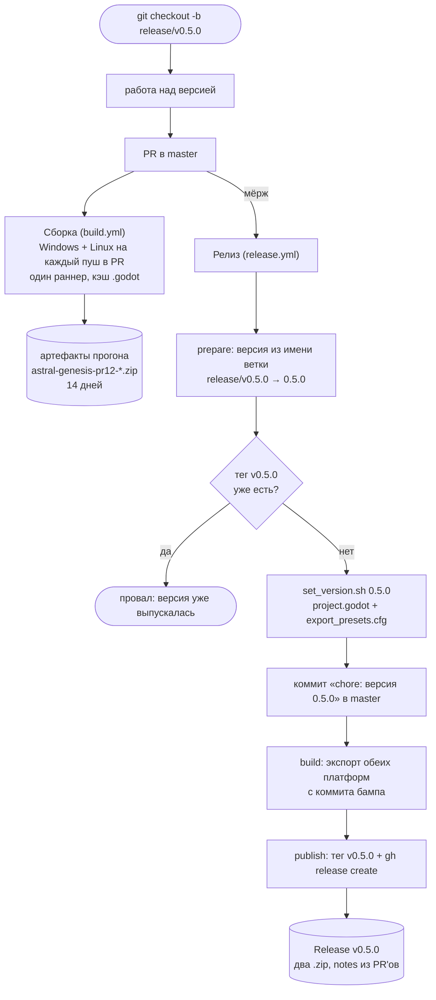

# Релизы и сборка

Как проект собирается в CI и как из влитой ветки получается релиз на GitHub.
Главное правило одно:

> **Версию нигде не пишут руками. Версия — это имя ветки `release/vX.Y.Z`.**

Всё остальное (номер в `project.godot`, имена файлов сборок, тег, сам релиз)
выводится из имени ветки автоматически.

## Схема потока



## Что где лежит

| Файл | Роль |
|---|---|
| [build.yml](../../../.github/workflows/build.yml) | Проверочная сборка на каждый PR в master. Артефакты живут 14 дней — ревьюер скачивает и играет. |
| [release.yml](../../../.github/workflows/release.yml) | Бамп версии, тег, сборка, публикация релиза. Срабатывает только на **влитый** PR из ветки `release/v*`. |
| [action.yml](../../../.github/actions/godot-export/action.yml) | Общий шаг: поставить Godot с шаблонами экспорта, импортировать ресурсы, собрать, упаковать в `.zip`. |
| [set_version.sh](../../../.github/scripts/set_version.sh) | Единственное место, где версия расходится по файлам. |
| [dev/release.ps1](../../../dev/release.ps1) | Локальная сборка в `dist/` (release или debug), по флагу — публикация релиза. |

## Почему так, а не иначе

- **Многопоточный импорт на раннере выключен.** Это и было то самое «прогон
  застрял на 22%»: главный поток Godot ждёт группу задач `WorkerThreadPool`,
  она не завершается, и раз в секунду печатается один и тот же элемент —
  `reimport | scratch_002.ogg`. Файл тут ни при чём, это просто индекс, на
  котором застыл счётчик завершённых задач: тот же `scratch_002.ogg`
  импортируется за миллисекунды и под Windows, и под Linux, а холодный импорт
  всех 679 ассетов локально проходит за 9 секунд. Ловилось на обеих ОС и всегда
  ровно на 22%, потому что очередь импорта детерминирована. Лечится
  `editor/import/use_multiple_threads=false` — action дописывает вторую секцию
  `[editor]` в конец `project.godot` уже на раннере (`ConfigFile` сливает
  одноимённые секции, так что дубль безопасен). Терять нечего: однопоточный
  импорт всего проекта стоит секунды.
- **Импорт ограничен таймаутом** (`IMPORT_TIMEOUT`, 10 минут). Если движок
  снова где-нибудь зависнет, прогон падает с внятным сообщением, а не висит до
  таймаута джоба и не ждёт, пока его отменят руками.
- **Обе платформы собираются на `ubuntu-latest`.** Сначала было по раннеру на
  платформу, чтобы Windows-сборка делалась «дома». Причиной переезда считался
  медленный дисковый ввод-вывод `windows-latest` — на самом деле это было то же
  зависание импорта, что описано выше. Переезд всё равно оправдан: движок,
  шаблоны и импорт переиспользуются между платформами, второй экспорт доходит
  за секунды. Кросс-экспорт при этом ничего не стоит: rcedit в Godot 4.4+
  больше не нужен (в `editor_settings-4.7.tres` ключа `export/windows/rcedit`
  уже нет — метаданные PE пишет сам движок), а `.import`-кэш общий для обеих
  платформ. Если кросс-экспортированный `.exe` когда-нибудь окажется битым
  (подозревать в первую очередь бейк шейдеров под d3d12), вернуть Windows на
  свой раннер — это `runs-on` и вызов action'а.
- **`.godot/` кэшируется между прогонами.** Ключ — хэш ассетов, `restore-keys`
  даёт частичное попадание, после которого движок переимпортирует только
  изменившееся. Без этого каждый PR платил бы полный холодный импорт.
- **Версия берётся из имени ветки, а не из `project.godot`.** Иначе номер живёт
  в трёх местах (`config/version` и два `export_path`), и рассинхрон замечается
  уже после релиза — ровно так вышло с v0.4.0, где тег есть, а в
  `project.godot` внутри сборки осталось `0.3.0`.
- **Тег ставится на коммит бампа**, а не на мёрж-коммит: иначе в теге лежал бы
  исходник со старым номером версии.
- **Релиз помечается предварительным**, пока мажорная версия нулевая — чтобы
  «Latest release» не выглядел обещанием готовой игры.
- **Импорт прогоняется дважды.** `.godot/` в репозитории нет, импорт всегда
  холодный, а часть ссылок между сценами резолвится только после того, как
  первый проход сгенерирует `.uid`-файлы.

## Как выпустить версию

1. `git checkout -b release/v0.5.0` от master — это единственный момент, когда
   номер версии произносится вслух.
2. Работать, пушить, открыть PR в master. На каждый пуш собираются обе
   платформы; красный крестик в PR = экспорт сломан, чинить до мёржа.
3. Влить PR. Дальше без участия человека: бамп → тег → сборка → релиз.

Собрать релиз руками (например, перевыпустить сломанный) — вкладка **Actions →
Релиз → Run workflow**, ввести версию без `v`. Тот же путь, но версия берётся из
поля ввода.

Локальный экспорт из редактора кладёт файлы в `builds/` с тем именем, которое
записал последний `set_version.sh`; `builds/` в `.gitignore` и в релиз не едет.

## Локальная сборка

[`dev/release.ps1`](../../../dev/release.ps1) — «собери мне готовые архивы».
Ветка любая, ничего никуда не отправляется, результат в `dist/`.

```powershell
pwsh dev/release.ps1                                # обе платформы, release
pwsh dev/release.ps1 -Config debug -Platform windows  # быстро, погонять самому
pwsh dev/release.ps1 -Platform linux                  # только одна платформа
```

- **`-Config release` (по умолчанию)** — то, что раздают. **`-Config debug`** —
  отладочные шаблоны: работает удалённый отладчик, видны стеки и `print`. Архив
  получает суффикс `-debug`, чтобы не перепутать с раздаточным; сборки лежат
  рядом и не затирают друг друга (`build/windows-debug`, `build/windows-release`).
- **Версия трогается только на версионной ветке.** На `release/vX.Y.Z` скрипт
  зовёт `set_version.sh` и метит архив как `v0.5.0`; на любой другой ветке версия
  остаётся той, что в `project.godot`, а меткой становится имя ветки — как у CI
  для сборок по PR.

Нужны: Godot той же версии, что `godot-version` в `action.yml` (скрипт читает её
оттуда и предупредит о расхождении), и шаблоны экспорта под обе платформы.
Для проставления версии — `bash` из Git for Windows.

### Публикация со своей машины

`-Publish` доводит дело до релиза на GitHub: коммит бампа, тег `vX.Y.Z`, пуш,
`gh release create`. Требует версионной ветки, `-Config release` и
авторизованного `gh`; спрашивает подтверждение, если не передан `-Force`.

**Это запасной путь, а не основной.** Обычно версия выпускается мёржем PR в
master, и `release.yml` делает всё то же самое сам. Локально — когда Actions
недоступен.

### Устройство и грабли

- **Zip пишется вручную**, а не `Compress-Archive`: тот не хранит права POSIX, и
  распакованный на Linux бинарник оказывался бы без `+x`. Скрипт проставляет
  `0755` исполняемому файлу через `ExternalAttributes` — то же, что делает `zip`
  на раннере.
- **Обход зависания импорта** тот же, что в CI, но временный: блок с
  `use_multiple_threads=false` помечен комментарием и срезается сразу после
  импорта, чтобы не осесть в `project.godot` и не уехать в коммит.
- **Тег вешается на текущую ветку**, а не на master — в master версия приедет
  обычным мёржем PR. Но тег после этого занят, и `release.yml` на мёрже честно
  упадёт с «версия уже выпускалась»: это ожидаемо, релиз-то уже выпущен.

## Грабли

- **Ветка обязана называться `release/vX.Y.Z`.** PR из ветки с другим именем
  вливается молча и релиза не выпускает — это осознанно: правки доков и
  хотфиксы не должны рожать версию. Теги при этом остаются `vX.Y.Z` без
  префикса; исторические `alpha-v0.2.0`…`alpha-v0.3.0` остались как есть.
- **Тег занят — прогон падает специально.** Перевыпуск требует сначала снести
  тег и релиз руками: молча перезаписать уже скачанную кем-то сборку хуже, чем
  упасть.
- **Защита ветки master.** `release.yml` пушит коммит бампа напрямую в master.
  Если на master включить protection с обязательным PR, пуш начнёт отлетать —
  тогда боту нужно исключение (allow specified actors to bypass) или отдельный
  токен.
- **Godot обновился — правится одно место:** `godot-version` по умолчанию в
  [action.yml](../../../.github/actions/godot-export/action.yml). Версия входит
  в ключ кэша, так что старый движок не «прилипнет».
- **`permissions:` в workflow — это allowlist, не дополнение к умолчаниям.**
  Как только в файле объявлен хоть один scope, ВСЕ неперечисленные сбрасываются
  в `none` — репозиторий/организация тут ни при чём. `release.yml` объявлял
  только `contents: write` (нужен для пуша бампа и тега), из-за чего
  `actions/cache` внутри `godot-export` не мог сохранить кэш движка и
  импортированных ресурсов — `Failed to save … token has no writable scopes` в
  annotations прогона. Сама сборка при этом не падает: кэш — это только ускоритель
  повторных прогонов, промах бьёт по времени, не по результату. Нашлось на
  первом реальном прогоне пайплайна (v0.5.0) — `build.yml` без объявленного
  `permissions:` наследует умолчания репозитория и не задет.

## Смотри также

- [Цикл забега](Цикл%20забега.md) — что именно собирается.
- [Состояние проекта](../Состояние%20проекта.md)
