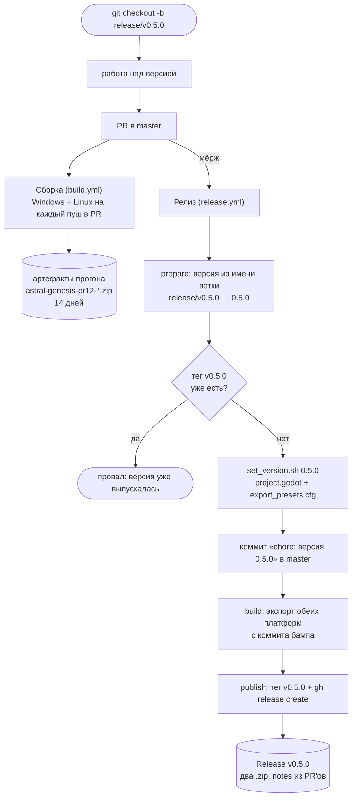

# Релизы и сборка

Как проект собирается в CI и как из влитой ветки получается релиз на GitHub.
Главное правило одно:

> **Версию нигде не пишут руками. Версия — это имя ветки `release/vX.Y.Z`.**

Всё остальное (номер в `project.godot`, имена файлов сборок, тег, сам релиз)
выводится из имени ветки автоматически.

## Схема потока

## Что где лежит

| Файл | Роль |
|---|---|
| [build.yml](../../../.github/workflows/build.yml) | Проверочная сборка на каждый PR в master. Артефакты живут 14 дней — ревьюер скачивает и играет. |
| [release.yml](../../../.github/workflows/release.yml) | Бамп версии, тег, сборка, публикация релиза. Срабатывает только на **влитый** PR из ветки `release/v*`. |
| [action.yml](../../../.github/actions/godot-export/action.yml) | Общий шаг: поставить Godot с шаблонами экспорта, импортировать ресурсы, собрать, упаковать в `.zip`. |
| [set_version.sh](../../../.github/scripts/set_version.sh) | Единственное место, где версия расходится по файлам. |

## Почему так, а не иначе

- **Каждая платформа собирается на своём раннере** (`windows-latest` → Windows,
  `ubuntu-latest` → Linux). Кросс-экспорт Windows-сборки с Linux упирается в
  две вещи: бейк шейдеров (`shader_baker/enabled=true`) под форсированный
  d3d12 и запись метаданных в PE-заголовок (иконка, `product_name`,
  копирайт из пресета). Репозиторий публичный, минуты Actions бесплатны —
  платить сложностью тут не за что.
- **Версия берётся из имени ветки, а не из `project.godot`.** Иначе номер живёт
  в трёх местах (`config/version` и два `export_path`), и рассинхрон замечается
  уже после релиза — ровно так вышло с v0.4.0, где тег есть, а в
  `project.godot` внутри сборки осталось `0.3.0`.
- **Тег ставится на коммит бампа**, а не на мёрж-коммит: иначе в теге лежал бы
  исходник со старым номером версии.
- **Релиз помечается предварительным**, пока мажорная версия нулевая — чтобы
  «Latest release» не выглядел обещанием готовой игры.
- **Импорт прогоняется дважды.** `.godot/` в репозитории нет, импорт всегда
  холодный, а часть ссылок между сценами резолвится только после того, как
  первый проход сгенерирует `.uid`-файлы.

## Как выпустить версию

1. `git checkout -b release/v0.5.0` от master — это единственный момент, когда
   номер версии произносится вслух.
2. Работать, пушить, открыть PR в master. На каждый пуш собираются обе
   платформы; красный крестик в PR = экспорт сломан, чинить до мёржа.
3. Влить PR. Дальше без участия человека: бамп → тег → сборка → релиз.

Собрать релиз руками (например, перевыпустить сломанный) — вкладка **Actions →
Релиз → Run workflow**, ввести версию без `v`. Тот же путь, но версия берётся из
поля ввода.

Локальный экспорт из редактора кладёт файлы в `builds/` с тем именем, которое
записал последний `set_version.sh`; `builds/` в `.gitignore` и в релиз не едет.

## Грабли

- **Ветка обязана называться `release/vX.Y.Z`.** PR из ветки с другим именем
  вливается молча и релиза не выпускает — это осознанно: правки доков и
  хотфиксы не должны рожать версию. Теги при этом остаются `vX.Y.Z` без
  префикса; исторические `alpha-v0.2.0`…`alpha-v0.3.0` остались как есть.
- **Тег занят — прогон падает специально.** Перевыпуск требует сначала снести
  тег и релиз руками: молча перезаписать уже скачанную кем-то сборку хуже, чем
  упасть.
- **Защита ветки master.** `release.yml` пушит коммит бампа напрямую в master.
  Если на master включить protection с обязательным PR, пуш начнёт отлетать —
  тогда боту нужно исключение (allow specified actors to bypass) или отдельный
  токен.
- **Godot обновился — правится одно место:** `godot-version` по умолчанию в
  [action.yml](../../../.github/actions/godot-export/action.yml). Версия входит
  в ключ кэша, так что старый движок не «прилипнет».

## Смотри также

- [Цикл забега](Цикл%20забега.md) — что именно собирается.
- [Состояние проекта](../Состояние%20проекта.md)
