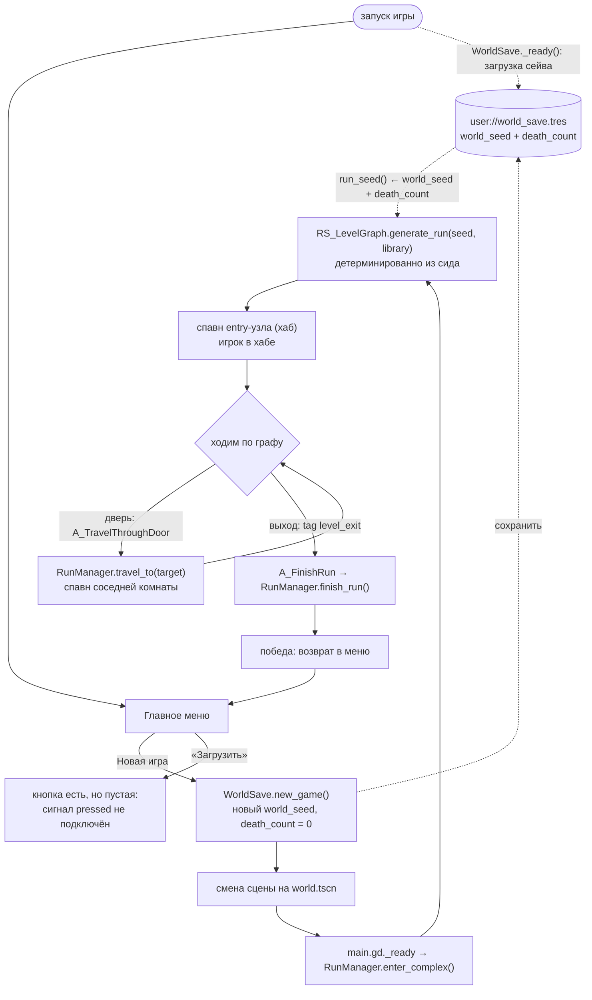

# Цикл забега

Как забег живёт от главного меню до конца - какие автолоады и системы за что
отвечают. Забег - это **граф уровня**, а не линейный уровень.

## Схема потока

## 1. Новая игра

- **Главное меню** ([main_menu.gd](../../../src/ui/main_menu/main_menu.gd)) на «Новая
  игра» зовёт `WorldSave.new_game()` — тот катит новый `world_seed` и обнуляет
  `death_count`, — затем меняет сцену на `world.tscn`.
- Меню-фон — 3D-сцена `L_menu_map.tscn` с покачивающейся камерой
  ([l_menu_map.gd](../../../src/levels/menu_map/l_menu_map.gd)).
- **Пробел:** кнопка «Загрузить» в меню есть, но пустая — у неё не подключён
  сигнал `pressed` (в отличие от «Новая игра»/«Настройки»/«Выйти»), хотя
  `WorldSave` умеет восстанавливать сохранение. См.
  [[Состояние проекта#Известные пробелы]].

## 2. Старт мира

`world.tscn` → [main.gd](../../../src/world/main.gd):
1. `ECS.world = world`, включает `UIManager`, захватывает курсор, вешает HUD.
2. `RunManager.enter_complex()` — точка входа в забег.

`RunManager.enter_complex()`:
1. Если сид не передан — берёт `WorldSave.save.run_seed()` (детерминированно из
   `world_seed` + `death_count`).
2. `RS_LevelGraph.new().generate_run(seed, GameConfig.config.room_preset_library)`
   строит **весь** граф комплекса сразу.
3. Спавнит **только entry-узел** (хаб) и ставит туда игрока.

### Что такое граф ([rs_level_graph.gd](../../../src/resources/world_generator/rs_level_graph.gd))

- Слои по глубине `[4, 3, 2, 1, 0]` (поверхность = 0). Каждый слой — 1–3 «этажа»
  примерно по 4 комнаты, связанных основным деревом + доп. рёбра.
- Слои соединяются вертикальными коннекторами (часть — заперты `locked_by` ключом).
- Домашняя лаборатория игрока — гарантированный тупик на `HOME_DEPTH = 3`.
- Выходы (`level_exit`) — на поверхностном слое.
- Сцены комнат назначаются последним проходом через
  `RS_RoomPresetLibrary.select_preset`; entry всегда переопределяется на
  авторский **хаб** (`hub.tscn`).

> **Про `HOME_DEPTH`.** Это **не** игровой параметр: ни одна рантайм-система не
> читает `depth`, на геймплей само число никак не влияет. Это якорь
> **генераторного инварианта** — три места обязаны ссылаться на один и тот же
> слой: выбор домашнего узла (`layers_by_depth[HOME_DEPTH]`), размещение
> гарантированного тупика в комнате 0/этаж 0 этого слоя, и исключение дома из
> кандидатов в `vertical_hub` (иначе у тупика появится второе ребро). Поэтому это
> именованная константа, а не литерал `3` в трёх местах — рассинхрон тихо ломает
> тупик. Значение должно входить в `DEPTHS`; структурно дом стоит в **середине**
> (под ним есть слой, над ним — путь к выходу), а `3` = зона L3 по лору
> ([[История]]).

## 3. Активная комната и переходы

`RunManager` держит **одну** активную комнату (стриминга соседей пока нет). В
планах — загружать **слой целиком** (все его комнаты одновременно в дереве
сцены), а не по одной; под это зарезервирован `RS_LevelGraph.get_nodes_by_depth`
(сейчас без вызовов).

- **Спавн** (`_spawn_room`): грузит сцену комнаты, регистрирует её в мире, затем
  **явно** регистрирует все вложенные сущности (`_register_room_children`) — GECS
  не обходит дерево в поисках вложенных `Entity`.
- **Двери** (`_bind_doors`): двери комнаты несут `C_DoorSlot`; RunManager
  сортирует их по `slot_id` и штампует `C_DoorPortal { target_node_id, locked_by }`
  по рёбрам узла. Лишние слоты запечатываются (`C_Interactable.enabled = false`).
  Подробнее о связке двери↔рёбра — в `CLAUDE.md` (раздел «Doors ↔ graph edges»)
  и комментариях `RunManager._bind_doors`.
- **Переход** (`A_TravelThroughDoor` → `RunManager.travel_to`): читает
  `C_DoorPortal` двери, проверяет замок, спавнит целевой узел. На прибытии игрок
  ставится у двери, ведущей обратно (`_find_return_door`), иначе — в `SpawnPoint`.
- **Замки:** `A_TravelThroughDoor` при `is_locked()` сейчас лишь печатает в
  консоль — ключей/инвентаря ещё нет.

## 4. Конец забега

- **Победа:** комната-выход (`exit_room.tscn`, tag `level_exit`) несёт действие
  `A_FinishRun` → `RunManager.finish_run()`: деспавн комнаты, сигнал
  `run_finished`, возврат в меню. Экрана победы пока нет — уходим в меню-заглушку.
- **Смерть:** **не подключена.** `S_Lifespan` при истечении запаса шлёт событие
  `run_ended`, но на него никто не подписан; `WorldSave.record_death()` тоже
  никем не зовётся. См. [[Состояние проекта#Известные пробелы]].

## 5. Сохранение и загрузка

- [WorldSave](../../../src/autoloads/world_save.gd) хранит `RS_WorldSave`
  (`world_seed` + `death_count`) в `user://world_save.tres`.
- Генерация детерминирована от `run_seed()`, поэтому один и тот же сид даёт один
  и тот же комплекс. Рост `death_count` меняет будущую генерацию.
- [SkillManager](../../../src/autoloads/skill_manager.gd) и
  [SettingsManager](../../../src/autoloads/settings_manager.gd) персистят свои
  ресурсы отдельно (`user://skills.tres`, `user://settings.tres`).

## 6. Влияние смертей на забег

Задумано: смерть тела ≠ конец забега (выброс БФЖ в призрака), а истечение
распада в развоплощённом состоянии = настоящая смерть → `death_count += 1` →
другая генерация следующего комплекса. Механика захвата/распада **реализована**
(см. [[Взаимодействие]] и [[Состояние проекта]]), но замкнутого контура
«смерть → возврат в хаб → инкремент» ещё нет.
