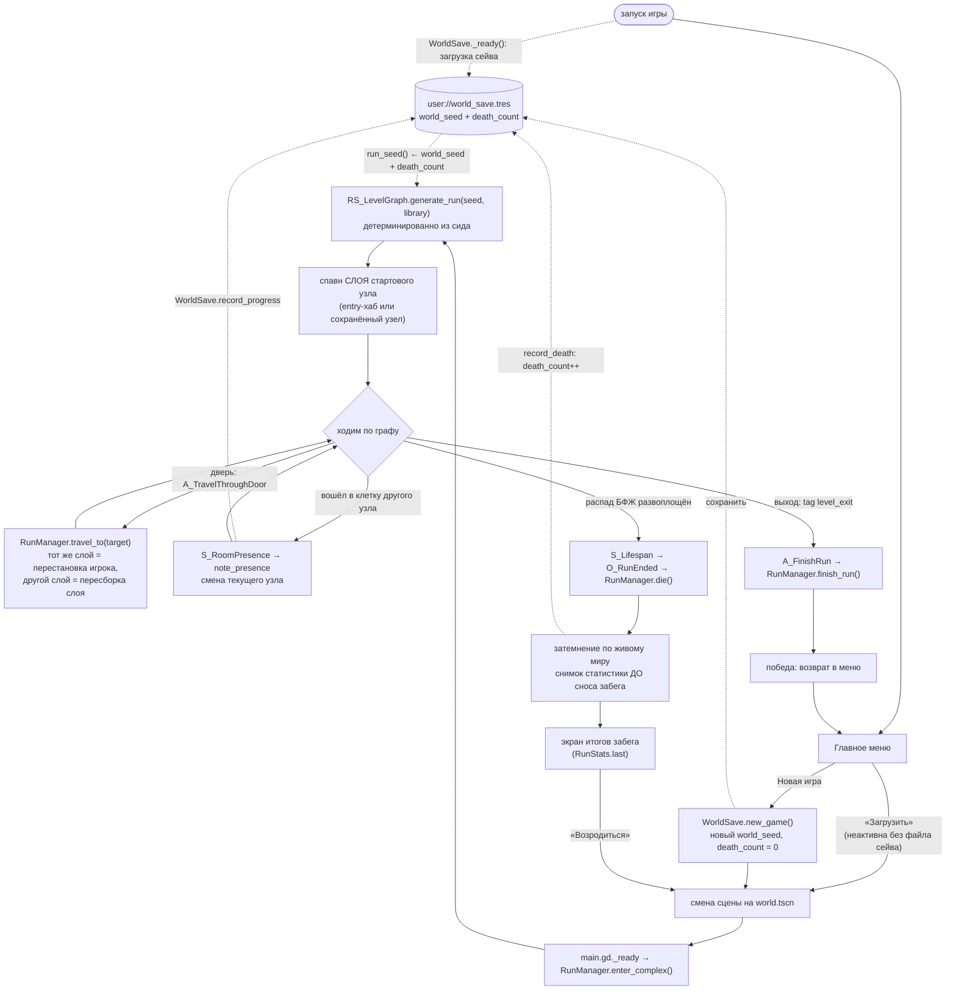

# Цикл забега

Как забег живёт от главного меню до конца - какие автолоады и системы за что
отвечают. Забег - это **граф уровня**, а не линейный уровень.

## Схема потока

## 1. Новая игра

- **Главное меню** ([main_menu.gd](../../../src/ui/main_menu/main_menu.gd)) на «Новая
  игра» зовёт `WorldSave.new_game()` — тот катит новый `world_seed` и обнуляет
  `death_count`, — затем меняет сцену на `world.tscn`.
- Меню-фон — 3D-сцена `L_menu_map.tscn` с покачивающейся камерой
  ([l_menu_map.gd](../../../src/levels/menu_map/l_menu_map.gd)).
- **«Загрузить»** просто меняет сцену на `world.tscn`, ничего не катя: сейв уже
  поднят `WorldSave._ready()`, а `RunManager` возьмёт из него и сид, и узел, на
  котором игрок остановился. Кнопка **неактивна**, пока на диске нет файла
  сейва (`WorldSave.has_save_file`) — продолжать нечего.

## 2. Старт мира

`world.tscn` → [main.gd](../../../src/world/main.gd):
1. `ECS.world = world`, включает `UIManager`, захватывает курсор, вешает HUD.
2. `RunManager.enter_complex()` — точка входа в забег.

`RunManager.enter_complex()`:
1. Если сид не передан — берёт `WorldSave.save.run_seed()` (детерминированно из
   `world_seed` + `death_count`).
2. `RS_LevelGraph.new().generate_run(seed, library, _run_gen_config())`
   строит **весь** граф комплекса сразу. Третий аргумент — **снимок ручек
   генерации** (`RS_WorldGenConfig`, база — `data/world_gen_config.tres`):
   новый забег снимает конфиг в сейв (`RS_WorldSave.gen_config`), начатый
   продолжает по снимку. Сид задаёт комплекс только вместе с ручками — без
   снимка улучшение Архитектора, купленное посреди забега, перестроило бы
   комплекс под игроком на ближайшей загрузке.
3. Восстанавливает остаток распада БФЖ из сейва (`_restore_player_progress`).
4. Спавнит **слой** стартового узла и ставит туда игрока. Стартовый узел —
   сохранённый (`run_in_progress`) либо entry-хаб; если сохранённого узла в
   графе нет (сейв старше проекта), молча откатывается на вход.

### Что такое граф ([rs_level_graph.gd](../../../src/resources/world_generator/rs_level_graph.gd))

Граф строится по [[Процедурные коридоры между комнатами|карточке коридоров]]:
комнаты висят на ветках коридора, коридоры ходят только в плоскости этажа, между
этажами и слоями — порталы.

- Слои по глубине `[4, 3, 2, 1, 0]` (поверхность = 0). Каждый слой — 1–3 этажа по
  `rooms_per_floor` комнат (ручки — `RS_WorldGenConfig`, `data/world_gen_config.tres`).
- **Сначала комната, потом рёбра** (порядок из карточки рефакторинга генератора):
  комнаты этажей → уникальные → вертикаль → типы → подбор сцен → ветки. Рёбер у
  комнаты ровно столько, сколько дверей в её сцене (`RS_RoomLayout.
  door_count_of_scene`), поэтому заваренных дверей нет по построению, а тупик
  хаба получается сам — у его сцены одна дверь. До коридоров было наоборот:
  генератор раздавал степень, подбор искал комнату «с дверями не меньше», и
  лишние двери заваривались (154 на 748 узлов).
- **Роль узла** — `RS_LevelNode.role`: `ROOM` или `CORRIDOR`. Коридор — ветка
  этажа без сцены (1–3 на этаж, ручка), ветки связаны деревом. Комната висит на
  **одной** ветке, и каждая её дверь — ребро в эту ветку (коридор огибает
  комнату). Одна ветка на комнату — условие укладки: коридоры этажа не
  пересекаются, и комнаты, чьи двери ведут в разные ветки, делали граф
  неукладываемым на плоскость (8 % этажей без трассы на первом прогоне). Хотя бы
  одна комната на ветку — «коридор в никуда» не выпадает.
- **Уникальные комнаты** — `RS_UniqueRoom` в конфиге: хаб (вход, `HOME_DEPTH`),
  два выхода на поверхности и Архитектор — ровно один, на любом слое, кроме
  хаба и поверхности. Узел резервируется под заранее известную сцену; три
  броска rng на экземпляр при любом исходе; их пресеты исключены из обычного
  подбора. Глубина разыгрывается **индексом** среди допустимых
  (`allowed_depths()` — отрезок минус `excluded_depths`), а не числом из
  отрезка: вычеркнутая глубина не должна перекашивать шансы соседних. Хаб — не пресет
  автоподбора: его `hub.tres` лежит в `RS_RoomPresetLibrary.hub` для Room Wizard и
  инлайн-редактора «Генератора мира», отдельно от `.presets`.
- **Вертикаль только порталом**, и между этажами слоя тоже. Портал в комнате ровно
  один, поэтому на узел не больше одного вертикального ребра; подбор сверяет
  портал жёстко в обе стороны — лишний был бы мёртвым порталом посреди пола.
  Первый переход каждой пары слоёв всегда открыт (часть остальных заперты
  `locked_by` ключом): ключей в игре нет, и запертая наглухо пара делала бы забег
  непроходимым.
- Проверка — `dev/corridor_graph_check.tscn`.

### Две оси подбора комнаты: способности и тип

Комнату выбирают два независимых набора данных, и держать их врозь обязательно.

| Ось | Где | Отвечает на вопрос | Как работает |
|---|---|---|---|
| **Способности** | `tags` узла и пресета | «что комната умеет структурно» | жёсткий фильтр: портал в обе стороны, прочие теги узла ⊆ теги пресета |
| **Тип помещения** | `room_type` узла и пресета, каталог `RS_RoomTypeCatalog` | «что это за помещение» | мягкое предпочтение внутри уже отобранной группы |

Тип структурных обязательств не несёт: арсенал бывает и тупиком, и проходной, и
вертикальным хабом. Поэтому он **не тег**. Стоит положить `arsenal` в тот же
массив — и узел, помеченный типом, начнёт получать **только** комнаты этого
типа: тип станет требованием. На смешении осей однажды перестали выпадать
`lab_room` и `exit_room`.

У тегов есть **словарь** — `RS_RoomTagCatalog` (`data/room_tag_catalog.tres`,
висит на `RS_RoomPresetLibrary.tag_catalog`): что каждый тег значит и ставит ли
его генератор сам. Словарь **описательный, а не разрешительный**: подбор
по-прежнему сравнивает сырые `StringName`, в каталог не заглядывает вовсе, и тег
без записи в словаре работает как работал. Иначе «+ тег» в редакторских
инструментах молча ломал бы генерацию, требуя сперва завести описание. Зачем он
тогда нужен и как правится — [[Редакторские инструменты]]. `floor_hub` в словаре
помечен устаревшим: переход между этажами теперь портал, генератор тег не ставит.

Полный порядок отбора в `RS_RoomPresetLibrary.select_preset`:

1. **портал** (жёстко): у пресета тег `vertical_hub` ровно тогда, когда он есть у
   узла;
2. **теги** (жёстко): прочие теги узла ⊆ теги пресета (`level_exit` не
   сверяется — выход ставит конфиг);
3. **тип** (мягко): среди прошедших — совпавшие по `room_type`; **совпавших нет
   — группа идёт дальше целиком**;
4. **вес** — авторский.

Вместимости и специфичности нет. Вместимость потеряла смысл — степень выводится
из сцены; специфичность существовала только потому, что в `tags` сидела
структура, и с ней пресет с «лишним» тегом проигрывал безликому.

Шаг 3 — предпочтение, а не фильтр, и это принципиально: каталог типов заполнен
вперёд контента, и узел-полигон обязан спокойно получить обычную комнату, пока
полигона не нарисовали. Пустой тип — полноценный случай той же логики: безликий
узел предпочитает безликие пресеты, иначе тематическая комната лезла бы в каждый
непомеченный узел и перестала бы читаться как особенная.

**Тип узла проходит генерацию дважды, и это два разных смысла.** Сперва генератор
кладёт в `RS_LevelNode.room_type` ЗАГАДАННЫЙ тип — розыгрыш по каталогу с учётом
глубины узла. Потом подбор сцены переписывает поле типом ФАКТИЧЕСКИ вставшей
комнаты. После генерации там всегда правда: загаданное больше никому не нужно, а
на карту и в игровую логику должно уходить то, что реально стоит. Уникальные
комнаты получают тип своего пресета.

Распределение по глубине живёт в каталоге (`data/room_type_catalog.tres`):
у каждого типа отрезок `depth_min…depth_max` по номеру слоя (**0 — поверхность,
4 — самый глубокий**). Казармы, столовые и досуг — 0–2, полигон и содержание
существ/артефактов — 3–4, где по лору ([[История]]) уже усиленная охрана.
Отдельным весом (`untyped_weight`) задана доля безликих комнат — таких в
комплексе большинство.

> **Розыгрыш типа тратит rng ВСЕГДА**, даже когда на этой глубине не подходит ни
> один тип и результат заведомо «без типа». Rng один на всю генерацию, и
> пропуск броска на одном узле сдвинул бы всё, что разыгрывается после него, —
> граф перестал бы быть функцией сида. Без каталога (`type_catalog == null`)
> проход не делает ничего и не трогает rng вовсе.

> **Про `HOME_DEPTH`.** Генератор его не читает: хаб ставит уникальная комната
> конфига. Константа — глубина по умолчанию для инструментов и отладки (слой,
> который открывает вкладка «Генератор мира»). Разойтись с конфигом она не может
> незаметно — это сверяет `dev/corridor_graph_check`.

## 3. Загруженный слой и переходы

Гранула стриминга — **слой** (все узлы одной `depth`, `get_nodes_by_depth`), а не
комната: `RunManager` держит в дереве сцены весь слой разом — комнаты и тайлы
веток коридора.

- **Раскладка** (`RS_LayerPlan.build` → `RS_CorridorPlanner`): клетка кита
  `CELL_SIZE = 18 м` (шаг задан артом — у комнат и тайлов один стык по грани
  клетки), комнаты змейкой на решётке с шагом `room_lattice_step` клеток (3 →
  центры через 54 м), ветки трассируются по свободным клеткам поиском с ценой
  поворота — иначе «лесенка» из угловых кусков. Этажи слоя разносятся по высоте
  (`FLOOR_SPACING`) и раскладываются независимо. План отдаёт `corridor_tiles`
  (клетка → маска проёмов, по ней выбирается кусок кита) и `door_sides`
  (комната → сторона → ветка; ключ — сторона, потому что две двери законно ведут
  в одну ветку). Раскладка детерминирована от графа и не тратит rng. Живёт она
  **отдельно от `RunManager`** (`@tool`) по той же причине, что и
  `RS_RoomLayout`: `RunManager` — автолоад без `@tool`, в редакторе его нет, а
  редакторскому тулу генератора нужна ровно та раскладка, которую делает игра.
  Кэш планов (`plan_for_depth`, по снимку ручек забега) и спавн держит
  `LayerStreamer`, `RunManager` лишь отдаёт наружу `plan_for_depth`. Сторону двери
  берём из **геометрии** (`RS_RoomLayout.door_direction` — положение
  относительно центра комнаты), а не из `C_DoorSlot.slot_id`: slot_id — просто
  стабильный идентификатор слота и у `vertical_hub_*` со стенами не совпадает.
- **Кто за что отвечает.** `RunManager` (автолоад) — автомат забега и
  контрольные точки: вход, переход, смерть, побег, сейв. Что лежит в дереве —
  `LayerStreamer` (`src/world/layer_streamer.gd`, `RunManager.layer`): спавн и
  снос слоя, планы, раздача рёбер дверям и порталам. Куда поставить игрока —
  `PlayerPlacement` (`src/world/player_placement.gd`), чистая геометрия над уже
  заспавненным слоем. Раньше всё это жило в одном `RunManager` на тысячу строк,
  где спавн комнаты ходил в те же поля, что и запись сейва.
  Проверка — `dev/corridor_layout_check.tscn`; 200 сидов, 1976 этажей — ни одного
  отказа трассы, в том числе при 12 комнатах на этаж.
- **Спавн комнат** (`LayerStreamer._spawn_room`): ставит комнате позицию, регистрирует её в
  мире, затем **явно** регистрирует все вложенные сущности
  (`_register_room_children`) — GECS не обходит дерево в поисках вложенных
  `Entity`. Учёт ведётся по комнатам (`LayerStreamer.SpawnedRoom`: сама Entity + children +
  двери), чтобы деспавн слоя снимал всё до последней вложенной сущности.
- **Тайлы коридора** (`LayerStreamer._spawn_corridor`): на каждый тайл плана — кусок из
  `data/corridor_kit.tres` (`RS_CorridorKit`) под маску проёмов, повёрнутый на
  четверть оборота. Не сущности ECS, а голая геометрия со светом-заглушкой;
  сносятся `free()`, а не `queue_free()` — все слои раскладываются от клетки
  (0, 0), и дожившие до конца кадра тайлы стояли бы коллизией внутри нового
  слоя. Проверка — `dev/corridor_spawn_check.tscn`, повороты кусков сверяются
  лучами по коллизии.
- **Порталы** (`LayerStreamer._bind_portals`): рёбра, меняющие **глубину или этаж**, достаются
  порталу комнаты — ради этого `vertical_hub_*` пресеты его и несут. Подсказка —
  «Подняться» (ближе к поверхности или этажом выше) или «Спуститься». Портал в
  комнате один, и генератор даёт узлу не больше одного вертикального ребра;
  портал без ребра глушится («Портал мёртв»). Само перемещение — `A_UsePortal`,
  наследник `A_TravelThroughDoor`: механически это тот же переход по ребру,
  отличаются только тексты, поэтому проверки замка и заглушки у них общие.
- **Двери** (`LayerStreamer._bind_doors`): двери комнаты несут `C_DoorSlot`; каждая получает
  `C_DoorPortal` на ветку, которую план поставил на её сторону, и подсказку
  «Открыть». Порядок дверей при этом ничего не решает — каждая привязывается сама,
  по своей стене, — поэтому двери и не сортируются. Остаточного принципа нет — рёбер в коридоры у комнаты ровно столько,
  сколько дверей; дверь без ветки значит, что план и сцена разошлись, и её
  честнее заварить с предупреждением (пустой `C_DoorPortal` + «Прохода нет»,
  интеракция остаётся включённой, иначе дверь молчала бы и не подсвечивалась).
- **Переход** (`A_TravelThroughDoor` → `RunManager.use_door`): читает
  `C_DoorPortal` двери и проверяет её состояние. Дверь в коридор своего этажа
  **открывается на месте** — `C_DoorOpen`, полотно поднимает `S_DoorOpen`
  (группа physics: полотно — `AnimatableBody3D` из `.glb`, и двигается САМО
  тело, абсолютной высотой от точки покоя. Подъём родителя `Visual` тело с
  `sync_to_physics` не видит — так и было, и коллизия оставалась в проёме за
  уехавшим вверх мешем), подсветка гаснет (`C_Interactable.enabled = false`), дальше
  игрок идёт ногами. Исключение — комната без проёма за дверью
  (`RS_LevelNode.door_teleports`, хаб до переделки арта): её дверь ставит игрока
  на тайл перед собой, а вернуться из коридора в хаб пока нельзя. Порталы уходят
  в `travel_to`: между этажами слоя — игрок только **переставляется** к порталу
  обратно, текущий узел сменит присутствие; в **другой слой** — деспавн старого
  слоя, спавн нового и смена узла сразу.
- **Текущий узел — по присутствию** (`S_RoomPresence` → `RunManager.note_presence`
  → `RS_LayerPlan.node_at`): в чьей клетке плана стоит игрок, тот узел и
  текущий; смена даёт контрольную точку, `visited_node_ids` и `room_changed`.
  Точка вне раскладки (пустота, провал, пустая клетка между коридорами) узел не
  меняет. Тайлы коридора лежат в той же таблице клеток, так что ветка
  становится текущим узлом так же, как комната. Сейв, сделанный в коридоре,
  грузит игрока на первый тайл ветки. Проверка — `dev/room_presence_check.tscn`.
- **Прибытие через портал** (`PlayerPlacement.in_room`): игрок появляется **у того
  портала новой комнаты, что ведёт обратно** (`PlayerPlacement.return_exit`), с отступом
  `ARRIVAL_OFFSET` к центру комнаты; высота — от `SpawnPoint` (пол).
  **Поворот не трогаем**: игрок мог взаимодействовать под углом, и доворачивать
  его за него — дезориентирует. Меняется только позиция; рыскание живёт на самой
  `E_Player`, тангаж — на её камере (`S_FPSLook`). `SpawnPoint` остаётся для
  входа **не через портал** (старт забега, загрузка сейва) — там авторский
  поворот как раз уместен.
- **Замки и тупики:** `A_TravelThroughDoor` при запертой двери и при
  запечатанном проёме показывает экранное сообщение (`C_ScreenMessage`, см.
  [[Взаимодействие]]), а не печатает в консоль. Ключей/инвентаря по-прежнему
  нет, так что заперто = закрыто наглухо.

> **Инвариант сцен комнат:** контейнер `Doors` обязан быть `Node3D`, а не `Node`.
> Node3D наследует трансформ только от **прямого** родителя-Node3D; плоский
> `Node` посередине рвёт цепочку, и двери (вместе с коллайдерами) остаются в
> начале координат, а не в своей комнате. Пока комната всегда стояла в нуле, это
> не было заметно.

## 4. Конец забега

- **Победа:** комната-выход (`exit_room.tscn`, tag `level_exit`) несёт действие
  `A_FinishRun` → `RunManager.finish_run()`: снимок статистики, деспавн комнаты,
  сигнал `run_finished`, возврат в меню. Экрана победы пока нет — уходим в
  меню-заглушку, хотя сводка забега для неё уже снимается.
- **Смерть (проигрыш):** распад БФЖ в развоплощён → `S_Lifespan` шлёт `run_ended`
  → `O_RunEnded` → `RunManager.die()`. Порядок внутри `die()` не произволен:

  1. **снимок статистики** (`RunStats.finish`) — до всего остального, потому что
     следующие шаги сносят и посещённые комнаты, и граф;
  2. **затемнение** (`UIManager.fade_to_black`, `GameConfig.death_fade_duration`)
     — по ЕЩЁ ЖИВОМУ миру: гаснуть должно то, в чём игрок только что был;
  3. `WorldSave.record_death()` (`death_count++` меняет будущую генерацию),
     награда очками, снос забега, сигнал `died`;
  4. смена сцены на **экран итогов** (`death_screen`, он же `DEATH_SCENE`).

  Между 1 и 3 проходит почти секунда живого мира — там есть кому ударить ещё
  раз, поэтому у `die()` есть сторож `_ending` от второго распада. Разбор всей
  цепочки захвата/смерти — [[Захват тела]].
- **Провал сквозь мир:** `S_VoidFall` (группа `"gameplay"`) шлёт тот же
  `run_ended`, когда игрок оказался **ниже `GameConfig.void_fall_depth`** (−100 м
  по умолчанию). Комнаты стыкуются генератором, и щель между кусками геометрии —
  вопрос времени: без дна провалившийся падает бесконечно, распад тикает, экрана
  смерти нет, и забег превращается в зависание. Провал — это **смерть, а не
  развоплощение**: выброшенный из тела призрак остался бы в той же дыре.

  Дно — **сравнение координаты**, а не `Area3D`-death box: коробку пришлось бы
  растягивать под слой, двигать за стримингом и держать на нужном слое коллизий,
  а ловила бы она только тех, у кого есть подходящий коллайдер. Выборка сужена до
  `C_Velocity` — тела в комнатах (`StaticBody3D`) падать не умеют вовсе, и сносить
  их молча нельзя: тело — единственный ресурс забега. Всё остальное, что
  провалилось (враги), просто убирается из мира: убийство через `C_Health`
  объявило бы `entity_died` со всеми наблюдателями, хотя врага никто не убивал.
  Проверка — `dev/void_fall_check.tscn`.

### Сводка забега

Экран смерти перестал быть надгробием: он показывает, что игрок успел, и одну
кнопку «Возродиться». Выхода в меню на нём нет намеренно — это обычная пауза по
`Esc` уже после возрождения.

**Статистика собирается ПО ХОДУ забега, а не в конце.** В конце её собирать не из
чего: комплекс не сериализуется покомнатно, `die()` сносит слой и обнуляет граф
до показа экрана, а `death_count++` меняет сид — прошедшего забега к моменту
сводки физически нет.

| Кто | Роль |
|---|---|
| `RS_RunStats` | данные забега: **словарь** показателей + записи занятых тел (`RS_RunBody`) |
| `RunStats` (автолоад) | накопитель: тикает время, ловит сигналы `RunManager`, держит снимок последнего забега (`last`) |
| `O_RunStats` | мост от событий ECS (`body_snatched`, `damage_dealt`) к накопителю |
| `RS_RunStatCatalog` | из чего складывается сводка: `data/run_stat_catalog.tres` |

Два решения, которые здесь главные:

- **Показатели — словарь, а строки сводки — данные.** Набор показателей открыт
  (артефакты, способности по телам, чем нанесён урон). Поле на каждый показатель
  означало бы, что «добавить строку в сводку» — это правка ресурса, экрана и
  сейва разом; со словарём новый показатель стоит ключа в `RS_RunStats` и строки
  в каталоге, а экран итогов не знает ни одного показателя по имени. Тот же
  приём, что у навыков (`data/skill_tree.tres`) и типов комнат.
- **Накопитель лежит в сейве** (`RS_WorldSave.run_stats` — ТОТ ЖЕ объект, что
  `RunStats.current`), поэтому любая контрольная точка сохраняет статистику
  заодно, а «выход в меню» посреди забега её не теряет: вход в комплекс при
  `run_in_progress` подхватывает накопленное вместо того, чтобы начать с нуля.
  `clear_run()` при этом ссылку **отвязывает, а не чистит поля** — снятый снимок
  держит тот же объект, и очистка стёрла бы сводку ровно в момент показа.

Готовый снимок тоже уходит на диск (`WorldSave.record_run_summary` →
`RS_WorldSave.last_run`), и `RunStats` поднимает его в своём `_ready()`: игру
могли закрыть прямо на экране итогов, и открытая заново она не должна делать
вид, что забега не было. Запись идёт сразу в `finish()`, а не «когда-нибудь
потом», — следующий же шаг зовущего отпускает ссылку сейва на текущий забег.

Комнаты накопитель не считает сам — берёт размер `visited_node_ids` из сейва:
свой счётчик по `room_changed` разъехался бы с ним при первом же возврате в
пройденную комнату.

**Урон идёт через воронку.** `S_Health.deal_damage(цель, сколько, кто, чем)` —
единственный способ нанести урон; прямая запись в `C_Health.current` из боевых
систем (так делал `S_EnemyAI`) следа не оставляла, а считать урон по падению HP
значит считать уроном лечение и смену тела. Воронка шлёт событие `damage_dealt`
с атрибуцией; «чем» (`means`) пока не заполняет никто, кроме `S_EnemyAI`
(`enemy_melee`), — это заготовка под способности. Своим/чужим урон делает
наличие `C_BodySnatch` у цели или источника.

> [!info] «Урона нанесено» в сводке сегодня всегда пусто
> У `E_Enemy` нет `C_Health` вовсе — бить в ответ пока некого и нечем (боевой
> системы нет, см. бэклог). Пустые показатели строкой в сводке не становятся.

**Загрузочного экрана пока нет.** `enter_complex()` синхронный: генерация графа и
спавн слоя проходят за один кадр. «Возродиться» гасит кнопку, меняет подпись и
дожидается отрисованного кадра — это честно показывает, что игра не зависла, но
прогрессом не является. Настоящий загрузочный экран требует разбить генерацию по
кадрам — отдельная задача.

## 5. Сохранение и загрузка

[WorldSave](../../../src/autoloads/world_save.gd) хранит `RS_WorldSave` в
`user://world_save.tres`. Комплекс **не сериализуется покомнатно** — он
детерминированно восстанавливается из `run_seed()`, поэтому в сейве лежит только
то, что из сида не выводится:

| Поле | Зачем |
|---|---|
| `world_seed`, `death_count` | из них выводится `run_seed()` → весь комплекс |
| `run_in_progress` | есть ли что продолжать (снимается смертью и побегом) |
| `current_node_id` | узел, с которого продолжится сессия |
| `visited_node_ids` | посещённое — под будущую карту комплекса |
| `lifespan_remaining` | остаток распада БФЖ: иначе загрузка = бесплатное лечение |
| `body_scene_path` | сцена занятого тела; `""` = призрак. Из неё же берётся облик |
| `body_health`, `body_health_max` | HP тела: чистое состояние, из сцены не выводится |
| `consumed_body_ids` | какие тела уже съедены — иначе комната вернёт их из сида |
| `rewarded_node_ids` | узлы, чья разовая награда забега взята (встреча с Архитектором) — по той же причине, что и съеденные тела |
| `body_lifespan_remaining`, `body_lifespan_max` | карман текущего тела: во плоти распад платится отсюда |
| `run_stats` | статистика забега (`RS_RunStats`) — тот же объект, что `RunStats.current`; без неё «выход в меню» обнулял бы сводку |
| `gen_config` | снимок ручек генерации (`RS_WorldGenConfig`), по которым построен ЭТОТ забег: сид задаёт комплекс только вместе с ними |
| `last_run` | итоги ПОСЛЕДНЕГО завершённого забега; лежат в прохождении, а не в прогрессе, и `clear_run()` их не трогает |

**Забег, начатый до коридоров**, снимка ручек не имеет, а комплекс, по которому
он шёл, больше не строится. Такой забег **сбрасывается на вход** (решено 22.09,
`RunManager._run_gen_config`): текущий узел, посещённые комнаты и съеденные тела
обнуляются — узлы нового графа названы так же (`L3_F0_room_0`…), и старые записи
молча легли бы на чужие комнаты. Запас распада и тело при этом остаются.

**Воплощение** сохраняется как **путь к сцене тела**, а не как набор его данных.
Меш и материал живут в сцене; писать их в `.tres` значило бы завести второй
источник правды о внешности, который разъедется с первой же правкой сцены. При
загрузке `RunManager._restore_embodiment` вешает на душу `C_Embodied`,
характеристики тела (`E_Body.traits_of_scene` — тем же общим механизмом
`C_BodyTrait`, что и захват, а не покомпонентным перечислением: вторая копия
правила переноса молча отстала бы от первой) и `C_BodyVisual`
(`E_Body.visual_of_scene`).

Запас распада при загрузке **не обрезается** по максимуму: с моделью «распад как
ресурс» он законно бывает больше — это излишек, вынесенный из тела при
добровольном выходе (утекает он быстрее обычного, см. [[Захват тела]]). Обрезка
съедала бы ровно то, что игрок заработал, выйдя вовремя.

Характеристики тела (`C_Walk`, `C_Jump`, потолки `C_Health`/`C_BodyDecay`) при
загрузке **выводятся из сцены**, как и облик: это числа пресета, а не состояние.
Состояние — только «сколько осталось»: HP и остаток кармана распада, они и лежат в
сейве числами и накладываются поверх свежих компонентов (`on_worn` открывает
карман полным, сейв поправляет на фактическое). Потолки тоже из сейва — их правят
скиллы.

Съеденные тела помечаются **сразу при захвате** (`WorldSave.mark_body_consumed`),
а не на ближайшей контрольной точке: между захватом и сменой комнаты можно выйти
в меню, и тогда тело возродилось бы дубликатом того, в ком игрок сидит. Id тела —
`«узел графа»/«путь узла в комнате»`, его штампует `RunManager` при спавне
(`C_BodyOrigin`) ровно так же, как раздаёт дверям `C_DoorPortal`: сама сцена тела
своего id не знает, один и тот же `e_body.tscn` стоит в разных комнатах.

- **Когда пишем — четыре повода, и все идут через `RunManager.save_progress()`:**

  | Повод | Почему именно он |
  |---|---|
  | смена комнаты (`_enter_node`) | гранула прогресса: дальше игрок продолжит отсюда |
  | по времени (`_process`, `GameConfig.autosave_interval`, 20 с) | внутри одной комнаты утекает распад и копится урон — без этого вылет откатывал бы к состоянию на момент входа в неё |
  | захват тела (`S_BodySnatch._embody`) | тело помечается съеденным НА ДИСКЕ сразу, а воплощение игрока до этого нигде не сохранялось: вылет в этом окне давал сейв, где тело поглощено, а игрок призрак — тело исчезало насовсем, не достав никому |
  | развоплощение (`O_ExpelFromBody.expel`) | зеркально захвату: меняются и запас распада, и воплощение |
  | кнопка «Сохранить» в паузе | ручная точка, см. ниже |

  Точка при захвате снимается **после применения командного буфера** (в том же
  `cmd.add_custom`, что шлёт `body_snatched`): до него `_checkpoint` прочитал бы
  душу ещё развоплощённой и записал ровно то расхождение, от которого уходим.

  **Вход в забег точкой НЕ считается** — ни старт, ни загрузка, ни возрождение
  (`_enter_node` с пустым `came_from`). Писать там нечего: состояние входа
  выводится из сида и `death_count`, и на диске уже лежит ровно оно; лишняя
  запись только мигала бы игроку значком сохранения сразу после загрузки. В
  памяти состояние всё равно обновляется (`record_progress(..., persist = false)`)
  — комната, в которой игрок стоит, обязана попасть в `visited_node_ids`, иначе
  её не считает ни карта, ни статистика.

  Каждая запись шлёт `WorldSave.progress_saved` — по нему HUD показывает значок
  сохранения (`UI_HudSaveIndicator`): запись проходит между кадрами и иначе ничем
  себя не выдаёт. Значок гаснет твином с `TWEEN_PAUSE_PROCESS`: сохранить можно
  кнопкой из паузы, а обычный твин там замирает — и, сняв паузу, игрок находил бы
  значок висящим с прошлого сохранения.

  Побег на поверхность (`finish_run` → `clear_run`) и смерть (`die` →
  `record_death`) прогресс забега снимают; смерть вдобавок инкрементит
  `death_count`, поэтому следующий комплекс будет другим. **Пока идёт смерть
  (`_ending`), точку не ставит никто** — `save_progress()` отказывает: снимок
  статистики уже снят, и запись воскресила бы законченный забег в сейве, а окно
  это не теоретическое — экран гаснет почти секунду по живому миру.
- **«Сохранить» в паузе** (`RunManager.save_progress()`) фиксирует точку
  вручную. Не дубль автосейва: распад тикает НЕПРЕРЫВНО, и без этого в файле
  остаётся запас на момент входа в комнату, а не на сейчас. Кнопка обязана дать
  отклик (подпись «Сохранено» на пару секунд) — сохранение проходит между
  кадрами, и без отклика кнопка выглядит сломанной.
- **Выход в меню из паузы** (`RunManager.leave_to_menu()`) забег НЕ заканчивает:
  ставит контрольную точку и отпускает мир. Отпускать обязательно — `RunManager`
  это autoload, он переживает смену сцены, а комнаты уходят вместе со старой
  сценой. Осталась бы ссылка — следующий вход увидел бы «загруженный» слой из
  мёртвых комнат (`Trying to cast a freed object`). На всякий случай то же самое
  делает и `enter_complex` в самом начале: любой путь в забег стартует с чистого
  состояния.
- **Чего сейв НЕ хранит:** воплощённость БФЖ и HP тела, состояние комнат
  (подобранное, убитые тела), точную позицию внутри комнаты — при загрузке игрок
  появляется в `SpawnPoint` комнаты развоплощённым.
- [SkillManager](../../../src/autoloads/skill_manager.gd),
  [ArchitectManager](../../../src/autoloads/architect_manager.gd) и
  [SettingsManager](../../../src/autoloads/settings_manager.gd) персистят свои
  ресурсы отдельно (`user://skills.tres`, `user://architect.tres`,
  `user://settings.tres`).
- **Дерево навыков переживает смерть, но не «Новую игру».** Прокачка — это
  метапрогресс, то самое, что игрок уносит из провалившегося забега, поэтому
  `die()` её не трогает. А «Новая игра» — чистый лист целиком: главное меню
  зовёт `SkillManager.reset()` и `ArchitectManager.reset()` рядом с
  `WorldSave.new_game()`. Именно рядом, а
  не изнутри: каждый автолоад держит свой файл сам, и сейву мира незачем знать
  про навыки. Ловушка внутри самого сброса: `Resource.duplicate()` **не
  копирует** `Dictionary` — ранги дефолтного сейва иначе оказываются общим на
  весь процесс объектом, в который пишет первая же покупка навыка.

## 6. Влияние смертей на забег

Смерть тела ≠ конец забега: гибель захваченного тела (`entity_died` при HP=0)
выбрасывает БФЖ обратно в призрака (`O_ExpelFromBody`), забег продолжается.
Настоящая смерть — истечение распада, пока БФЖ **развоплощён**: `run_ended` →
`RunManager.die()` → `death_count += 1` → другая генерация следующего комплекса +
экран итогов забега. Контур **замкнут**; пока смерть ведёт на `death_screen`, а
не в хаб (возврат в хаб как способ рестарта — на будущее). Полный разбор —
[[Захват тела]].
