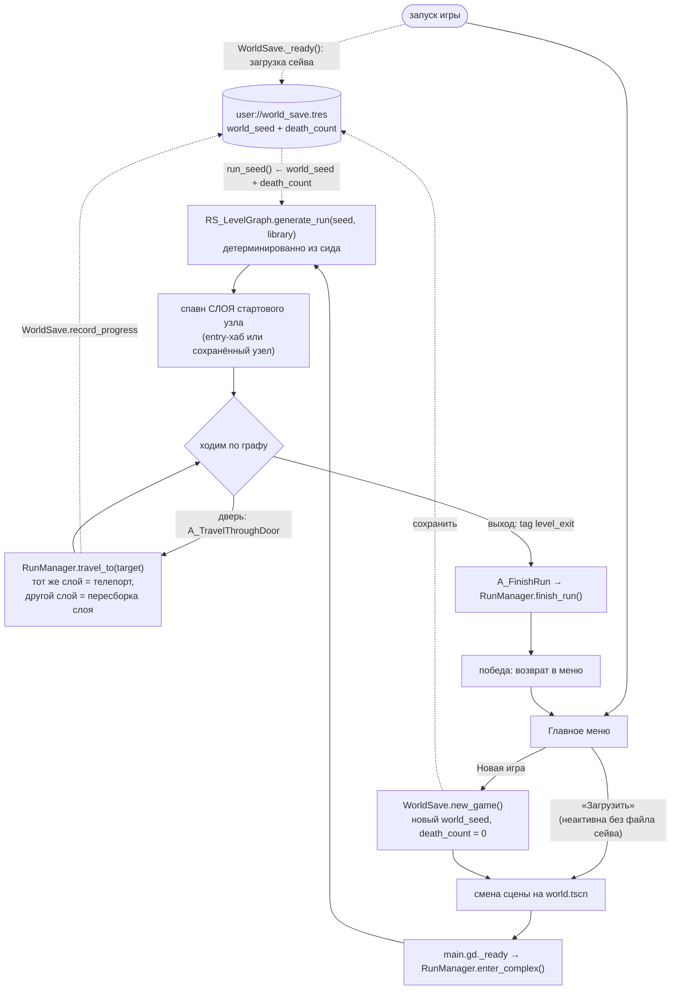

# Цикл забега

Как забег живёт от главного меню до конца - какие автолоады и системы за что
отвечают. Забег - это **граф уровня**, а не линейный уровень.

## Схема потока

## 1. Новая игра

- **Главное меню** ([main_menu.gd](../../../src/ui/main_menu/main_menu.gd)) на «Новая
  игра» зовёт `WorldSave.new_game()` — тот катит новый `world_seed` и обнуляет
  `death_count`, — затем меняет сцену на `world.tscn`.
- Меню-фон — 3D-сцена `L_menu_map.tscn` с покачивающейся камерой
  ([l_menu_map.gd](../../../src/levels/menu_map/l_menu_map.gd)).
- **«Загрузить»** просто меняет сцену на `world.tscn`, ничего не катя: сейв уже
  поднят `WorldSave._ready()`, а `RunManager` возьмёт из него и сид, и узел, на
  котором игрок остановился. Кнопка **неактивна**, пока на диске нет файла
  сейва (`WorldSave.has_save_file`) — продолжать нечего.

## 2. Старт мира

`world.tscn` → [main.gd](../../../src/world/main.gd):
1. `ECS.world = world`, включает `UIManager`, захватывает курсор, вешает HUD.
2. `RunManager.enter_complex()` — точка входа в забег.

`RunManager.enter_complex()`:
1. Если сид не передан — берёт `WorldSave.save.run_seed()` (детерминированно из
   `world_seed` + `death_count`).
2. `RS_LevelGraph.new().generate_run(seed, GameConfig.config.room_preset_library)`
   строит **весь** граф комплекса сразу.
3. Восстанавливает остаток распада БФЖ из сейва (`_restore_player_progress`).
4. Спавнит **слой** стартового узла и ставит туда игрока. Стартовый узел —
   сохранённый (`run_in_progress`) либо entry-хаб; если сохранённого узла в
   графе нет (сейв старше проекта), молча откатывается на вход.

### Что такое граф ([rs_level_graph.gd](../../../src/resources/world_generator/rs_level_graph.gd))

- Слои по глубине `[4, 3, 2, 1, 0]` (поверхность = 0). Каждый слой — 1–3 «этажа»
  примерно по 4 комнаты, связанных основным деревом + доп. рёбра.
- Слои соединяются вертикальными коннекторами (часть — заперты `locked_by` ключом).
- Домашняя лаборатория игрока — гарантированный тупик на `HOME_DEPTH = 3`.
- Выходы (`level_exit`) — на поверхностном слое.
- Сцены комнат назначаются последним проходом через
  `RS_RoomPresetLibrary.select_preset`; entry всегда переопределяется на
  авторский **хаб** (`hub.tscn`).

> **Про `HOME_DEPTH`.** Это **не** игровой параметр: ни одна рантайм-система не
> читает `depth`, на геймплей само число никак не влияет. Это якорь
> **генераторного инварианта** — три места обязаны ссылаться на один и тот же
> слой: выбор домашнего узла (`layers_by_depth[HOME_DEPTH]`), размещение
> гарантированного тупика в комнате 0/этаж 0 этого слоя, и исключение дома из
> кандидатов в `vertical_hub` (иначе у тупика появится второе ребро). Поэтому это
> именованная константа, а не литерал `3` в трёх местах — рассинхрон тихо ломает
> тупик. Значение должно входить в `DEPTHS`; структурно дом стоит в **середине**
> (под ним есть слой, над ним — путь к выходу), а `3` = зона L3 по лору
> ([[История]]).

## 3. Загруженный слой и переходы

Гранула стриминга — **слой** (все узлы одной `depth`, `get_nodes_by_depth`), а не
комната: `RunManager` держит в дереве сцены весь слой разом.

- **Раскладка** (`_layer_layout`): коридоров между комнатами нет, связь чисто
  логическая, поэтому комнаты просто расставляются по детерминированной сетке —
  этажи слоя разносятся по высоте (`FLOOR_SPACING`), комнаты этажа в ряд по X
  (`ROOM_SPACING`), порядок задаёт `index_in_layer`.
- **Спавн** (`_spawn_room`): ставит комнате позицию, регистрирует её в мире,
  затем **явно** регистрирует все вложенные сущности
  (`_register_room_children`) — GECS не обходит дерево в поисках вложенных
  `Entity`. Учёт ведётся по комнатам (`SpawnedRoom`: сама Entity + children +
  двери), чтобы деспавн слоя снимал всё до последней вложенной сущности.
- **Двери** (`_bind_doors`): двери комнаты несут `C_DoorSlot`; RunManager
  сортирует их по `slot_id`, штампует `C_DoorPortal { target_node_id, locked_by }`
  по рёбрам узла и проставляет подсказку («Пройти» / «Заперто»). Лишние слоты
  **запечатываются** — пустой `C_DoorPortal` + подсказка «Прохода нет», при этом
  интеракция остаётся включённой (иначе дверь молчала бы и не подсвечивалась).
  Подробнее — в `CLAUDE.md` (раздел «Doors ↔ graph edges»).
- **Переход** (`A_TravelThroughDoor` → `RunManager.travel_to`): читает
  `C_DoorPortal` двери и проверяет её состояние. Цель в **том же слое** — просто
  телепорт (ничего не грузится и не сносится); цель в **другом слое** — деспавн
  старого слоя и спавн нового. На прибытии игрок ставится у двери, ведущей
  обратно (`_find_return_door`), иначе — в `SpawnPoint` комнаты.
- **Замки и тупики:** `A_TravelThroughDoor` при запертой двери и при
  запечатанном проёме показывает экранное сообщение (`C_ScreenMessage`, см.
  [[Взаимодействие]]), а не печатает в консоль. Ключей/инвентаря по-прежнему
  нет, так что заперто = закрыто наглухо.

> **Инвариант сцен комнат:** контейнер `Doors` обязан быть `Node3D`, а не `Node`.
> Node3D наследует трансформ только от **прямого** родителя-Node3D; плоский
> `Node` посередине рвёт цепочку, и двери (вместе с коллайдерами) остаются в
> начале координат, а не в своей комнате. Пока комната всегда стояла в нуле, это
> не было заметно.

## 4. Конец забега

- **Победа:** комната-выход (`exit_room.tscn`, tag `level_exit`) несёт действие
  `A_FinishRun` → `RunManager.finish_run()`: деспавн комнаты, сигнал
  `run_finished`, возврат в меню. Экрана победы пока нет — уходим в меню-заглушку.
- **Смерть (проигрыш):** распад БФЖ в развоплощён → `S_Lifespan` шлёт `run_ended`
  → `O_RunEnded` → `RunManager.die()`: `WorldSave.record_death()` (`death_count++`
  меняет будущую генерацию), снос забега, экран смерти (`death_screen`). Разбор
  всей цепочки захвата/смерти — [[Захват тела]].

## 5. Сохранение и загрузка

[WorldSave](../../../src/autoloads/world_save.gd) хранит `RS_WorldSave` в
`user://world_save.tres`. Комплекс **не сериализуется покомнатно** — он
детерминированно восстанавливается из `run_seed()`, поэтому в сейве лежит только
то, что из сида не выводится:

| Поле | Зачем |
|---|---|
| `world_seed`, `death_count` | из них выводится `run_seed()` → весь комплекс |
| `run_in_progress` | есть ли что продолжать (снимается смертью и побегом) |
| `current_node_id` | узел, с которого продолжится сессия |
| `visited_node_ids` | посещённое — под будущую карту комплекса |
| `lifespan_remaining` | остаток распада БФЖ: иначе загрузка = бесплатное лечение |

- **Когда пишем:** `RunManager` зовёт `WorldSave.record_progress()` при каждой
  смене комнаты — это и есть контрольная точка. Побег на поверхность
  (`finish_run` → `clear_run`) и смерть (`die` → `record_death`) прогресс
  забега снимают; смерть вдобавок инкрементит `death_count`, поэтому следующий
  комплекс будет другим.
- **Выход в меню из паузы** ничего не рушит: последняя контрольная точка уже на
  диске, «Загрузить» вернёт игрока в ту же комнату.
- **Чего сейв НЕ хранит:** воплощённость БФЖ и HP тела, состояние комнат
  (подобранное, убитые тела), точную позицию внутри комнаты — при загрузке игрок
  появляется в `SpawnPoint` комнаты развоплощённым.
- [SkillManager](../../../src/autoloads/skill_manager.gd) и
  [SettingsManager](../../../src/autoloads/settings_manager.gd) персистят свои
  ресурсы отдельно (`user://skills.tres`, `user://settings.tres`).

## 6. Влияние смертей на забег

Смерть тела ≠ конец забега: гибель захваченного тела (`entity_died` при HP=0)
выбрасывает БФЖ обратно в призрака (`O_ExpelFromBody`), забег продолжается.
Настоящая смерть — истечение распада, пока БФЖ **развоплощён**: `run_ended` →
`RunManager.die()` → `death_count += 1` → другая генерация следующего комплекса +
экран смерти. Контур **замкнут**; пока смерть ведёт на `death_screen`, а не в хаб
(возврат в хаб как способ рестарта — на будущее). Полный разбор — [[Захват тела]].
