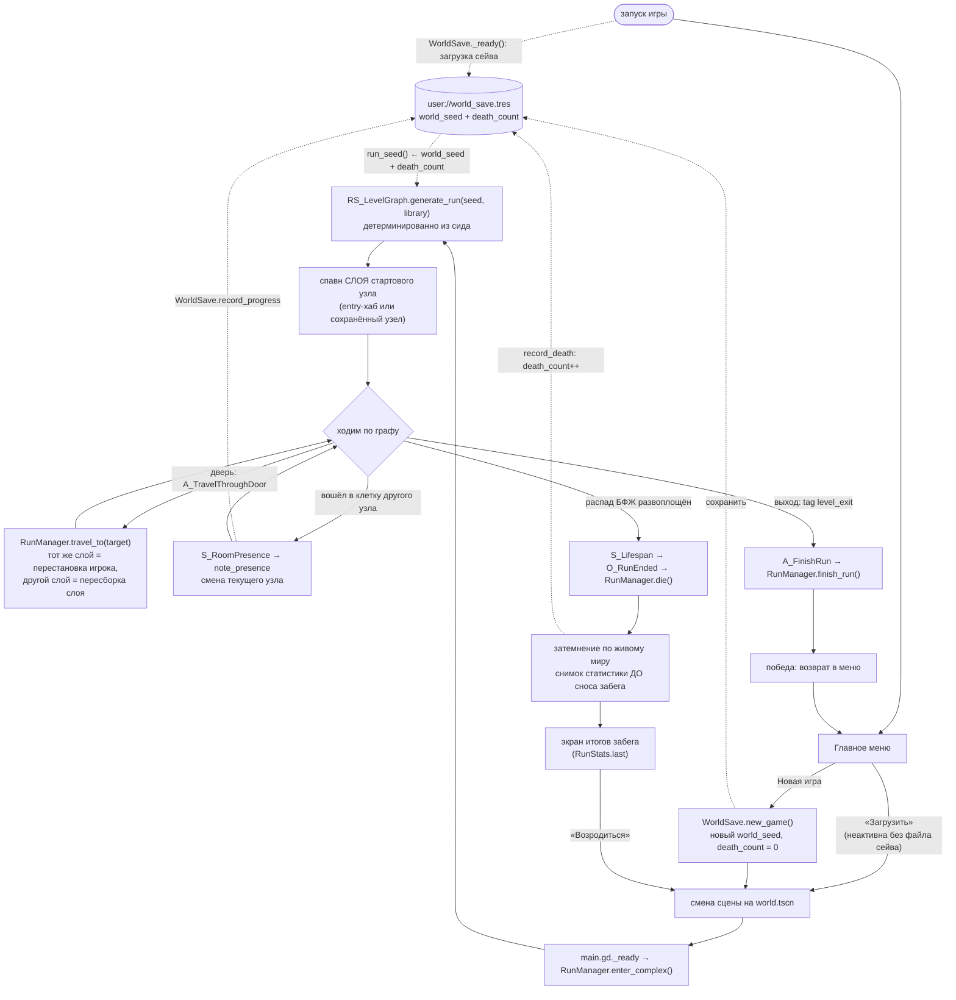

# Цикл забега

Как забег живёт от главного меню до конца - какие автолоады и системы за что
отвечают. Забег - это **граф уровня**, а не линейный уровень.

## Схема потока

```mermaid
flowchart TD
    save[("user://world_save.tres<br/>world_seed + death_count")]

    boot(["запуск игры"]) --> menu["Главное меню"]
    boot -.->|"WorldSave._ready(): загрузка сейва"| save

    menu -->|"Новая игра"| newgame["WorldSave.new_game()<br/>новый world_seed, death_count = 0"]
    newgame -.->|"сохранить"| save
    menu -->|"«Загрузить»<br/>(неактивна без файла сейва)"| scene

    newgame --> scene["смена сцены на world.tscn"]
    scene --> ready["main.gd._ready → RunManager.enter_complex()"]
    save -.->|"run_seed() ← world_seed + death_count"| gen
    ready --> gen["RS_LevelGraph.generate_run(seed, library)<br/>детерминированно из сида"]
    gen --> spawn["спавн СЛОЯ стартового узла<br/>(entry-хаб или сохранённый узел)"]
    spawn --> loop{"ходим по графу"}

    loop -->|"дверь: A_TravelThroughDoor"| travel["RunManager.travel_to(target)<br/>тот же слой = перестановка игрока,<br/>другой слой = пересборка слоя"]
    travel --> loop
    loop -->|"вошёл в клетку другого узла"| presence["S_RoomPresence → note_presence<br/>смена текущего узла"]
    presence -.->|"WorldSave.record_progress"| save
    presence --> loop

    loop -->|"выход: tag level_exit"| finish["A_FinishRun → RunManager.finish_run()"]
    finish --> win["победа: возврат в меню"]
    win --> menu

    loop -->|"распад БФЖ развоплощён"| death["S_Lifespan → O_RunEnded → RunManager.die()"]
    death --> fade["затемнение по живому миру<br/>снимок статистики ДО сноса забега"]
    fade -.->|"record_death: death_count++"| save
    fade --> summary["экран итогов забега<br/>(RunStats.last)"]
    summary -->|"«Возродиться»"| scene
```

## 1. Новая игра

- **Главное меню** ([main_menu.gd](../../../src/ui/main_menu/main_menu.gd)) на «Новая
  игра» зовёт `WorldSave.new_game()` — тот катит новый `world_seed` и обнуляет
  `death_count`, — затем меняет сцену на `world.tscn`.
- Меню-фон — 3D-сцена `L_menu_map.tscn` с покачивающейся камерой
  ([l_menu_map.gd](../../../src/levels/menu_map/l_menu_map.gd)).
- **«Загрузить»** просто меняет сцену на `world.tscn`, ничего не катя: сейв уже
  поднят `WorldSave._ready()`, а `RunManager` возьмёт из него и сид, и узел, на
  котором игрок остановился. Кнопка **неактивна**, пока на диске нет файла
  сейва (`WorldSave.has_save_file`) — продолжать нечего.

## 2. Старт мира

`world.tscn` → [main.gd](../../../src/world/main.gd):
1. `ECS.world = world`, включает `UIManager`, захватывает курсор, вешает HUD.
2. `RunManager.enter_complex()` — точка входа в забег.

`RunManager.enter_complex()`:
1. Если сид не передан — берёт `WorldSave.save.run_seed()` (детерминированно из
   `world_seed` + `death_count`).
2. `RS_LevelGraph.new().generate_run(seed, library, _run_gen_config())`
   строит **весь** граф комплекса сразу. Третий аргумент — **снимок ручек
   генерации** (`RS_WorldGenConfig`, база — `data/world_gen_config.tres`):
   новый забег снимает конфиг в сейв (`RS_WorldSave.gen_config`), начатый
   продолжает по снимку. Сид задаёт комплекс только вместе с ручками — без
   снимка улучшение Архитектора, купленное посреди забега, перестроило бы
   комплекс под игроком на ближайшей загрузке. И только на том же генераторе:
   рядом со снимком сейв помнит `generator_version`, и забег, начатый на другой
   версии (`RS_LevelGraph.GENERATOR_VERSION`), сбрасывается на вход — узел,
   посещённые, съеденные тела и награды обнуляются, запас и тело остаются, ручки
   снимаются заново (решено 27.09 на всю v0.7.0).
3. Восстанавливает остаток распада БФЖ из сейва (`_restore_player_progress`).
4. Спавнит **слой** стартового узла и ставит туда игрока. Стартовый узел —
   сохранённый (`run_in_progress`) либо entry-хаб; если сохранённого узла в
   графе нет (сейв старше проекта), молча откатывается на вход.

### Что такое граф ([rs_level_graph.gd](../../../src/resources/world_generator/rs_level_graph.gd))

Граф строится по [[Процедурные коридоры между комнатами|карточке коридоров]]:
двери комнат выходят в коридоры, коридоры ходят только в плоскости этажа,
между этажами слоя — лестница (с 29.09), между слоями — порталы.

- Слои по глубине `[4, 3, 2, 1, 0]` (поверхность = 0). Каждый слой — 1–3 этажа по
  `rooms_per_floor` комнат (ручки — `RS_WorldGenConfig`, `data/world_gen_config.tres`;
  с 29.09 — 8). Порталы и лестницы берут места из этого же числа: средний слой
  отдаёт до `layer_connectors` переходов вверх и вниз плюс по лестнице на пару
  этажей. При 4 комнатах на этаж и портальной паре на каждую пару этажей слою
  хаба оставалось 5 % обычных комнат.
- **Сначала комната, потом рёбра** (порядок из карточки рефакторинга генератора):
  комнаты этажей → уникальные → вертикаль → типы → подбор сцен → раскладка этажа
  и из неё коридоры. Рёбер у
  комнаты ровно столько, сколько у неё дверей (`RS_LevelNode.door_count`), поэтому
  заваренных дверей нет по построению, а тупик хаба получается сам — у его сцены
  одна дверь. У комнаты с дверями в сцене это число дверей сцены
  (`RS_RoomLayout.door_count_of_scene`); у комнаты, **собранной по маске
  сокетов** (`C_RoomShell`, ниже), — бросок в диапазоне пресета
  `doors_min..doors_max`, не больше числа сокетов. Бросок идёт из **своего потока
  на узел** (сид + id, `RS_LevelGraph._roll_socket_doors`), а не из общего rng:
  общий сдвинулся бы от первой же сборной комнаты, и правка одного пресета меняла
  бы чужие комнаты. До коридоров было наоборот: генератор раздавал степень,
  подбор искал комнату «с дверями не меньше», и лишние двери заваривались (154 на
  748 узлов).
- **Роль узла** — `RS_LevelNode.role`: `ROOM` или `CORRIDOR`. Коридор — узел без
  сцены: отрезок сети коридоров этажа между развилками
  ([[Коридор — отдельный узел]]); сколько их, выводится из сети, ручки нет. **Какие коридоры и в какой
  ведёт дверь, решает раскладка, а граф записывает построенное**
  (`RS_LevelGraph._lay_out_floor`): каждая дверь — ребро в коридор перед ней,
  коридоры — рёбра друг с другом по стыкам. Комната может стоять на двух
  коридорах — это обходной путь. Так с п. 7 карточки «Сетка уровня»; раньше граф
  назначал двери веткам сам, и чтобы укладка существовала (двери в случайные ветки
  не трассировались на 8 % этажей), комната висела на одной ветке всеми дверями —
  ценой коридора вокруг неё. До 27.09 узлом была «ветка» — связка коридоров с
  развилками, 1–3 на этаж ручкой. Коридор без дверей законен — перемычка или
  тупик; коридора без соседей не бывает.
- **Уникальные комнаты** — `RS_UniqueRoom` в конфиге: хаб (вход, `HOME_DEPTH`),
  два выхода на поверхности и Архитектор — ровно один, на слое хаба, но **не на
  его этаже** (`apart_from_entry`, с 01.10; до того — на любом слое, кроме хаба
  и поверхности). Этаж входа отсекается при выборе узла, поэтому такая запись
  идёт в списке после входа (`validate()` это проверяет), а слою, где могут
  встать обе, генератор даёт не меньше двух этажей — поправкой после броска
  числа этажей, чтобы rng тратился как прежде. Узел резервируется под заранее известную сцену; три
  броска rng на экземпляр при любом исходе; их пресеты исключены из обычного
  подбора. Глубина разыгрывается **индексом** среди допустимых
  (`allowed_depths()` — отрезок минус `excluded_depths`), а не числом из
  отрезка: вычеркнутая глубина не должна перекашивать шансы соседних. Хаб — не пресет
  автоподбора: его `hub.tres` лежит в `RS_RoomPresetLibrary.hub` для Room Wizard и
  инлайн-редактора «Генератора мира», отдельно от `.presets`.
- **Между этажами слоя — лестница** (`RS_WorldGenConfig.floor_stairs`,
  `src/levels/procedural/rooms/stairs/`; с 29.09, до того — портальная пара).
  Одна на пару соседних этажей, комнатой нижнего: `_place_floor_stairs`
  резервирует под неё узел так же, как под уникальную комнату, — сцена задана
  заранее, подбор и порталы слоёв её не трогают. Коробка лестницы — в два уровня
  (`C_RoomShell.size.y = 2`), и двери у неё **объявлены**
  (`C_RoomShell.door_sockets`): у подножия марша на нижнем уровне и у верхней
  площадки на втором. Нижнюю дверь раскладка своего этажа связывает как обычно,
  а верхнюю видеть не может — трассы идут по своему уровню. Она кладёт дверь в
  `RS_LayerPlan.pending_doors`, и её забирает раскладка этажа выше
  (`RS_CorridorPlanner._adopt_pending`) — как свою дверь, с клетками верха
  лестницы как комнатой. Поэтому рёбра дверей граф ставит, когда разложены все
  этажи слоя. Верхняя дверь — **обычное коридорное ребро** в коридор этажа выше,
  а не портал: слой стоит в дереве целиком, этажи — друг над другом, и игрок
  поднимается ногами. Отсюда правило: **портальное ребро узнаётся по типу**
  (`RS_LevelConnection.is_portal()` — `ELEVATOR`/`STAIRWELL` из
  `_link_vertical`), а не по разнице этажей или глубин — по разнице верхнюю дверь
  лестницы приняли бы за портал спавн (`_bind_portals`), карта
  (`MapKnowledge.portal_of`) и проверки. Карта этажа показывает комнату на
  каждом этаже её footprint, миникарта берёт этаж по клетке под игроком: узел
  лестницы числится нижним этажом. Без `floor_stairs` в ручках этажи по-старому
  связывает портальная пара (`_connect_floors_vertically`).
- **Между слоями — порталом.** Портал в комнате ровно
  один, поэтому на узел не больше одного портального ребра; подбор сверяет
  портал жёстко в обе стороны — лишний был бы мёртвым порталом посреди пола.
  Первый переход каждой пары слоёв всегда открыт (часть остальных заперты
  `locked_by` ключом): ключей в игре нет, и запертая наглухо пара делала бы забег
  непроходимым.
- Проверка — `dev/corridor_graph_check.tscn`.

### Две оси подбора комнаты: способности и тип

Комнату выбирают два независимых набора данных, и держать их врозь обязательно.

| Ось | Где | Отвечает на вопрос | Как работает |
|---|---|---|---|
| **Способности** | `tags` узла и пресета | «что комната умеет структурно» | жёсткий фильтр: портал в обе стороны, прочие теги узла ⊆ теги пресета |
| **Тип помещения** | `room_type` узла и пресета, каталог `RS_RoomTypeCatalog` | «что это за помещение» | мягкое предпочтение внутри уже отобранной группы |

Тип структурных обязательств не несёт: арсенал бывает и тупиком, и проходной, и
вертикальным хабом. Поэтому он **не тег**. Стоит положить `arsenal` в тот же
массив — и узел, помеченный типом, начнёт получать **только** комнаты этого
типа: тип станет требованием. На смешении осей однажды перестали выпадать
`lab_room` и `exit_room`.

У тегов есть **словарь** — `RS_RoomTagCatalog` (`data/room_tag_catalog.tres`,
висит на `RS_RoomPresetLibrary.tag_catalog`): что каждый тег значит и ставит ли
его генератор сам. Словарь **описательный, а не разрешительный**: подбор
по-прежнему сравнивает сырые `StringName`, в каталог не заглядывает вовсе, и тег
без записи в словаре работает как работал. Иначе «+ тег» в редакторских
инструментах молча ломал бы генерацию, требуя сперва завести описание. Зачем он
тогда нужен и как правится — [[Редакторские инструменты]]. `floor_hub` в словаре
помечен устаревшим: между этажами теперь лестница (раньше — портал), генератор
тег не ставит.

Полный порядок отбора в `RS_RoomPresetLibrary.select_preset`:

1. **портал** (жёстко): у пресета тег `vertical_hub` ровно тогда, когда он есть у
   узла;
2. **теги** (жёстко): прочие теги узла ⊆ теги пресета (`level_exit` не
   сверяется — выход ставит конфиг);
3. **тип** (мягко): среди прошедших — совпавшие по `room_type`; **совпавших нет
   — группа идёт дальше целиком**;
4. **вес** — авторский.

Вместимости и специфичности нет. Вместимость потеряла смысл — степень выводится
из сцены; специфичность существовала только потому, что в `tags` сидела
структура, и с ней пресет с «лишним» тегом проигрывал безликому.

Шаг 3 — предпочтение, а не фильтр, и это принципиально: каталог типов заполнен
вперёд контента, и узел-полигон обязан спокойно получить обычную комнату, пока
полигона не нарисовали. Пустой тип — полноценный случай той же логики: безликий
узел предпочитает безликие пресеты, иначе тематическая комната лезла бы в каждый
непомеченный узел и перестала бы читаться как особенная.

**Тип узла проходит генерацию дважды, и это два разных смысла.** Сперва генератор
кладёт в `RS_LevelNode.room_type` ЗАГАДАННЫЙ тип — розыгрыш по каталогу с учётом
глубины узла. Потом подбор сцены переписывает поле типом ФАКТИЧЕСКИ вставшей
комнаты. После генерации там всегда правда: загаданное больше никому не нужно, а
на карту и в игровую логику должно уходить то, что реально стоит. Уникальные
комнаты получают тип своего пресета.

Распределение по глубине живёт в каталоге (`data/room_type_catalog.tres`):
у каждого типа отрезок `depth_min…depth_max` по номеру слоя (**0 — поверхность,
4 — самый глубокий**). Казармы, столовые и досуг — 0–2, полигон и содержание
существ/артефактов — 3–4, где по лору ([[История]]) уже усиленная охрана.
Отдельным весом (`untyped_weight`) задана доля безликих комнат — таких в
комплексе большинство.

> **Розыгрыш типа тратит rng ВСЕГДА**, даже когда на этой глубине не подходит ни
> один тип и результат заведомо «без типа». Rng один на всю генерацию, и
> пропуск броска на одном узле сдвинул бы всё, что разыгрывается после него, —
> граф перестал бы быть функцией сида. Без каталога (`type_catalog == null`)
> проход не делает ничего и не трогает rng вовсе.

> **Про `HOME_DEPTH`.** Генератор его не читает: хаб ставит уникальная комната
> конфига. Константа — глубина по умолчанию для инструментов и отладки (слой,
> который открывает вкладка «Генератор мира»). Разойтись с конфигом она не может
> незаметно — это сверяет `dev/corridor_graph_check`.

## 3. Загруженный слой и переходы

Гранула стриминга — **слой** (все узлы одной `depth`, `get_nodes_by_depth`), а не
комната: `RunManager` держит в дереве сцены весь слой разом — комнаты и тайлы
коридоров.

- **Раскладка** (`RS_CorridorPlanner`) идёт этаж за этажом **внутри генерации
  графа** (`RS_LevelGraph._lay_out_floor`), и план слоя хранит сам граф
  (`RS_LevelGraph.layer_plan`): какие в сети коридоры и в какой ведёт дверь, решает
  раскладка, и узлы и рёбра графа берутся из неё. Порядок (п. 7 карточки
  [[Сетка уровня — генерация на 3D-сетке]]):
  1. комнаты **вразброс** (с 29.09, [[Хаос раскладки этажа]]; до того —
     решёткой рядами, и 4 комнаты всегда стояли квадратом по углам). Область
     этажа — сумма footprint'ов с улицами, делённая на `room_density` (0.65),
     вытянутость — бросок до 2 : 1. Комнаты в перетасованном порядке встают в
     случайные точки, где до любой занятой клетки плана не меньше `room_gap`
     клеток (2 — улица, по которой коридор обходит комнату не вплотную); из 24
     точек выбор взвешен шумом плотности (`FastNoiseLite`, пятно ~12 клеток),
     поэтому комнаты сбиваются в кучки, а между кучками остаются пустыри. Занятые
     клетки смотрятся по всему плану слоя, а не только по своему этажу: верх
     высокой комнаты этажа ниже — тоже препятствие. Не нашлось точки — область
     растёт на клетку. Цена — длина коридоров: 6.3 тайла на комнату против 4.4 у
     решётки;
  2. двери — **по одной на сторону** комнаты (на каждом её уровне), стороны —
     туда, где соседи (`_pick_sockets`): сторону тянут комнаты этажа, лежащие в
     её сторону, с весом обратно расстоянию. Комната с двумя дверями —
     **сквозная**: вторая дверь на противоположной стороне, если и там есть
     соседи. На стороне — сокет, ближайший к тем, кто её тянет (у комнаты с
     дверями в сцене — её стороны, повёрнутые с комнатой). До 08.10 двери
     смотрели к центру этажа и не больше чем с двух сторон: у коробки 2×2 это
     четыре сокета на двух соседних сторонах, дерево связывало двери одной
     комнаты коридором вокруг её угла (у 61 % комнат), а сквозных комнат не было
     вовсе;
  3. сеть — дерево по клеткам, где **комната — звено**: стоит одной её двери
     связаться с сетью, и её остальные двери тоже в сети — через комнату
     (`_enter_room`). Каждый раз подключается комната, чья дверь ближе всех к уже
     проложенному (Прим для дерева Штейнера), — к коридору или к свободной двери
     уже вошедшей комнаты, так комнаты и встают сквозными. Трасса — `GridRouter`
     с ценой поворота, иначе «лесенка» из угловых кусков; свой пояс (клетки
     вплотную к комнате) ей закрыт, кроме клетки перед дверью: от двери коридор
     уходит прочь, а не вдоль своей стены. Трасса, обволокшая чужую комнату,
     ищется заново в обход её пояса (`_route_around`);
  4. **запасные двери** (`_join_spare_doors`) — двери вошедших комнат, к которым
     сеть не подошла. Каждая тянется к сети как петля: к месту, до которого по
     сети (сквозь комнату) не ближе `MIN_LOOP_GAIN`, не по своему поясу и не
     вплотную к ближней сети, и срезая не меньше того же. Не нашлось — двери нет,
     сокет остаётся стеной, `RS_LevelNode.socket_doors` уменьшается: диапазон
     пресета — «сколько можно», а не «сколько обязательно». Последнюю дверь
     комнаты это не трогает;
  5. петли по коридору (`corridor_loops`) — срез по свободным клеткам между
     местами сети, далёкими по ней (расстояние считается и сквозь комнаты), и
     тупики (`dead_ends`) — отросток в одну-две клетки; конец тупика отмечен в
     `plan.dead_ends` под то, что туда положат (не генератор). Ни петля, ни
     тупик не ставятся, если обволокли бы комнату;
  6. коридоры — разрез сети по развилкам (`_segment`, карточка
     [[Коридор — отдельный узел]]): коридор — отрезок между развилками, поворот и
     дверь его не режут, клетка развилки достаётся коридору, идущему через неё
     прямо, боковой примыкает (стык — место под будущий шлюз). Проём на стыке
     открыт. Коридор без дверей законен — перемычка или тупик.

  Отказов трассы нет по построению: сеть на этаже одна и растёт от уже
  проложенного. Раньше граф заранее назначал двери веткам, укладки могло не быть
  вовсе, и её выкупали правилом «все двери комнаты в одну ветку» — 42 %
  обволакиваемых комнат. Случайность — свой поток этажа (сид + слой + этаж). Этажи
  слоя — уровни сетки (`.y` клетки) и раскладываются независимо. План отдаёт
  `cells` (узел → клетка; у комнаты — угловая клетка footprint), `footprints`
  (комната → размер в клетках, в осях мира), `turns` (комната → четверти
  оборота), `corridor_tiles` (клетка → маска проёмов: бит стороны — `1 << индекс`,
  по маске выбирается кусок кита, один проём — тупик), `door_faces` (комната →
  грань → коридор), `dead_ends` и `branch_joints()` (пары коридоров со стыком). Грань —
  клетка footprint и её сторона (`GridTopology.face`): у комнаты в несколько клеток
  на одной стороне несколько сокетов; ключ — грань, а не сосед, потому что две
  двери законно ведут в один коридор. Комната занимает все клетки своего footprint.
  Живёт раскладка **отдельно от `RunManager`** (`@tool`) по той же причине, что и
  `RS_RoomLayout`: `RunManager` — автолоад без `@tool`, в редакторе его нет, а
  редакторскому тулу генератора нужна ровно та раскладка, которую делает игра.
  Спавн держит `LayerStreamer`, `RunManager` лишь отдаёт наружу `plan_for_depth`
  (план графа). Сторону двери, запечённой в сцену, берём из **геометрии**
  (`RS_RoomLayout.door_side` — положение относительно центра комнаты → индекс
  стороны `SquareGridTopology.Side`), а не из `C_DoorSlot.slot_id`: slot_id —
  просто стабильный идентификатор слота и у `vertical_hub_*` со стенами не
  совпадал. Имена стен (`RS_RoomLayout.SIDE_NAMES`) остались только для slot_id и
  сообщений проверок.

  Проверка — `dev/corridor_layout_check.tscn`: 30 сидов на ручках по умолчанию и
  10 — на 8 комнатах на этаж, где работают предохранители от обволакивания (на 4
  комнатах двери и так смотрят внутрь, и без предохранителей было бы те же 0 %, а
  на 8 — 15 %). Она же печатает **метрики раскладки** (`RS_LayoutMetrics`, те же,
  что в «Прогоне сидов» вкладки «Генератор мира») и держит потолок доли
  обволакиваемых комнат — 1 % (сейчас 0.5 %) — и нижнюю границу доли сквозных —
  25 % (сейчас 29 %). **Обволакивание** — с 08.10 по поясу
  (`RS_LayoutMetrics.wraps`, одно правило на раскладку и метрику): связный кусок
  коридора в клетках вплотную к комнате (перед гранями и на углах) связывает две
  её двери или подходит к ней с трёх сторон. Прежняя мера — «её коридоры с трёх
  сторон» — держалась на 0 %, пока игрок видел коридор вокруг угла, а с дверью на
  каждую сторону коридоры с четырёх сторон — это перекрёсток. Печатается и
  «снято дверей» (`RS_LayerPlan.dropped_doors`): растёт — пресетам обещано
  больше дверей, чем помещается на этажах.
  Там же форма коридоров: коридор — путь без развилок внутри, на развилке не
  сворачивает, коридор без двери — перемычка или тупик.
- **Поворот комнаты** — `RS_LevelNode.turns`, четверти оборота вокруг Y
  (`rotation.y = turns · π/2`, как у кусков кита). Разыгрывается при подстановке
  у **всех** комнат, включая уникальные, из своего потока на узел (сид + id,
  `RS_LevelGraph._roll_turns`) — по той же причине, что и число дверей: бросок из
  общего rng сдвинул бы весь мир. Сторона сцены s смотрит в мир стороной
  s − turns (`GridTopology.rotate_side`): так поворачиваются стороны дверей,
  запечённых в сцену, — и в раскладке, и при привязке дверей на спавне. У
  нечётного поворота footprint в плане меняет ширину и длину местами. Сборной
  комнате поворачивать нечего: грани её дверей план выдаёт уже в сторонах мира,
  поворот меняет только то, как стоит к ним содержимое коробки.
- **Сетка: раскладка не видит мира** (`src/grid/`, карточка
  [[Сетка уровня — генерация на 3D-сетке]]). Три слоя, каждый знает только о
  нижних. **Топология** (`GridTopology` → `SquareGridTopology`) — кто чей сосед и
  через какую сторону; сторона — индекс в клетке, «прямо» — противоположная
  сторона, а не тот же шаг ещё раз. На ней же `GridRouter` — Дейкстра с ценой
  поворота, по которой идут трассы. **Размещение** — сам план: всё в клетках и
  сторонах, мировых координат он не хранит. **Вложение** (`GridEmbedding` →
  `SquareGridEmbedding`, `plan.embedding`) — клетка ↔ точка мира; спавн, карта,
  тул и присутствие игрока спрашивают мир только у него (`position_of`,
  `node_at`, `embedding.cell_origin`). Поэтому **размер клетки живёт ровно в
  одном месте** — во вложении плана: куб 8 м (с 27.09; шаг задан китом — у
  комнат и тайлов один стык по грани клетки), уровень этажа равен клетке, запас
  «чуть ниже пола» — 0.5 м. Переход с 18 м на 8 м так и прошёл — подменой этого
  места, генератор не правился. Поверх всех трёх — **узел сетки** `GridView`
  (`@tool Node3D`): рисует решётку, контуры групп клеток, отметки граней и
  стрелки, зная только топологию и вложение; где кончается грань, ему говорит
  вложение (`face_edge`). Что рисовать, решает тот, кто знает план, — оверлей
  «Сетка» «Генератора мира» ([[Редакторские инструменты]]). Папка `src/grid/`
  не знает об игре (ни узлов графа, ни автолоадов), чтобы её можно было вынести
  в аддон; интерфейс писан так, чтобы не исключать гексы на шаре, но реализована
  одна квадратная сетка.
- **Кто за что отвечает.** `RunManager` (автолоад) — автомат забега и
  контрольные точки: вход, переход, смерть, побег, сейв. Что лежит в дереве —
  `LayerStreamer` (`src/world/layer_streamer.gd`, `RunManager.layer`): спавн и
  снос слоя, раздача рёбер дверям и порталам; планы слоёв — у графа. Куда
  поставить игрока — `PlayerPlacement` (`src/world/player_placement.gd`), чистая
  геометрия над уже заспавненным слоем. Раньше всё это жило в одном `RunManager`
  на тысячу строк, где спавн комнаты ходил в те же поля, что и запись сейва.
- **Спавн комнат** (`LayerStreamer._spawn_room`): ставит комнате место (центр
  footprint) и поворот (`RS_LayerPlan.room_transform`) ДО регистрации в мире,
  затем **явно** регистрирует все вложенные сущности
  (`_register_room_children`) — GECS не обходит дерево в поисках вложенных
  `Entity`. Учёт ведётся по комнатам (`LayerStreamer.SpawnedRoom`: сама Entity + children +
  двери и их грани), чтобы деспавн слоя снимал всё до последней вложенной сущности.
- **Сборная комната** (`C_RoomShell` на корне сцены): сцена — только коробка (пол,
  потолок, пропы), а footprint и кит стен (`RS_RoomWallKit`) лежат в самом
  компоненте, а не в пресете — это свойства геометрии коробки, в пресете они молча
  разъехались бы со сценой. Стены ставит `RS_RoomWallKit.assemble`, одна на игру и
  на предпросмотр «Генератора мира»: на каждую грань по периметру —
  стена с проёмом и дверью (полотно на середине грани, на границе клеток), если
  план поставил туда дверь (у лестницы — и на втором уровне), иначе глухая, выше
  нижнего уровня — глухая стена верха (`upper_wall`; в ките P пока та же глухая). Детали
  нарисованы на северной грани и поворачиваются к стороне
  (`RS_RoomLayout.north_piece_turns`); место детали считается в мире и
  переводится в координаты уже повёрнутого корня, так что стены встают в стороны
  мира при любом повороте комнаты. Какие сокеты станут дверями, решает раскладка
  (выше: по одной на сторону, к соседям). Монолит со стенами в меше
  (`C_RoomShell.walls_in_shell`) собирается иначе: сборка обходит только его
  объявленные сокеты — на дверь полотно, на невыбранный заглушку
  (`RS_RoomWallKit.plug`), прочие грани уже в меше ([[Метрики и кит]] §3).
  Проверка — `dev/room_shell_check.tscn`: все комнаты генератора — коробки,
  коробка = footprint × клетка, пропы не заходят в зоны перед сокетами и не
  выходят за footprint (в толщу стены — можно), и сборка на деталях кита P
  лучами по коллизии. С 27.09 **все
  комнаты игры сборные** — коробка P 2×2×1 со своим содержимым (тела, порталы,
  терминалы); комнаты с дверями в сцене код по-прежнему понимает, но в игре их
  нет.
- **Тайлы коридора** (`LayerStreamer._spawn_corridor`): на каждый тайл плана — кусок из
  `data/corridor_kit.tres` (`RS_CorridorKit`) под маску проёмов — прямой, поворот,
  Т, крест или тупик (`SM_corridor_P_end`, на отмеченные `dead_ends`), —
  повёрнутый на четверть оборота; на стороны, упёршиеся в дверь комнаты
  (`RS_LayerPlan.door_mask`), — торец с проёмом `door_end` (стены кита —
  плоскости лицом внутрь, и без торца из коридора было бы видно комнату сквозь
  обратную сторону её стены). Не сущности ECS, а голая геометрия со светом-заглушкой;
  сносятся `free()`, а не `queue_free()` — все слои раскладываются от клетки
  (0, 0), и дожившие до конца кадра тайлы стояли бы коллизией внутри нового
  слоя. Проверка — `dev/corridor_spawn_check.tscn`, повороты кусков сверяются
  лучами по коллизии.
- **Порталы** (`LayerStreamer._bind_portals`): рёбра, меняющие **глубину или этаж**, достаются
  порталу комнаты — ради этого `vertical_hub_*` пресеты его и несут. Подсказка —
  «Подняться» (ближе к поверхности или этажом выше) или «Спуститься». Портал в
  комнате один, и генератор даёт узлу не больше одного вертикального ребра;
  портал без ребра глушится («Портал мёртв»). Само перемещение — `A_UsePortal`,
  наследник `A_TravelThroughDoor`: механически это тот же переход по ребру,
  отличаются только тексты, поэтому проверки замка и заглушки у них общие.
- **Двери** (`LayerStreamer._bind_doors`): двери комнаты несут `C_DoorSlot`; каждая получает
  `C_DoorPortal` на коридор, который план поставил на её грань, и подсказку
  «Открыть». Дверь сборной комнаты грань знает с рождения, запечённая в сцену —
  по своей стене (сцена такой комнаты в одну клетку). По той же грани
  `PlayerPlacement` ставит игрока перед дверью: сторона из положения двери
  относительно центра у вытянутой комнаты вышла бы не та. Порядок дверей при этом ничего не решает — каждая привязывается сама,
  по своей грани, — поэтому двери и не сортируются. Остаточного принципа нет — рёбер в коридоры у комнаты ровно столько,
  сколько дверей; дверь без коридора значит, что план и сцена разошлись, и её
  честнее заварить с предупреждением (пустой `C_DoorPortal` + «Прохода нет»,
  интеракция остаётся включённой, иначе дверь молчала бы и не подсвечивалась).
- **Переход** (`A_TravelThroughDoor` → `RunManager.use_door`): читает
  `C_DoorPortal` двери и проверяет её состояние. Дверь в коридор своего этажа
  **открывается на месте** — `C_DoorOpen`, полотно убирает `S_DoorOpen`
  (группа physics: полотно — `AnimatableBody3D` из `.glb`, и двигается САМО
  тело, абсолютно от точки покоя. Сдвиг родителя `Visual` тело с
  `sync_to_physics` не видит — так и было, и коллизия оставалась в проёме за
  уехавшим мешем). Дверь двустворчатая: створки разъезжаются вбок, в толщу стены,
  — одиночное полотно, поднимаясь, уходило бы в клетку уровня выше; одно
  полотно или створки, система решает по числу тел в арте. Подсветка гаснет
  (`C_Interactable.enabled = false`), дальше игрок идёт ногами. Исключение —
  комната без проёма за дверью (`RS_LevelNode.door_teleports`): её дверь ставит
  игрока на тайл перед собой. С 27.09 таких нет — у коробки P проём есть всегда, и
  хаб открывает дверь, как любая комната; флаг остался строкой данных. Порталы уходят
  в `travel_to`: между этажами слоя (если этажи связаны порталами, а не
  лестницей) — игрок только **переставляется** к порталу
  обратно, текущий узел сменит присутствие; в **другой слой** — деспавн старого
  слоя, спавн нового и смена узла сразу.
- **Текущий узел — по присутствию** (`S_RoomPresence` → `RunManager.note_presence`
  → `RS_LayerPlan.node_at`): в чьей клетке плана стоит игрок, тот узел и
  текущий; смена даёт контрольную точку, `visited_node_ids` и `room_changed`.
  Точка вне раскладки (пустота, провал, пустая клетка между коридорами) узел не
  меняет. Тайлы коридора лежат в той же таблице клеток, так что коридор
  становится текущим узлом так же, как комната. Сейв, сделанный в коридоре,
  грузит игрока на первый тайл коридора. Проверка — `dev/room_presence_check.tscn`.
- **Прибытие через портал** (`PlayerPlacement.in_room`): игрок появляется **у того
  портала новой комнаты, что ведёт обратно** (`PlayerPlacement.return_exit`), с отступом
  `ARRIVAL_OFFSET` к центру комнаты; высота — от `SpawnPoint` (пол).
  **Поворот не трогаем**: игрок мог взаимодействовать под углом, и доворачивать
  его за него — дезориентирует. Меняется только позиция; рыскание живёт на самой
  `E_Player`, тангаж — на её камере (`S_FPSLook`). `SpawnPoint` остаётся для
  входа **не через портал** (старт забега, загрузка сейва) — там авторский
  поворот как раз уместен.
- **Замки и тупики:** `A_TravelThroughDoor` при запертой двери и при
  запечатанном проёме показывает экранное сообщение (`C_ScreenMessage`, см.
  [[Взаимодействие]]), а не печатает в консоль. Ключей/инвентаря по-прежнему
  нет, так что заперто = закрыто наглухо.

> **Инвариант сцен комнат:** контейнер `Doors` обязан быть `Node3D`, а не `Node`.
> Node3D наследует трансформ только от **прямого** родителя-Node3D; плоский
> `Node` посередине рвёт цепочку, и двери (вместе с коллайдерами) остаются в
> начале координат, а не в своей комнате. Пока комната всегда стояла в нуле, это
> не было заметно.

## 4. Конец забега

- **Победа:** комната-выход (`exit_room.tscn`, tag `level_exit`) несёт действие
  `A_FinishRun` → `RunManager.finish_run()`: снимок статистики, деспавн комнаты,
  сигнал `run_finished`, возврат в меню. Экрана победы пока нет — уходим в
  меню-заглушку, хотя сводка забега для неё уже снимается.
- **Смерть (проигрыш):** распад БФЖ в развоплощён → `S_Lifespan` шлёт `run_ended`
  → `O_RunEnded` → `RunManager.die()`. Порядок внутри `die()` не произволен:

  1. **снимок статистики** (`RunStats.finish`) — до всего остального, потому что
     следующие шаги сносят и посещённые комнаты, и граф;
  2. **затемнение** (`UIManager.fade_to_black`, `GameConfig.death_fade_duration`)
     — по ЕЩЁ ЖИВОМУ миру: гаснуть должно то, в чём игрок только что был;
  3. `WorldSave.record_death()` (`death_count++` меняет будущую генерацию),
     награда очками, снос забега, сигнал `died`;
  4. смена сцены на **экран итогов** (`death_screen`, он же `DEATH_SCENE`).

  Между 1 и 3 проходит почти секунда живого мира — там есть кому ударить ещё
  раз, поэтому у `die()` есть сторож `_ending` от второго распада. Разбор всей
  цепочки захвата/смерти — [[Захват тела]].
- **Провал сквозь мир:** `S_VoidFall` (группа `"gameplay"`) шлёт тот же
  `run_ended`, когда игрок оказался **ниже `GameConfig.void_fall_depth`** (−100 м
  по умолчанию). Комнаты стыкуются генератором, и щель между кусками геометрии —
  вопрос времени: без дна провалившийся падает бесконечно, распад тикает, экрана
  смерти нет, и забег превращается в зависание. Провал — это **смерть, а не
  развоплощение**: выброшенный из тела призрак остался бы в той же дыре.

  Дно — **сравнение координаты**, а не `Area3D`-death box: коробку пришлось бы
  растягивать под слой, двигать за стримингом и держать на нужном слое коллизий,
  а ловила бы она только тех, у кого есть подходящий коллайдер. Выборка сужена до
  `C_Velocity` — тела в комнатах (`StaticBody3D`) падать не умеют вовсе, и сносить
  их молча нельзя: тело — единственный ресурс забега. Всё остальное, что
  провалилось (враги), просто убирается из мира: убийство через `C_Health`
  объявило бы `entity_died` со всеми наблюдателями, хотя врага никто не убивал.
  Проверка — `dev/void_fall_check.tscn`.

### Сводка забега

Экран смерти перестал быть надгробием: он показывает, что игрок успел, и одну
кнопку «Возродиться». Выхода в меню на нём нет намеренно — это обычная пауза по
`Esc` уже после возрождения.

**Статистика собирается ПО ХОДУ забега, а не в конце.** В конце её собирать не из
чего: комплекс не сериализуется покомнатно, `die()` сносит слой и обнуляет граф
до показа экрана, а `death_count++` меняет сид — прошедшего забега к моменту
сводки физически нет.

| Кто | Роль |
|---|---|
| `RS_RunStats` | данные забега: **словарь** показателей + записи занятых тел (`RS_RunBody`) |
| `RunStats` (автолоад) | накопитель: тикает время, ловит сигналы `RunManager`, держит снимок последнего забега (`last`) |
| `O_RunStats` | мост от событий ECS (`body_snatched`, `damage_dealt`) к накопителю |
| `RS_RunStatCatalog` | из чего складывается сводка: `data/run_stat_catalog.tres` |

Два решения, которые здесь главные:

- **Показатели — словарь, а строки сводки — данные.** Набор показателей открыт
  (артефакты, способности по телам, чем нанесён урон). Поле на каждый показатель
  означало бы, что «добавить строку в сводку» — это правка ресурса, экрана и
  сейва разом; со словарём новый показатель стоит ключа в `RS_RunStats` и строки
  в каталоге, а экран итогов не знает ни одного показателя по имени. Тот же
  приём, что у навыков (`data/skill_tree.tres`) и типов комнат.
- **Накопитель лежит в сейве** (`RS_WorldSave.run_stats` — ТОТ ЖЕ объект, что
  `RunStats.current`), поэтому любая контрольная точка сохраняет статистику
  заодно, а «выход в меню» посреди забега её не теряет: вход в комплекс при
  `run_in_progress` подхватывает накопленное вместо того, чтобы начать с нуля.
  `clear_run()` при этом ссылку **отвязывает, а не чистит поля** — снятый снимок
  держит тот же объект, и очистка стёрла бы сводку ровно в момент показа.

Готовый снимок тоже уходит на диск (`WorldSave.record_run_summary` →
`RS_WorldSave.last_run`), и `RunStats` поднимает его в своём `_ready()`: игру
могли закрыть прямо на экране итогов, и открытая заново она не должна делать
вид, что забега не было. Запись идёт сразу в `finish()`, а не «когда-нибудь
потом», — следующий же шаг зовущего отпускает ссылку сейва на текущий забег.

Комнаты накопитель не считает сам — берёт размер `visited_node_ids` из сейва:
свой счётчик по `room_changed` разъехался бы с ним при первом же возврате в
пройденную комнату.

**Урон идёт через воронку.** `S_Health.deal_damage(цель, сколько, кто, чем)` —
единственный способ нанести урон; прямая запись в `C_Health.current` из боевых
систем (так делал `S_EnemyAI`) следа не оставляла, а считать урон по падению HP
значит считать уроном лечение и смену тела. Воронка шлёт событие `damage_dealt`
с атрибуцией; «чем» (`means`) пока не заполняет никто, кроме `S_EnemyAI`
(`enemy_melee`), — это заготовка под способности. Своим/чужим урон делает
наличие `C_BodySnatch` у цели или источника.

> [!info] «Урона нанесено» в сводке сегодня всегда пусто
> У `E_Enemy` нет `C_Health` вовсе — бить в ответ пока некого и нечем (боевой
> системы нет, см. бэклог). Пустые показатели строкой в сводке не становятся.

**Загрузочного экрана пока нет.** `enter_complex()` синхронный: генерация графа и
спавн слоя проходят за один кадр. «Возродиться» гасит кнопку, меняет подпись и
дожидается отрисованного кадра — это честно показывает, что игра не зависла, но
прогрессом не является. Настоящий загрузочный экран требует разбить генерацию по
кадрам — отдельная задача.

## 5. Сохранение и загрузка

[WorldSave](../../../src/autoloads/world_save.gd) хранит `RS_WorldSave` в
`user://world_save.tres`. Комплекс **не сериализуется покомнатно** — он
детерминированно восстанавливается из `run_seed()`, поэтому в сейве лежит только
то, что из сида не выводится:

| Поле | Зачем |
|---|---|
| `world_seed`, `death_count` | из них выводится `run_seed()` → весь комплекс |
| `run_in_progress` | есть ли что продолжать (снимается смертью и побегом) |
| `current_node_id` | узел, с которого продолжится сессия |
| `visited_node_ids` | посещённое — под будущую карту комплекса |
| `lifespan_remaining` | остаток распада БФЖ: иначе загрузка = бесплатное лечение |
| `body_scene_path` | сцена занятого тела; `""` = призрак. Из неё же берётся облик |
| `body_health`, `body_health_max` | HP тела: чистое состояние, из сцены не выводится |
| `consumed_body_ids` | какие тела уже съедены — иначе комната вернёт их из сида |
| `rewarded_node_ids` | узлы, чья разовая награда забега взята (встреча с Архитектором) — по той же причине, что и съеденные тела |
| `body_lifespan_remaining`, `body_lifespan_max` | карман текущего тела: во плоти распад платится отсюда |
| `run_stats` | статистика забега (`RS_RunStats`) — тот же объект, что `RunStats.current`; без неё «выход в меню» обнулял бы сводку |
| `gen_config` | снимок ручек генерации (`RS_WorldGenConfig`), по которым построен ЭТОТ забег: сид задаёт комплекс только вместе с ними |
| `generator_version` | версия генератора, на которой начат забег (`RS_LevelGraph.GENERATOR_VERSION`): тот же сид на другом генераторе — другой комплекс |
| `last_run` | итоги ПОСЛЕДНЕГО завершённого забега; лежат в прохождении, а не в прогрессе, и `clear_run()` их не трогает |

**Забег, начатый на другом генераторе** — до коридоров (снимка ручек нет) или на
прежней `generator_version`, — идёт по комплексу, который больше не строится.
Такой забег **сбрасывается на вход** (решено 22.09, на всю v0.7.0 — 27.09;
`RunManager._run_gen_config`): текущий узел, посещённые комнаты, съеденные тела и
забранные награды обнуляются — узлы нового графа названы так же
(`L3_F0_room_0`…), и старые записи молча легли бы на чужие комнаты. Запас распада
и тело при этом остаются, ручки снимаются заново. Версию поднимают при любой
правке генерации, меняющей мир на том же сиде.

**Воплощение** сохраняется как **путь к сцене тела**, а не как набор его данных.
Меш и материал живут в сцене; писать их в `.tres` значило бы завести второй
источник правды о внешности, который разъедется с первой же правкой сцены. При
загрузке `RunManager._restore_embodiment` вешает на душу `C_Embodied`,
характеристики тела (`E_Body.traits_of_scene` — тем же общим механизмом
`C_BodyTrait`, что и захват, а не покомпонентным перечислением: вторая копия
правила переноса молча отстала бы от первой) и `C_BodyVisual`
(`E_Body.visual_of_scene`).

Запас распада при загрузке **не обрезается** по максимуму: с моделью «распад как
ресурс» он законно бывает больше — это излишек, вынесенный из тела при
добровольном выходе (утекает он быстрее обычного, см. [[Захват тела]]). Обрезка
съедала бы ровно то, что игрок заработал, выйдя вовремя.

Характеристики тела (`C_Walk`, `C_Jump`, потолки `C_Health`/`C_BodyDecay`) при
загрузке **выводятся из сцены**, как и облик: это числа пресета, а не состояние.
Состояние — только «сколько осталось»: HP и остаток кармана распада, они и лежат в
сейве числами и накладываются поверх свежих компонентов (`on_worn` открывает
карман полным, сейв поправляет на фактическое). Потолки тоже из сейва — их правят
скиллы.

Съеденные тела помечаются **сразу при захвате** (`WorldSave.mark_body_consumed`),
а не на ближайшей контрольной точке: между захватом и сменой комнаты можно выйти
в меню, и тогда тело возродилось бы дубликатом того, в ком игрок сидит. Id тела —
`«узел графа»/«путь узла в комнате»`, его штампует `RunManager` при спавне
(`C_BodyOrigin`) ровно так же, как раздаёт дверям `C_DoorPortal`: сама сцена тела
своего id не знает, один и тот же `e_body.tscn` стоит в разных комнатах.

- **Когда пишем — четыре повода, и все идут через `RunManager.save_progress()`:**

  | Повод | Почему именно он |
  |---|---|
  | смена комнаты (`_enter_node`) | гранула прогресса: дальше игрок продолжит отсюда |
  | по времени (`_process`, `GameConfig.autosave_interval`, 20 с) | внутри одной комнаты утекает распад и копится урон — без этого вылет откатывал бы к состоянию на момент входа в неё |
  | захват тела (`S_BodySnatch._embody`) | тело помечается съеденным НА ДИСКЕ сразу, а воплощение игрока до этого нигде не сохранялось: вылет в этом окне давал сейв, где тело поглощено, а игрок призрак — тело исчезало насовсем, не достав никому |
  | развоплощение (`O_ExpelFromBody.expel`) | зеркально захвату: меняются и запас распада, и воплощение |
  | кнопка «Сохранить» в паузе | ручная точка, см. ниже |

  Точка при захвате снимается **после применения командного буфера** (в том же
  `cmd.add_custom`, что шлёт `body_snatched`): до него `_checkpoint` прочитал бы
  душу ещё развоплощённой и записал ровно то расхождение, от которого уходим.

  **Вход в забег точкой НЕ считается** — ни старт, ни загрузка, ни возрождение
  (`_enter_node` с пустым `came_from`). Писать там нечего: состояние входа
  выводится из сида и `death_count`, и на диске уже лежит ровно оно; лишняя
  запись только мигала бы игроку значком сохранения сразу после загрузки. В
  памяти состояние всё равно обновляется (`record_progress(..., persist = false)`)
  — комната, в которой игрок стоит, обязана попасть в `visited_node_ids`, иначе
  её не считает ни карта, ни статистика.

  Каждая запись шлёт `WorldSave.progress_saved` — по нему HUD показывает значок
  сохранения (`UI_HudSaveIndicator`): запись проходит между кадрами и иначе ничем
  себя не выдаёт. Значок гаснет твином с `TWEEN_PAUSE_PROCESS`: сохранить можно
  кнопкой из паузы, а обычный твин там замирает — и, сняв паузу, игрок находил бы
  значок висящим с прошлого сохранения.

  Побег на поверхность (`finish_run` → `clear_run`) и смерть (`die` →
  `record_death`) прогресс забега снимают; смерть вдобавок инкрементит
  `death_count`, поэтому следующий комплекс будет другим. **Пока идёт смерть
  (`_ending`), точку не ставит никто** — `save_progress()` отказывает: снимок
  статистики уже снят, и запись воскресила бы законченный забег в сейве, а окно
  это не теоретическое — экран гаснет почти секунду по живому миру.
- **«Сохранить» в паузе** (`RunManager.save_progress()`) фиксирует точку
  вручную. Не дубль автосейва: распад тикает НЕПРЕРЫВНО, и без этого в файле
  остаётся запас на момент входа в комнату, а не на сейчас. Кнопка обязана дать
  отклик (подпись «Сохранено» на пару секунд) — сохранение проходит между
  кадрами, и без отклика кнопка выглядит сломанной.
- **Выход в меню из паузы** (`RunManager.leave_to_menu()`) забег НЕ заканчивает:
  ставит контрольную точку и отпускает мир. Отпускать обязательно — `RunManager`
  это autoload, он переживает смену сцены, а комнаты уходят вместе со старой
  сценой. Осталась бы ссылка — следующий вход увидел бы «загруженный» слой из
  мёртвых комнат (`Trying to cast a freed object`). На всякий случай то же самое
  делает и `enter_complex` в самом начале: любой путь в забег стартует с чистого
  состояния.
- **Чего сейв НЕ хранит:** воплощённость БФЖ и HP тела, состояние комнат
  (подобранное, убитые тела), точную позицию внутри комнаты — при загрузке игрок
  появляется в `SpawnPoint` комнаты развоплощённым.
- [SkillManager](../../../src/autoloads/skill_manager.gd),
  [ArchitectManager](../../../src/autoloads/architect_manager.gd) и
  [SettingsManager](../../../src/autoloads/settings_manager.gd) персистят свои
  ресурсы отдельно (`user://skills.tres`, `user://architect.tres`,
  `user://settings.tres`).
- **Дерево навыков переживает смерть, но не «Новую игру».** Прокачка — это
  метапрогресс, то самое, что игрок уносит из провалившегося забега, поэтому
  `die()` её не трогает. А «Новая игра» — чистый лист целиком: главное меню
  зовёт `SkillManager.reset()` и `ArchitectManager.reset()` рядом с
  `WorldSave.new_game()`. Именно рядом, а
  не изнутри: каждый автолоад держит свой файл сам, и сейву мира незачем знать
  про навыки. Ловушка внутри самого сброса: `Resource.duplicate()` **не
  копирует** `Dictionary` — ранги дефолтного сейва иначе оказываются общим на
  весь процесс объектом, в который пишет первая же покупка навыка.

## 6. Влияние смертей на забег

Смерть тела ≠ конец забега: гибель захваченного тела (`entity_died` при HP=0)
выбрасывает БФЖ обратно в призрака (`O_ExpelFromBody`), забег продолжается.
Настоящая смерть — истечение распада, пока БФЖ **развоплощён**: `run_ended` →
`RunManager.die()` → `death_count += 1` → другая генерация следующего комплекса +
экран итогов забега. Контур **замкнут**; пока смерть ведёт на `death_screen`, а
не в хаб (возврат в хаб как способ рестарта — на будущее). Полный разбор —
[[Захват тела]].
