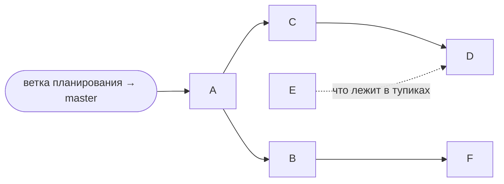

# v0.7.0 — сессии

Как работа по [[v0.7.0]] разложена на сессии Claude и готовые промпты к ним.
Каждый промпт самодостаточен: копируется в новую сессию целиком. Общие правила
вынесены в раздел «Общее для всех сессий» — промпты на него ссылаются, поэтому
файл должен лежать в той ветке, от которой стартует сессия.

## Группировка

Шесть пунктов плана легли в шесть сессий, но не один к одному: два пункта
объединены, один разрезан.

| Сессия | Что | Почему так | Предусловие | Параллельно с |
|---|---|---|---|---|
| **A** | Процесс: работа в `master` + окружение облачных сессий | Процесс определяет, куда вливаются все остальные; окружение (git-lfs, Godot) нужно всем, кто гоняет проверки | — | E |
| **B** | Ассеты: тела без текстур + швы коридоров | Оба — «контракт ассета, проверенный по файлу»: тот же пайплайн-док, тот же импорт, та же нужда в LFS и Godot | `MAT_monster` в Blender | C, E |
| **C** | Сетка, часть 1: API сетки + метрики | Чистый рефакторинг с проверкой «дамп плана совпал» — отдельно от смены поведения, иначе не отличить ошибку рефакторинга от новой логики | A | B, E, F |
| **D** | Сетка, часть 2: поворот комнат + новая раскладка + узел | Меняет генерацию; опирается на API и базовые метрики из C | C | F |
| **E** | Геймдизайн: угроза + эссенция | Разговор без кода; можно провести хоть в этом же чате | — | всё |
| **F** | Тела: что носит игрок, анимации, вид из тела, рэгдолл | Упирается в архитектурную развилку и в арт | B | C, D |



**Перед стартом:** карточки v0.7.0 заведены в ветке планирования
(`claude/intelligent-ritchie-8n1hj6`) — её нужно влить в `master` раньше любой
сессии, иначе сессия не найдёт ни карточек, ни этого файла.

## Общее для всех сессий

- **Пути в промптах.** `Задачи/…`, `how-to/…`, `Справка/…`, `Состояние проекта.md`,
  `История.md` — от `docs/astral-genesis/`; `src/…`, `dev/…`, `addons/…`,
  `data/…`, `assets/…` — от корня репозитория.
- **Язык и карта.** Документация, комментарии, коммиты — по-русски. `CLAUDE.md` —
  карта: перед правкой области прочитать связанный документ из
  `docs/astral-genesis/`. Карточка задачи — источник правды: решение, принятое в
  сессии, записывается в неё («Решения <дата>»), а не остаётся в чате.
- **Ветка и PR.** Ветка от `master`, PR в `master` — схема
  [[Работа в master и релизы тегами]]. Версию руками не трогать: в
  `project.godot` уже `0.7.0`, релиз — кнопкой ([[Релизы и сборка]]).
- **Скиллы проекта.** `gameplay-testing` — headless-проверки (`dev/*_check.tscn`,
  все разом — `dev/run_checks.ps1`);
  `gdscript-review` — перед PR; `docs-sync` — перед закрытием;
  `commit-message` — сообщения коммитов.
- **Окружение облачной сессии** ставит SessionStart-хук
  (`.claude/hooks/session-start.sh`, сессия A): git-lfs и ассеты, `addons/gecs`,
  теги, Godot (`godot`, `$GODOT`), `pwsh`, холодный импорт. Что знать поверх —
  [[Релизы и сборка]], «Облачная сессия Claude»:
  - **Импорт — `bash dev/import.sh`**, не голый `godot --import`: многопоточный
    импорт в headless виснет, а `override.cfg` его не выключает.
  - **Не подменять LFS-указатели файлами вручную** (скачав объект мимо git-lfs):
    без фильтра git увидит изменение и закоммитит бинарник мимо LFS.
  - Холодный импорт переписывает `assets/monsters/models/*.res` — хук
    возвращает их из git и пишет об этом; это баг сессии B, не правка.
  - `api.github.com` закрыт прокси — версии и ассеты релизов брать прямыми
    ссылками на `github.com`.
  - Нативного рантайма byProd в репозитории нет — звука не будет, это штатно
    ([[Звук]]).
- **«Проверено» — только за реально прогнанное.** Что headless не видит
  (картинка, звук, ощущение) — в чек-лист живого прогона пользователю.
- **В конце:** документы сведены (`docs-sync`), строка на доске [[v0.7.0]]
  передвинута в нужную колонку, PR открыт.

## A. Процесс: работа в master и окружение

✅ **Выполнена 25.09** — решения в [[Работа в master и релизы тегами]]
(«Решения 25.09»). Промпт ниже оставлен как запись задания.

Предусловие: ветка планирования влита в `master`.

```text
Сессия A из плана v0.7.0 — процесс: работа в master и окружение облачных сессий.

Сначала прочитай:
- docs/astral-genesis/Задачи/v0.7.0 — сессии.md, раздел «Общее для всех сессий»;
- docs/astral-genesis/Задачи/Карточки/Работа в master и релизы тегами.md —
  решения там приняты пользователем, не переоткрывай их;
- docs/astral-genesis/how-to/Релизы и сборка.md.

Задача 1 — процесс (вариант «В» карточки):
- .github/workflows/release.yml: релиз только по workflow_dispatch с номером
  (бамп коммитом в master + тег на коммит бампа — эта ветка уже написана);
  убрать срабатывание на мёрж PR из release/v*.
- .github/workflows/build.yml: PR в master и push в master, без release/**.
- Номер не-релизной сборки: предлагаю `git describe --tags`
  (v0.6.0-12-gabc1234 — 12 коммитов после v0.6.0) вместо «0.7.0+хэш» из
  карточки: он не обещает версию, которой ещё нет. Реши и запиши в карточку.
  Вписывать на время сборки, не коммитя: .github/actions/godot-export/action.yml,
  .github/scripts/set_version.sh (регулярка сейчас строго X.Y.Z).
- dev/release.ps1: версия из параметра или тега, а не из имени ветки; метка
  не-релизной сборки — тот же describe.
- Строка версии в игре: угол главного меню (src/ui/main_menu/) и отладочный
  оверлей (dev/debug_overlay.*), из ProjectSettings application/config/version.
- Документация: CLAUDE.md (Git conventions, Running/Releases — карта, только
  сводка и ссылка), how-to/Релизы и сборка.md (схема потока), скилл
  .claude/skills/project-status/ (ищет доску по имени ветки release/vX.Y.Z,
  в т.ч. scripts/scan_project_state.py; теперь доска — ближайшая незакрытая
  Задачи/vX.Y.Z.md). Строку бэклога «топики версии — отдельными PR в версионную
  ветку» закрыть как решённую иначе.
- Старые ветки release/v0.5.0, release/v0.6.0 и прочие смёрженные не удалять
  самому — дать пользователю список.

Задача 2 — окружение облачной сессии (скилл session-start-hook):
SessionStart-хук, работающий только в облачном окружении (у пользователя
локально Windows со своими Godot и LFS — там хук ничего не делает):
git-lfs (apt или бинарник v3.7.0 — оба пути проверены), git lfs install
--local && git lfs pull, Godot 4.7.2 linux в кэш, если его нет. Холодный
импорт проекта — в хуке или по требованию: реши по замеру времени.

Готово, когда: YAML валиден (actionlint, если доступен), set_version.sh
проверен на обоих форматах номера, хук прогнан в этой же сессии и повторный
запуск идемпотентен, документы сведены, карточка и доска обновлены. Реальный
релиз не запускать.
```

## B. Ассеты: тела без текстур и швы коридоров

Предусловие **от пользователя**: в Blender трём мешам тел назначен материал
`MAT_monster`, `monsters.glb` переэкспортирован и запушен. Если сессия A ещё не
влита — спросить сессию, куда вливать.

```text
Сессия B из плана v0.7.0 — ассеты: тела без текстур и швы коридоров.

Предусловие: в monsters.glb у трёх мешей (body, half_body, headog) есть
материал MAT_monster. Проверь это первым делом (glTF-чанк .glb); если
материалов нет — часть 1 не начинается, скажи пользователю.

Сначала прочитай:
- docs/astral-genesis/Задачи/v0.7.0 — сессии.md, раздел «Общее для всех сессий»;
- Задачи/Карточки/Баг — тела монстров без текстур в экспортированной сборке.md
  (причина подтверждена экспериментом — не переисследуй её);
- Задачи/Карточки/Баг — швы на стыках коридоров.md (таблица замеров);
- Справка/Blender-Godot пайплайн.md §8, §9, §14, §16.

Часть 1 — тела:
1. assets/shared/materials/palette_1_(alive).tres → MAT_monster.tres (имя
   материала — ключ подмены, §8). Найти все ссылки по пути и по uid.
2. Свести две копии палитры (§16 п.2): assets/textures/Gradient Pallete.png
   (LFS, на неё смотрит MAT_building) и assets/shared/palette/Gradient
   Pallete.png (обычный git, на неё смотрят MAT_furniture и материал тел).
   Файлы одинаковые, uid разные. Оставить одну; выбор «переезд в textures/ под
   LFS» или «правило LFS не только путевое» — предложи пользователю и запиши
   в §14 и §16.
3. dev/fix_import_settings.ps1 проставляет use_external для MAT_monster (нет
   pwsh — поставь, или приведи monsters.glb.import к тому же виду руками по
   образцу .import любой комнаты). Добавь в скрипт предупреждение о
   примитивах без материала — он уже читает glTF-чанк ради имён.
4. Проверить ХОЛОДНЫМ импортом (пустой .godot/): все три
   assets/monsters/models/*.res ссылаются на MAT_monster.tres, а не на
   встроенный StandardMaterial3D. Редактор с тёплым кэшем этот баг не
   показывает никогда. Закрепить headless-проверкой в dev/: меши тел грузятся,
   на каждой поверхности внешний материал.

Часть 2 — швы:
Расстановка в коде точная, швы в ассетах. Написать headless-проверку контракта
стыка по МЕШУ, а не лучами (лучи corridor_spawn_check мимо кромок рамки
проходят): для кусков кита (data/corridor_kit.tres) и сцен комнат из
библиотеки пресетов — плоскость каждой открытой грани клетки ровно на ±9.000,
рамка проёма шириной 3 м по центру грани, допуск ~1 мм. Пока арт не исправлен —
отчёт с конкретными числами (что и на сколько сдвинуть: это задание
художнику), а не красный ассерт; после исправления — ассерт. Туда же — отчёт
«арт» из corridor_spawn_check: когда он опустеет, должен стать ассертом.
Замеры 24.09 для сверки: A_2 точный; A_2C южная рамка −3.1 см; A_3 рамки N/S
−3.5 см, восточная грань +8.965; A_4 грани −9.046/+8.954 по X и −9.006/+8.994
по Z; комнаты A_2/2C/3/4 южная рамка до +9.165; B-комнаты и Архитектор до ±10 м
(известно, решено подрезать).

Готово, когда: холодный импорт даёт внешний материал; новые проверки включены
в dev/run_checks.ps1; карточки обновлены (тела — ждут только живого
прогона сборки пользователем; швы — отчёт как задание художнику); §16
пайплайна сведён.
```

## C. Сетка, часть 1: API и метрики

Предусловие: сессия A влита.

```text
Сессия C из плана v0.7.0 — сетка уровня, часть 1: API сетки и метрики. Чистый
рефакторинг: поведение генерации не меняется ни на бит.

Сначала прочитай:
- docs/astral-genesis/Задачи/v0.7.0 — сессии.md, раздел «Общее для всех сессий»;
- Задачи/Карточки/Сетка уровня — генерация на 3D-сетке.md — решения 24.09 и
  раздел «API сетки»; решения не переоткрывать;
- how-to/Цикл забега.md §2;
- Задачи/Карточки/Процедурные коридоры между комнатами.md.

Код: src/resources/world_generator/ — rs_layer_plan.gd (сетка в данных плюс
мировые позиции), rs_corridor_planner.gd (раскладка и трассы),
rs_corridor_kit.gd (маски и поворот кусков), rs_room_layout.gd (стороны дверей
сцены), rs_level_graph.gd. Потребители: src/autoloads/run_manager.gd (спавн
тайлов, node_at), src/ui/map/, addons/game_design_tool/tabs/world_gen.gd и
addons/game_design_tool/world/ (предпросмотр, прогон сидов), dev/gen_verifier.gd.

1. Снимок до: детерминированный дамп плана (клетки, узлы, маски, стороны
   дверей) по ~50 сидам и всем слоям — в scratchpad, не в репозиторий. После
   рефакторинга дамп обязан совпасть байт в байт.
2. Выделить три слоя: топология (клетки, соседи, сторона как индекс, поворот,
   противоположная сторона), размещение (что где стоит, footprint, поворот,
   проёмы — 4-битные маски кита это уровень игры, а не сетки), вложение в мир
   (клетка → Transform3D: cell * 18, этаж × FLOOR_SPACING). Генерация и
   планировщик не видят мировых координат. Интерфейс без допущений квадрата
   (у будущей гекс-сферы 12 клеток по 5 сторон и нет «севера»), реализация —
   только квадрат. Код сетки без зависимостей от игры (ни RS_LevelNode, ни
   RunManager), отдельной папкой — куда именно, предложи.
3. План остаётся доступным без спавна: карта и предпросмотр строят его для
   незагруженных слоёв. Узел в сцене не делаем — это сессия D.
4. Метрики обволакивания из раздела «Как мерить» карточки — строка в «Прогоне
   сидов» «Генератора мира» и в gen_verifier. Снять значения на нынешнем
   генераторе и записать в карточку как базу для сессии D.

Готово, когда: дамп совпал; зелёные corridor_graph_check,
corridor_layout_check, corridor_spawn_check, room_presence_check,
complex_map_check, world_gen_tool_check и gen_verifier; базовые метрики в
карточке; how-to/Цикл забега.md описывает слои сетки.
```

## D. Сетка, часть 2: поворот, раскладка, узел

Предусловие: сессия C влита. Желательно — решения сессии E по тупикам, но не
обязательно: генератор оставляет место, контент приходит позже.

```text
Сессия D из плана v0.7.0 — сетка уровня, часть 2: поворот комнат, новая
раскладка, узел сетки. Меняет генерацию: тот же сид даст другой комплекс.

Предусловие: сессия C влита (API сетки и базовые метрики в карточке).

Сначала прочитай:
- docs/astral-genesis/Задачи/v0.7.0 — сессии.md, раздел «Общее для всех сессий»;
- Задачи/Карточки/Сетка уровня — генерация на 3D-сетке.md целиком (решения,
  «Что затрагивает поворот комнат», «Как мерить», базовые метрики);
- Задачи/Карточки/Процедурные коридоры между комнатами.md — почему правило
  «одна ветка на комнату» (8 % неукладываемых этажей) и прецеденты этапа 5;
- Задачи/Карточки/Рефакторинг генератора мира — роль, интерфейс, теги.md.

Решено пользователем, не переоткрывать: клетка 18 м; поворачиваются все
комнаты; дверь прямо в соседнюю комнату и комната на двух ветках допустимы;
тупики и петли нужны.

1. Поворот комнат — отдельным PR: стороны дверей из RS_RoomLayout с учётом
   поворота; всё, что считает сторону по origin сущности; карта; повёрнутые
   комнаты под теми же лучами corridor_spawn_check.
2. Новая раскладка: снять правило одной ветки
   (RS_LevelGraph._hang_floor_on_corridors) и обеспечить укладываемость
   алгоритмом. Сначала прототип в данных двух подходов из «Открытых вопросов»
   карточки (хребет с комнатами по сторонам против «комнаты, потом трассы, с
   поворотом») и сравнение метрик с базой на тех же сидах; выбор — с цифрами.
   Инварианты карточки: детерминизм (rng тратится одинаково при любом исходе),
   «сначала комната, потом рёбра» (ноль заваренных дверей), уникальные комнаты,
   node_at без физики. Тупики и петли — ручками RS_WorldGenConfig со снимком в
   сейве. Забег, начатый на прежнем генераторе, сбрасывается на вход — как на
   этапе 5 карточки коридоров.
3. Узел сетки в «Генераторе мира»: отрисовка клеток, footprint, повороты —
   представление поверх данных, а не их владелец. Не вмещается в сессию —
   вынести отдельной и сказать об этом.

Что лежит в тупиках, генератор не решает — это «Источники эссенции»
(сессия E). Оставить место: пометка узла или клетки «тупик», без контента.

Готово, когда: метрики обволакивания лучше базы и закреплены порогом-ассертом в
corridor_layout_check; отказов трассы ноль на прогоне сидов; все проверки
генерации зелёные; карточки и how-to/Цикл забега.md сведены; чек-лист живого
прогона от gameplay-testing передан пользователю.
```

## E. Геймдизайн: угроза и эссенция

Без предусловий. Кода нет — это разговор, его можно провести и в текущем чате
планирования, где контекст уже загружен.

```text
Сессия E из плана v0.7.0 — геймдизайн: угроза и источники эссенции. Без кода:
интервью с пользователем и решения в карточках.

Сначала прочитай:
- docs/astral-genesis/Задачи/v0.7.0 — сессии.md, раздел «Общее для всех сессий»;
- Задачи/Карточки/Угроза — зачем выбираться из комплекса.md;
- Задачи/Карточки/Источники эссенции.md;
- Задачи/Карточки/Артефакт «Архитектор».md и Задачи/Карточки/Осколки Кавума.md;
- Задачи/Карточки/Сетка уровня — генерация на 3D-сетке.md — решение про тупики
  и секреты;
- how-to/Захват тела.md (распад, E_Enemy, S_EnemyAI), how-to/Цикл забега.md §4
  (конец забега), Состояние проекта.md (навыки, Архитектор), История.md (лор —
  только читать).

Цель: ответить, почему игрок каждый раз хочет выбраться, а не умирает на
удобной глубине, и что тянет его в тупики и секреты. Веди как интервью: по
одному-два вопроса за раз (AskUserQuestion, где есть варианты), 2–3 варианта с
плюсами и минусами, не решай за пользователя. Опирайся на то, что в игре уже
есть: распад как ресурс, тела как расходник, атрибуция урона в
S_Health.deal_damage, очки за глубину и за выход из выжатого тела, эссенция за
первое касание Архитектора.

Выход:
- решения в карточках угрозы и эссенции (раздел «Решения <дата>»), открытые
  вопросы закрыты или явно отложены;
- карточки задач на реализацию с объёмом «в v0.7.0» или «позже» и строки на
  доске v0.7.0;
- числа (эссенция за забег, цены улучшений) — через скилл game-balance, если
  разговор до них дойдёт.
Код не писать.
```

## F. Тела: анимации, вид из тела, рэгдолл

Предусловие: сессия B влита (не конфликтовать по `monsters.glb`). Уточнить у
пользователя, есть ли анимации от художника.

```text
Сессия F из плана v0.7.0 — переработка тел: что носит игрок, анимации, вид из
тела, рэгдолл.

Предусловие: сессия B влита (материал тел починен). В начале спроси
пользователя, есть ли анимации от художника; нет — план строится на заглушках.

Сначала прочитай:
- docs/astral-genesis/Задачи/v0.7.0 — сессии.md, раздел «Общее для всех сессий»;
- Задачи/Карточки/Переработка тел — анимации, вид из тела, рэгдолл.md;
- Задачи/Карточки/Визуал захваченного тела.md;
- Задачи/Карточки/Баг — вселение в тело (посадка, масштаб, камера).md;
- Задачи/Карточки/Характеристики захватываемых тел.md;
- how-to/Захват тела.md, how-to/Взаимодействие.md (как RS_EntityVisuals ищет
  геометрию для обводки), Справка/Blender-Godot пайплайн.md §9 и §11.

Код: src/entities/body/ (сцены держат свои Skeleton3D, Skin, TwoBoneIK3D,
PhysicalBoneSimulator3D; e_body_walker/crawler/hound.gd запускают рэгдолл на
старте — во всех трёх, документация местами говорит только про hound),
src/components/rendering/c_body_visual.gd, src/observers/o_body_visual.gd,
src/systems/physics/s_body_snatch.gd, src/entities/player/e_player.gd,
src/resources/rs_entity_visuals.gd. Проверки: dev/body_form_check,
dev/body_traits_check, dev/abilities_check.

1. Сначала развилка, до кода: что носит игрок при вселении — (а) копию меша на
   риге плюс перенос скелета с анимацией или (б) саму сущность тела как визуал,
   прицепленную к ригу. (б) спорит с инвариантом «E_Player — единственная
   управляемая сущность», из-за которого её однажды отклонили. Разобрать обе
   по коду: обводка, коалесценция remove+add C_BodyVisual при пересадке из тела
   в тело, сейв и загрузка воплощения, C_BodyForm. Дать рекомендацию; решает
   пользователь; записать в карточку.
2. Рэгдолл: живое и захватываемое тело — поза или анимация; рэгдолл — только
   труп и гибель.
3. Анимации: покой, ходьба и бег (S_Walk, S_Sprint), прыжок у тел с C_Jump,
   ползание у crawler. Источник — NLA из Blender (§11) или процедурно через
   имеющиеся IK-цели как заглушка.
4. Вид от первого лица в теле без клиппинга меша в камеру; камера от кости head
   вместо маркера Eyes, когда скелет анимирован.

Готово, когда: развилка решена и записана; проверки тел зелёные, новые
инварианты покрыты; how-to/Захват тела.md сведён; чек-лист живого прогона
передан пользователю.
```
