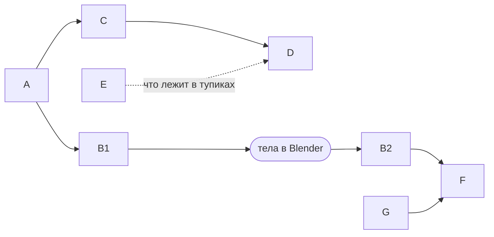

# v0.7.0 — сессии

Как работа по [[v0.7.0]] разложена на сессии Claude и готовые промпты к ним.
Каждый промпт самодостаточен: копируется в новую сессию целиком. Общие правила
вынесены в раздел «Общее для всех сессий» — промпты на него ссылаются, поэтому
файл должен лежать в той ветке, от которой стартует сессия.

## Где мы (29.09)

| Сессия | Состояние |
|---|---|
| **A** | ✅ 25.09. Ждёт живой проверки: первый релиз кнопкой, удаление старых веток `release/v0.5.0`, `v0.3.0`, `v0.4.0` (пользователь) |
| **B** | Не начата. 29.09 переписана по [[Пайплайн персонажей]]: **B1** — контракт рига в валидаторе аддона и headless-проверке (без предусловий), потом пользователь переводит тела в Blender, потом **B2** — тела на своих `.glb` и облик на риге. Часть про швы снята (кит 18 м удалён 27.09) |
| **C** | ✅ 26.09 — п. 1–2 [[Сетка уровня — генерация на 3D-сетке]] |
| **D** | ✅ 27.09 — п. 4–8 той же карточки. Сверх плана: [[Коридор — отдельный узел]], 29.09 — комнаты вразброс и лестница между этажами ([[Хаос раскладки этажа]]). Осталось: живой прогон |
| **E** | ✅ 01.10 — интервью проведено, решения в карточках («Решения 01.10»: [[Две оси прогрессии — тело и лабиринт]], угроза, эссенция, Архитектор, осколки, [[Экран победы]]), сырые мысли — в [[Обдумать]]. Осталось: разбивка по версиям и карточки реализации |
| **F** | Не начата, ждёт B2 и G. Развилки решены 29.09 — промпт переписан: анимации общей библиотекой на тип рига и гибрид от первого лица |
| **G** | ✅ 30.09 — `S_Walk` в мировом базисе, проверка в `dev/enemy_ai_check`. Ждёт живого прогона в хабе ([[Баг — враг не идёт за игроком]]) |

Промпты A, C и D оставлены как запись задания. Их числа устарели: клетка
теперь 8 м, а не 18. Заново их не запускать.

Вне этого плана на доске [[v0.7.0]] есть задачи без сессии: баг сида
([[Баг — сид забега длиннее поля «Сид»]]), [[Число дверей комнаты]], остаток
[[Хаос раскладки этажа]], origin Архитектора в Blender (строка в [[Бэклог]]).
Они берутся отдельными сессиями с доски, без промпта отсюда.

## Группировка

Шесть пунктов плана легли в шесть сессий, но не один к одному: два пункта
объединены, один разрезан. Седьмая сессия (G) добавлена 29.09.

| Сессия | Что | Почему так | Предусловие | Параллельно с |
|---|---|---|---|---|
| **A** | Процесс: работа в `master` + окружение облачных сессий | Процесс определяет, куда вливаются все остальные; окружение (git-lfs, Godot) нужно всем, кто гоняет проверки | — | E |
| **B1** | Контракт рига в автоматике | Проверки пишутся до арта, чтобы тела переводились уже под ними | — | E, G |
| **B2** | Тела на своих `.glb`, облик на риге | Сцены облика создаются здесь, а голова и руки отдельными объектами ломают перенос одного меша — облик на риге переезжает сюда из F | B1 + тела в Blender | E, G |
| **C** | Сетка, часть 1: API сетки + метрики | Чистый рефакторинг с проверкой «дамп плана совпал» — отдельно от смены поведения, иначе не отличить ошибку рефакторинга от новой логики | A | B, E, F |
| **D** | Сетка, часть 2: поворот комнат + новая раскладка + узел | Меняет генерацию; опирается на API и базовые метрики из C | C | F |
| **E** | Геймдизайн: угроза + эссенция | Разговор без кода; можно провести хоть в этом же чате | — | всё |
| **F** | Тела: анимации, гибрид от первого лица, рэгдолл по делу | Поверх готового облика на риге; упирается в анимации от художника | B2, G | E |
| **G** | Баг хода врага: базис `S_Walk` | Короткий фикс с проверкой; `S_Walk` потом перестраивает F под анимации, и два параллельных захода в одну систему разъедутся | — | B, E |


```mermaid
flowchart LR
    A --> C --> D
    A --> B1 --> U(["тела в Blender"]) --> B2 --> F
    G --> F
    E -.->|что лежит в тупиках| D
```

## Общее для всех сессий

- **Пути в промптах.** `Задачи/…`, `how-to/…`, `Справка/…`, `Состояние проекта.md`,
  `История.md` — от `docs/astral-genesis/`; `src/…`, `dev/…`, `addons/…`,
  `data/…`, `assets/…` — от корня репозитория.
- **Язык и карта.** Документация, комментарии, коммиты — по-русски. `CLAUDE.md` —
  карта: перед правкой области прочитать связанный документ из
  `docs/astral-genesis/`. Карточка задачи — источник правды: решение, принятое в
  сессии, записывается в неё («Решения <дата>»), а не остаётся в чате.
- **Ветка и PR.** Ветка от `master`, PR в `master` — схема
  [[Работа в master и релизы тегами]]. Версию руками не трогать: в
  `project.godot` уже `0.7.0`, релиз — кнопкой ([[Релизы и сборка]]).
- **Скиллы проекта.** `gameplay-testing` — headless-проверки (`dev/*_check.tscn`,
  все разом — `dev/run_checks.ps1`);
  `gdscript-review` — перед PR; `docs-sync` — перед закрытием;
  `commit-message` — сообщения коммитов.
- **Окружение облачной сессии** ставит SessionStart-хук
  (`.claude/hooks/session-start.sh`, сессия A): git-lfs и ассеты, `addons/gecs`,
  теги, Godot (`godot`, `$GODOT`), `pwsh`, холодный импорт. Что знать поверх —
  [[Релизы и сборка]], «Облачная сессия Claude»:
  - **Импорт — `bash dev/import.sh`**, не голый `godot --import`: многопоточный
    импорт в headless виснет, а `override.cfg` его не выключает.
  - **Не подменять LFS-указатели файлами вручную** (скачав объект мимо git-lfs):
    без фильтра git увидит изменение и закоммитит бинарник мимо LFS.
  - Холодный импорт переписывает `assets/monsters/models/*.res` — хук
    возвращает их из git и пишет об этом; это баг сессии B, не правка.
  - `api.github.com` закрыт прокси — версии и ассеты релизов брать прямыми
    ссылками на `github.com`.
  - Нативного рантайма byProd в репозитории нет — звука не будет, это штатно
    ([[Звук]]).
- **«Проверено» — только за реально прогнанное.** Что headless не видит
  (картинка, звук, ощущение) — в чек-лист живого прогона пользователю.
- **В конце:** документы сведены (`docs-sync`), строка на доске [[v0.7.0]]
  передвинута в нужную колонку, PR открыт.

## A. Процесс: работа в master и окружение

✅ **Выполнена 25.09** — решения в [[Работа в master и релизы тегами]]
(«Решения 25.09»). Промпт ниже оставлен как запись задания.

Предусловие: ветка планирования влита в `master`.

```text
Сессия A из плана v0.7.0 — процесс: работа в master и окружение облачных сессий.

Сначала прочитай:
- docs/astral-genesis/Задачи/v0.7.0 — сессии.md, раздел «Общее для всех сессий»;
- docs/astral-genesis/Задачи/Карточки/Работа в master и релизы тегами.md —
  решения там приняты пользователем, не переоткрывай их;
- docs/astral-genesis/how-to/Релизы и сборка.md.

Задача 1 — процесс (вариант «В» карточки):
- .github/workflows/release.yml: релиз только по workflow_dispatch с номером
  (бамп коммитом в master + тег на коммит бампа — эта ветка уже написана);
  убрать срабатывание на мёрж PR из release/v*.
- .github/workflows/build.yml: PR в master и push в master, без release/**.
- Номер не-релизной сборки: предлагаю `git describe --tags`
  (v0.6.0-12-gabc1234 — 12 коммитов после v0.6.0) вместо «0.7.0+хэш» из
  карточки: он не обещает версию, которой ещё нет. Реши и запиши в карточку.
  Вписывать на время сборки, не коммитя: .github/actions/godot-export/action.yml,
  .github/scripts/set_version.sh (регулярка сейчас строго X.Y.Z).
- dev/release.ps1: версия из параметра или тега, а не из имени ветки; метка
  не-релизной сборки — тот же describe.
- Строка версии в игре: угол главного меню (src/ui/main_menu/) и отладочный
  оверлей (dev/debug_overlay.*), из ProjectSettings application/config/version.
- Документация: CLAUDE.md (Git conventions, Running/Releases — карта, только
  сводка и ссылка), how-to/Релизы и сборка.md (схема потока), скилл
  .claude/skills/project-status/ (ищет доску по имени ветки release/vX.Y.Z,
  в т.ч. scripts/scan_project_state.py; теперь доска — ближайшая незакрытая
  Задачи/vX.Y.Z.md). Строку бэклога «топики версии — отдельными PR в версионную
  ветку» закрыть как решённую иначе.
- Старые ветки release/v0.5.0, release/v0.6.0 и прочие смёрженные не удалять
  самому — дать пользователю список.

Задача 2 — окружение облачной сессии (скилл session-start-hook):
SessionStart-хук, работающий только в облачном окружении (у пользователя
локально Windows со своими Godot и LFS — там хук ничего не делает):
git-lfs (apt или бинарник v3.7.0 — оба пути проверены), git lfs install
--local && git lfs pull, Godot 4.7.2 linux в кэш, если его нет. Холодный
импорт проекта — в хуке или по требованию: реши по замеру времени.

Готово, когда: YAML валиден (actionlint, если доступен), set_version.sh
проверен на обоих форматах номера, хук прогнан в этой же сессии и повторный
запуск идемпотентен, документы сведены, карточка и доска обновлены. Реальный
релиз не запускать.
```

## B. Тела на своих `.glb` (B1 → Blender → B2)

Переписано 29.09 по решениям [[Пайплайн персонажей]]: один `.glb` на
персонажа, сцена облика, контракт рига, общая библиотека клипов на тип рига,
гибрид от первого лица. Прежний промпт чинил монолит `monsters.glb` и снят.
Часть про швы коридоров снята раньше: кит 18 м удалён 27.09, у кита P контракт
«ничего за клетку» держат `room_shell_check` и `corridor_spawn_check`, а
[[Баг — швы на стыках коридоров]] закрывается живым взглядом пользователя.

Три шага, и два из них — сессии:

1. **B1 — контракт в автоматике.** До арта: тела потом переводятся уже под
   проверкой, а не проверяются задним числом.
2. **Пользователь в Blender.** `walker`, `crawler`, `hound` — каждый в свой
   `CH_<имя>.glb` по контракту рига: кости переименованы, голова и руки —
   отдельные объекты, материал `MAT_monster`, прокси рэгдолла на костях;
   руки-муляж `CH_<имя>_fp_arms.glb`. Файлы анимаций по типам рига могут
   подождать до F. Валидатор аддона из B1 зелёный.
3. **B2 — тела на своих `.glb` в Godot.**

### B1. Контракт рига в автоматике

Без предусловий. Параллельно с E и G.

```text
Сессия B1 из плана v0.7.0 — контракт рига персонажа в автоматике: валидатор
аддона Blender и headless-проверка Godot. Арта ещё нет — проверки пишутся под
контракт, чтобы пользователь переводил тела уже под ними.

Сначала прочитай:
- docs/astral-genesis/Задачи/v0.7.0 — сессии.md, раздел «Общее для всех сессий»;
- Задачи/Карточки/Пайплайн персонажей.md — решения 29.09 и контракт рига
  приняты пользователем, не переоткрывай их;
- tools/blender/README.md и tools/blender/godot_pipeline/README.md (валидатор,
  рэгдолл через PhysicalBone3D, тесты);
- Справка/Blender-Godot пайплайн.md §8, §9, §11, §16.

1. Валидатор аддона (tools/blender/godot_pipeline) проверяет контракт рига у
   коллекции персонажа: трансформы применены, масштаб 1; есть кости root и
   head; в именах костей нет автосуффиксов .001; голова и руки — отдельные
   объекты; материалы именованы MAT_*. Как объект помечается головой или руками
   и как коллекция объявляет тип рига (гуманоид, ползун, четвероногое) —
   предложи пользователю (имя объекта или свойство вкладки Godot) и запиши в
   карточку. Схема имён костей на тип рига — эталонный список рядом с аддоном;
   валидатор сверяет с ним. Тесты — tools/blender/tests/run_addon_tests.ps1.
2. dev/fix_import_settings.ps1: use_external для MAT_* у ассетов в
   assets/characters/; предупреждение о примитивах без материала (скрипт уже
   читает glTF-чанк ради имён).
3. Headless-проверка dev/character_check: по всем сценам облика
   assets/characters/*/CH_*.tscn — модификаторы скелета ссылаются на
   существующие кости, узлы базы на месте (так ловится тихая потеря
   переопределений унаследованной сцены), у каждой поверхности внешний
   материал, есть кости root и head. Персонажей пока нет — проверка обязана
   доказать, что ловит нарушение: мутация в памяти (модификатор на
   несуществующую кость) валит её, как детектор зон в room_shell_check.
4. Попутно, раз валидатор открыт (п. 8 карточки «Пайплайн ассетов», перенесён
   сюда 30.09): проверка клетки знает только одноклеточный тайл (±½ клетки) и
   считает нарушением коробку 2×2 при клетке 8 м. Нужен footprint ассета
   (W × L × H клеток) — полем коллекции — и сверка габарита с ним. В
   арт-репозитории tools/check_kit.py уже берёт footprint из имени коллекции
   (SM_room_A_shell_3x2x1) — сверь, не завести ли тот же источник.
5. Документы: README аддона, пайплайн §16 п. 5, карточка.

Готово, когда: тесты аддона и dev/run_checks.ps1 зелёные; детектор мутации
красный на мутации; коробка 2×2 проходит проверку клетки, а выступ за её
footprint — нет; карточка и §16 сведены.
```

### B2. Тела на своих `.glb`

Предусловие **от пользователя**: `CH_walker`, `CH_crawler`, `CH_hound` и их
руки-муляж лежат в `assets/characters/<имя>/`, валидатор аддона зелёный.

```text
Сессия B2 из плана v0.7.0 — тела на своих .glb: сцены облика, сцены
сущностей, облик на риге игрока. Закрывает баг тел без текстур переводом.

Предусловие: в assets/characters/ лежат CH_walker.glb, CH_crawler.glb,
CH_hound.glb. Проверь их dev/character_check и валидатором (B1) первым делом;
не проходят — скажи пользователю, не подгоняй.

Сначала прочитай:
- docs/astral-genesis/Задачи/v0.7.0 — сессии.md, раздел «Общее для всех сессий»;
- Задачи/Карточки/Пайплайн персонажей.md — решения 29.09 и схема сцен;
- Задачи/Карточки/Переработка тел — анимации, вид из тела, рэгдолл.md,
  «Решения 29.09»;
- Задачи/Карточки/Баг — тела монстров без текстур в экспортированной сборке.md;
- how-to/Захват тела.md (E_Body: visual_of, form_of, маркер Eyes, соглашения о
  подошве и взгляде), Справка/Blender-Godot пайплайн.md §8, §9, §14, §16.

Код: src/entities/body/ (e_body*.tscn/gd), src/entities/enemy/,
src/components/rendering/c_body_visual.gd, src/observers/o_body_visual.gd,
src/resources/rs_entity_visuals.gd, src/entities/player/, assets/monsters/,
.claude/hooks/session-start.sh (восстанавливает assets/monsters/models/*.res).

1. Материал: assets/shared/materials/palette_1_(alive).tres → MAT_monster.tres
   (имя — ключ подмены, §8), все ссылки по пути и uid. Две копии палитры
   (§16 п. 2) свести в одну; вариант — предложи пользователю, запиши в §14 и
   §16.
2. Сцены облика CH_<имя>.tscn, унаследованные от .glb: IK и
   CopyTransformModifier3D переезжают из сцен тел сюда. Физические кости —
   теперь из .glb (постимпорт аддона), ручные удалить.
3. Сцены сущностей тел инстанцируют облик как Visual, доворот на 180° под
   корнем, капсула и Eyes — по таблице «Числа» в Метрики и кит. Точки
   крепления — BoneAttachment3D с внешним скелетом. Сцена тела объявляет свою
   сцену рук-муляжа (свойство сцены, как display_name_key). То же — враг, если
   он собран из тех же мешей.
4. Облик на риге (решение 29.09): C_BodyVisual несёт сцену облика вместо меша;
   O_BodyVisual инстанцирует её на риге и снимает при развоплощении; обводка —
   на поддерево (RS_EntityVisuals.geometries). Сейв и загрузка воплощения — по
   body_scene_path, как сейчас. Голова и руки облика на игроке — SHADOWS_ONLY.
   Руки-муляж на камеру — сессия F, здесь не надо.
5. Удалить assets/monsters/ (monsters.glb, models/*.res, monsters.tscn), когда
   ссылок не осталось; убрать их восстановление из session-start.sh.
6. Проверить ХОЛОДНЫМ импортом (пустой .godot/): у всех поверхностей CH_*
   внешний материал.

Готово, когда: body_form_check, body_traits_check, abilities_check,
dev/character_check и весь run_checks зелёные; холодный импорт даёт внешний
материал; карточки сведены (баг без текстур ждёт только живого прогона
сборки); how-to/Захват тела.md описывает облик на риге; чек-лист живого
прогона (вселение, пересадка, выход, загрузка в теле) передан пользователю.
```

## C. Сетка, часть 1: API и метрики

✅ **Выполнена 26.09** — п. 1–2 [[Сетка уровня — генерация на 3D-сетке]]. Промпт
ниже оставлен как запись задания: клетка в нём ещё 18 м.

Предусловие: сессия A влита.

```text
Сессия C из плана v0.7.0 — сетка уровня, часть 1: API сетки и метрики. Чистый
рефакторинг: поведение генерации не меняется ни на бит.

Сначала прочитай:
- docs/astral-genesis/Задачи/v0.7.0 — сессии.md, раздел «Общее для всех сессий»;
- Задачи/Карточки/Сетка уровня — генерация на 3D-сетке.md — решения 24.09 и
  раздел «API сетки»; решения не переоткрывать;
- how-to/Цикл забега.md §2;
- Задачи/Карточки/Процедурные коридоры между комнатами.md.

Код: src/resources/world_generator/ — rs_layer_plan.gd (сетка в данных плюс
мировые позиции), rs_corridor_planner.gd (раскладка и трассы),
rs_corridor_kit.gd (маски и поворот кусков), rs_room_layout.gd (стороны дверей
сцены), rs_level_graph.gd. Потребители: src/autoloads/run_manager.gd (спавн
тайлов, node_at), src/ui/map/, addons/game_design_tool/tabs/world_gen.gd и
addons/game_design_tool/world/ (предпросмотр, прогон сидов), dev/gen_verifier.gd.

1. Снимок до: детерминированный дамп плана (клетки, узлы, маски, стороны
   дверей) по ~50 сидам и всем слоям — в scratchpad, не в репозиторий. После
   рефакторинга дамп обязан совпасть байт в байт.
2. Выделить три слоя: топология (клетки, соседи, сторона как индекс, поворот,
   противоположная сторона), размещение (что где стоит, footprint, поворот,
   проёмы — 4-битные маски кита это уровень игры, а не сетки), вложение в мир
   (клетка → Transform3D: cell * 18, этаж × FLOOR_SPACING). Генерация и
   планировщик не видят мировых координат. Интерфейс без допущений квадрата
   (у будущей гекс-сферы 12 клеток по 5 сторон и нет «севера»), реализация —
   только квадрат. Код сетки без зависимостей от игры (ни RS_LevelNode, ни
   RunManager), отдельной папкой — куда именно, предложи.
3. План остаётся доступным без спавна: карта и предпросмотр строят его для
   незагруженных слоёв. Узел в сцене не делаем — это сессия D.
4. Метрики обволакивания из раздела «Как мерить» карточки — строка в «Прогоне
   сидов» «Генератора мира» и в gen_verifier. Снять значения на нынешнем
   генераторе и записать в карточку как базу для сессии D.

Готово, когда: дамп совпал; зелёные corridor_graph_check,
corridor_layout_check, corridor_spawn_check, room_presence_check,
complex_map_check, world_gen_tool_check и gen_verifier; базовые метрики в
карточке; how-to/Цикл забега.md описывает слои сетки.
```

## D. Сетка, часть 2: поворот, раскладка, узел

✅ **Выполнена 27.09** — п. 4–8 [[Сетка уровня — генерация на 3D-сетке]], сверх
плана [[Коридор — отдельный узел]]. Промпт ниже оставлен как запись задания:
«клетка 18 м» в нём отменена решением 26.09 (куб 8 м).

Предусловие: сессия C влита. Желательно — решения сессии E по тупикам, но не
обязательно: генератор оставляет место, контент приходит позже.

```text
Сессия D из плана v0.7.0 — сетка уровня, часть 2: поворот комнат, новая
раскладка, узел сетки. Меняет генерацию: тот же сид даст другой комплекс.

Предусловие: сессия C влита (API сетки и базовые метрики в карточке).

Сначала прочитай:
- docs/astral-genesis/Задачи/v0.7.0 — сессии.md, раздел «Общее для всех сессий»;
- Задачи/Карточки/Сетка уровня — генерация на 3D-сетке.md целиком (решения,
  «Что затрагивает поворот комнат», «Как мерить», базовые метрики);
- Задачи/Карточки/Процедурные коридоры между комнатами.md — почему правило
  «одна ветка на комнату» (8 % неукладываемых этажей) и прецеденты этапа 5;
- Задачи/Карточки/Рефакторинг генератора мира — роль, интерфейс, теги.md.

Решено пользователем, не переоткрывать: клетка 18 м; поворачиваются все
комнаты; дверь прямо в соседнюю комнату и комната на двух ветках допустимы;
тупики и петли нужны.

1. Поворот комнат — отдельным PR: стороны дверей из RS_RoomLayout с учётом
   поворота; всё, что считает сторону по origin сущности; карта; повёрнутые
   комнаты под теми же лучами corridor_spawn_check.
2. Новая раскладка: снять правило одной ветки
   (RS_LevelGraph._hang_floor_on_corridors) и обеспечить укладываемость
   алгоритмом. Сначала прототип в данных двух подходов из «Открытых вопросов»
   карточки (хребет с комнатами по сторонам против «комнаты, потом трассы, с
   поворотом») и сравнение метрик с базой на тех же сидах; выбор — с цифрами.
   Инварианты карточки: детерминизм (rng тратится одинаково при любом исходе),
   «сначала комната, потом рёбра» (ноль заваренных дверей), уникальные комнаты,
   node_at без физики. Тупики и петли — ручками RS_WorldGenConfig со снимком в
   сейве. Забег, начатый на прежнем генераторе, сбрасывается на вход — как на
   этапе 5 карточки коридоров.
3. Узел сетки в «Генераторе мира»: отрисовка клеток, footprint, повороты —
   представление поверх данных, а не их владелец. Не вмещается в сессию —
   вынести отдельной и сказать об этом.

Что лежит в тупиках, генератор не решает — это «Источники эссенции»
(сессия E). Оставить место: пометка узла или клетки «тупик», без контента.

Готово, когда: метрики обволакивания лучше базы и закреплены порогом-ассертом в
corridor_layout_check; отказов трассы ноль на прогоне сидов; все проверки
генерации зелёные; карточки и how-to/Цикл забега.md сведены; чек-лист живого
прогона от gameplay-testing передан пользователю.
```

## E. Геймдизайн: угроза и эссенция

Без предусловий. Кода нет — это разговор, его можно провести и в текущем чате
планирования, где контекст уже загружен.

```text
Сессия E из плана v0.7.0 — геймдизайн: угроза и источники эссенции. Без кода:
интервью с пользователем и решения в карточках.

Сначала прочитай:
- docs/astral-genesis/Задачи/v0.7.0 — сессии.md, раздел «Общее для всех сессий»;
- Задачи/Карточки/Угроза — зачем выбираться из комплекса.md;
- Задачи/Карточки/Источники эссенции.md;
- Задачи/Карточки/Артефакт «Архитектор».md и Задачи/Карточки/Осколки Кавума.md;
- Задачи/Карточки/Сетка уровня — генерация на 3D-сетке.md — решение про тупики
  и секреты;
- Задачи/Карточки/Две оси прогрессии — тело и лабиринт.md — направление
  пользователя 29.09, уже решено: выход закрыт лабиринтом, а не боссом, и
  открывается улучшениями Архитектора; распад давит только в ранней игре.
  Не переоткрывать — строить угрозу и эссенцию поверх него;
- Задачи/Карточки/Хаос раскладки этажа.md — схема этажа пользователя
  (вентиляция для души, шлюзы, вход на этаж): места, куда ляжет угроза и
  находки;
- how-to/Захват тела.md (распад, E_Enemy, S_EnemyAI), how-to/Цикл забега.md §4
  (конец забега), Состояние проекта.md (навыки, Архитектор), История.md (лор —
  только читать).

Цель: ответить, почему игрок каждый раз хочет выбраться, а не умирает на
удобной глубине, и что тянет его в тупики и секреты. Половину ответа на первый
вопрос дают «Две оси прогрессии»: выход — цель второй оси. Спрашивать о том,
чем комплекс давит на первой оси и чем находки кормят Архитектора. Веди как интервью: по
одному-два вопроса за раз (AskUserQuestion, где есть варианты), 2–3 варианта с
плюсами и минусами, не решай за пользователя. Опирайся на то, что в игре уже
есть: распад как ресурс, тела как расходник, атрибуция урона в
S_Health.deal_damage, очки за глубину и за выход из выжатого тела, эссенция за
первое касание Архитектора.

Выход:
- решения в карточках угрозы и эссенции (раздел «Решения <дата>»), открытые
  вопросы закрыты или явно отложены;
- карточки задач на реализацию с объёмом «в v0.7.0» или «позже» и строки на
  доске v0.7.0;
- числа (эссенция за забег, цены улучшений) — через скилл game-balance, если
  разговор до них дойдёт.
Код не писать.
```

## F. Тела: анимации и гибрид от первого лица

Предусловие: сессии B2 и G влиты (B2 — облик на риге и сцены облика, G —
`S_Walk` в мировом базисе). Развилки F решены 29.09 ([[Пайплайн персонажей]],
[[Переработка тел — анимации, вид из тела, рэгдолл]]). Уточнить у
пользователя, готовы ли файлы анимаций по типам рига.

```text
Сессия F из плана v0.7.0 — анимации тел и гибрид от первого лица.

Предусловие: сессии B2 и G влиты. В начале спроси пользователя, есть ли
ANIM_<тип>.glb и ANIM_<тип>_fp.glb; нет — первый проход на процедурных
заглушках через имеющиеся IK-цели, а импорт библиотек — когда появятся.

Сначала прочитай:
- docs/astral-genesis/Задачи/v0.7.0 — сессии.md, раздел «Общее для всех сессий»;
- Задачи/Карточки/Пайплайн персонажей.md — п. 4 и «Гибрид от первого лица и
  облик на риге»; решения приняты, не переоткрывай;
- Задачи/Карточки/Переработка тел — анимации, вид из тела, рэгдолл.md;
- how-to/Захват тела.md, Справка/Blender-Godot пайплайн.md §11.

1. Библиотеки: ANIM_<тип>.glb и ANIM_<тип>_fp.glb импортом Animation Library;
   пути треков — скелет уникальным узлом (Retarget → Bone Renamer → Unique
   Node, свой SkeletonProfile для не-гуманоидов). Свои клипы тела — его
   библиотека поверх общей.
2. AnimationTree в сцене сущности (тело) и на риге (надетый облик и
   руки-муляж); библиотеки держит сам AnimationTree. Параметры пишет одна
   система S_BodyAnimation после движения: скорость, на полу, прыжок, действие
   рук. Скорость клипа — по метрам за цикл, не root motion.
3. Правило «способность ⇒ обязательные клипы»: реши, где способность объявляет
   свои клипы (константа компонента или ресурс-таблица), и закрепи
   headless-проверкой по сценам тел.
4. Гибрид: риг при вселении инстанцирует руки-муляж тела на камере; материал
   рук MAT_<имя>_fp с use_fov_override и use_z_clip_scale; руки своей тени не
   дают.
5. Рэгдолл только на гибель: живое тело в комнате — idle или клип «без
   сознания», запуск рэгдолла из _ready e_body_*.gd уходит.
6. Стены кита для рэгдолла (п. 9 карточки «Пайплайн ассетов», перенесён сюда
   30.09): трисетка стены строится из видимых граней, а граней лицом наружу на
   границе клетки нет (Метрики и кит §2 п. 4) — для физики стена односторонняя.
   Тела на move_and_slide это не задевает, а кость рэгдолла, проскочившую стену
   за шаг, назад не вытолкнет. Проверить на первом прогоне рэгдолла в ките 8 м;
   если пролетает — backface_collision у ConcavePolygonShape3D на импорте или
   коробки-прокси стен, выбор — с пользователем.

Готово, когда: проверки тел и новая проверка клипов зелёные; how-to/Захват
тела.md и §11 сведены; чек-лист живого прогона (ходьба, бег, прыжок, взгляд
вниз на ноги, руки у стены, тень) передан пользователю.
```

## G. Баг хода врага: базис S_Walk

Добавлена 29.09. Без предусловий. Идёт до F: F перестраивает `S_Walk` под
анимации, а базис — отдельная правка с отдельной проверкой.

```text
Сессия G из плана v0.7.0 — баг: враг не идёт за игроком.

Сначала прочитай:
- docs/astral-genesis/Задачи/v0.7.0 — сессии.md, раздел «Общее для всех сессий»;
- Задачи/Карточки/Баг — враг не идёт за игроком.md — вероятная причина там уже
  сверена с кодом, живым прогоном не подтверждена;
- how-to/Захват тела.md (E_Enemy, S_EnemyAI, C_EnemyInput).

Код: src/systems/physics/s_walk.gd (базис хода из node.transform),
src/systems/physics/s_enemy_ai.gd, src/entities/enemy/e_enemy.*.

1. Подтвердить диагноз headless, до правки: враг под родителем, повёрнутым на
   90°, после шага S_Walk получает скорость вбок от цели. Эта же сцена после
   правки становится проверкой в dev/ (скилл gameplay-testing).
2. S_Walk: базис хода — global_transform.basis. Шапку S_EnemyAI про «вперёд
   для тела и есть к цели» поправить: это верно только в мировом базисе.
3. Игрок не должен заметить разницы: его родитель — корень мира. Прогнать
   abilities_check, body_form_check и все проверки движения.

Навигация врага (раздел карточки «Навигация — подумать отдельно») — не эта
сессия: её решает тема угрозы (сессия E).

Готово, когда: проверка из п. 1 зелёная после правки и красная без неё;
run_checks зелёный; карточка закрыта до живого прогона в хабе с повёрнутой
комнатой (чек-лист пользователю).
```
